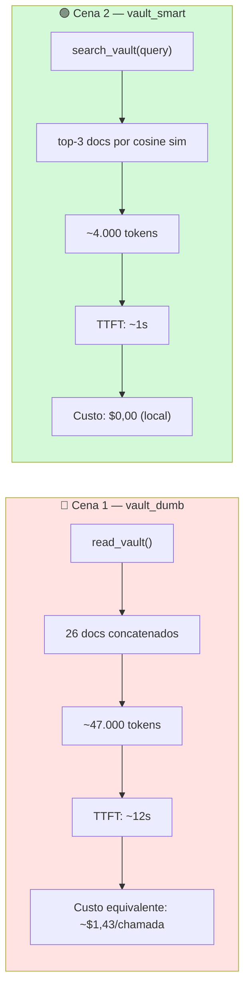
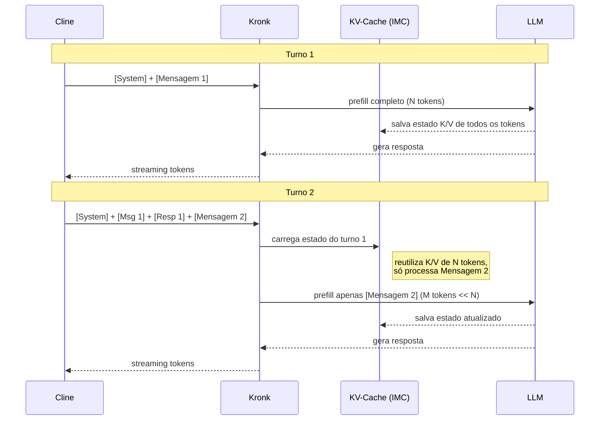
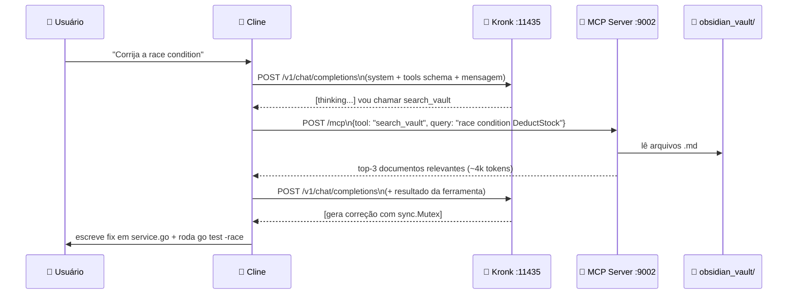
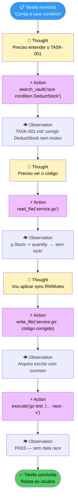
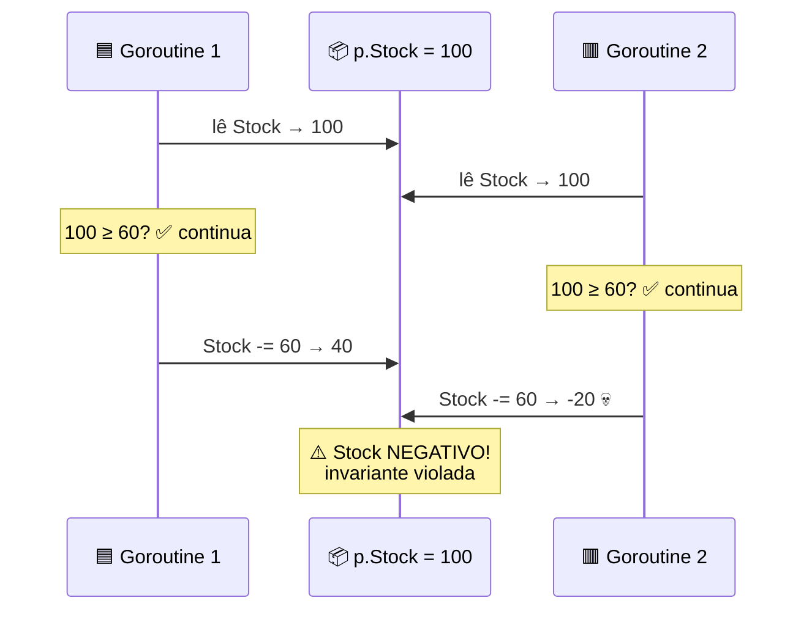
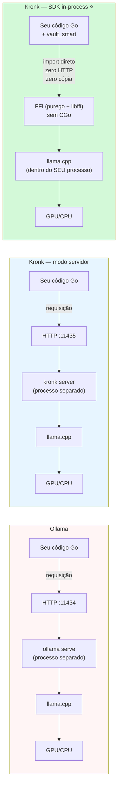
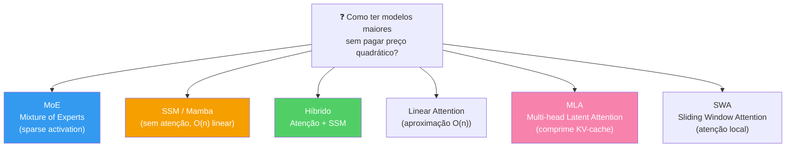

# IA sem Nuvem, em Golang — Guia de Estudo Completo

> Guia técnico detalhado de toda a stack da talk GolangSP (2026).
> Verificado contra código e benchmarks desta máquina (MacBook M4 Pro, 48 GB, Metal, Kronk 1.28.5, llama.cpp b9789).

---

## Índice

1. [O Problema: Por Que Contexto É Tudo](#cap-1)
2. [Fundamentos: Como um LLM Funciona por Dentro](#cap-2)
3. [Quantização: Comprimindo Bilhões de Números](#cap-3)
4. [Mixture of Experts (MoE): A Arquitetura por Trás do gpt-oss-20b](#cap-4)
5. [Transformer: a Mecânica Real de um Token](#cap-5)
6. [KV-Cache: Por Que o Modelo "Lembra" da Conversa](#cap-6)
7. [Offload de Camadas: CPU vs GPU vs Híbrido](#cap-7)
8. [Memória Unificada vs VRAM Dedicada — Como Muda o Jogo no M4 Pro](#cap-8)
9. [Kronk: Anatomia Completa do Servidor](#cap-9)
10. [model_config.yaml: Cada Parâmetro Explicado](#cap-10)
11. [Benchmarks Reais: O que Medimos e Por Que](#cap-11)
12. [MCP: O Protocolo que Liga Tudo](#cap-12)
13. [vault_dumb: O Servidor Ingênuo (Cena 1)](#cap-13)
14. [vault_smart: Embeddings + DuckDB + HNSW (Cena 2)](#cap-14)
15. [Busca Vetorial: Como a Similaridade de Cosseno Funciona de Verdade](#cap-15)
16. [Whisper no Kronk: o bucky (novo na 1.28.5)](#cap-16)
17. [Curiosidades e Detalhes que Ninguém Conta](#cap-17)
18. [Glossário de Sobrevivência](#cap-18)
19. [llama.cpp por Dentro + Como o Go se Conecta Sem CGo](#cap-19)
20. [Linha a Linha: Os MCPs, o Obsidian e o Kronk](#cap-20)
21. [O Universo dos Modelos: Origens, Curiosidades, Abertos e Fechados](#cap-21)
22. [Tamanhos, Densidade e o que os Números Realmente Significam](#cap-22)
23. [PyTorch e Hugging Face: o Ecossistema que o llama.cpp Desafiou](#cap-23)
24. [Tokenização: Como Texto Vira Número](#cap-24)
25. [Cline: o Agente que Dirige o Demo](#cap-25)
26. [O Loop ReAct: Como o Agente Pensa](#cap-26)
27. [A Race Condition: o Bug que o Agente Corrige](#cap-27)
28. [Kronk vs Ollama: Por Que Não Só Usar o Ollama?](#cap-28)
29. [Além do MoE: Outras Arquiteturas de LLM](#cap-29)

---

<a name="cap-1"></a>
## Capítulo 1 — O Problema: Por Que Contexto É Tudo

### O que é contexto em um LLM

Um modelo de linguagem não tem memória persistente. Cada vez que você fala com ele, você manda uma janela de texto — chamada de **contexto** — e ele gera a continuação. O contexto é literalmente tudo que ele "sabe" naquele momento: o histórico da conversa, as instruções do sistema, os documentos que você colou, as respostas de ferramentas MCP.

**Implicação direta:** tudo que está no contexto tem custo (tempo de compute + dinheiro em APIs de nuvem). Tudo que não está, o modelo simplesmente não vê.

### A janela de contexto

Cada modelo tem um limite máximo, medido em **tokens** (unidades de texto que podem ser palavras, sílabas, ou símbolos — depende do tokenizador). O `gpt-oss-20b-Q8_0` que usamos nessa talk suporta até **32.768 tokens** de contexto (configurado em `context-window: 32768` no `model_config.yaml`). Modelos maiores como o `gemma-4-26B-A4B` e o `Qwen3.6-35B` que temos configurados (mas não baixados) suportam até **131.072 tokens**.

Um token equivale, em média, a 3/4 de uma palavra em inglês. Em português, que tem palavras mais longas, a proporção é um pouco menor — pense em ~2/3 de palavra por token como estimativa.

### Por que mandar tudo é caro

O custo de processar o contexto cresce de forma **quadrática** com o comprimento — não linear. Isso é resultado direto da atenção do transformer (veremos no Cap. 5): cada token precisa se relacionar com todos os outros tokens. Dobrar o contexto não é dobrar o trabalho — é mais do que isso.

Na prática, nos nossos benchmarks:

| Prompt | Tokens | TTFT (Metal) |
|--------|--------|--------------|
| Curto  | 81     | ~300ms       |
| Médio  | 2.034  | ~2.2s        |
| Stress | 9.084  | ~12s         |

De 81 para 9.084 tokens (112x mais tokens) → TTFT vai de 300ms para 12s (40x mais lento). Não é linear. É a atenção fazendo O(n²) trabalho.

### A lição central

**Você não quer o maior contexto possível. Você quer o contexto mais relevante possível.**

Essa é a diferença entre o `vault_dumb` (manda os 26 documentos do vault inteiros, ~47k tokens) e o `vault_smart` (manda só os 3 mais relevantes, ~4k tokens). Mesma pergunta, resultado comparável, 10x menos tokens.



---

<a name="cap-2"></a>
## Capítulo 2 — Fundamentos: Como um LLM Funciona por Dentro

### Um modelo é uma função matemática gigante

Na essência, um LLM é uma função: recebe uma sequência de tokens, devolve uma distribuição de probabilidade sobre o vocabulário (tipicamente ~100k palavras/subpalavras possíveis). O token com a probabilidade mais alta (ou amostrado de forma controlada via temperatura) é escolhido, adicionado ao contexto, e o processo se repete.

### Parâmetros = Pesos = Números

Tudo que um modelo "aprendeu" está codificado em **bilhões de números de ponto flutuante** — chamados de pesos ou parâmetros. O `gpt-oss-20b` tem **20 bilhões de parâmetros**. Em precisão total (float32, 4 bytes por número), isso seria 80GB só de pesos. Por isso a quantização é indispensável — voltamos nisso no Cap. 3.

### O formato GGUF

**GGUF** (GPT-Generated Unified Format) é o formato de arquivo binário que o llama.cpp usa para armazenar e carregar modelos de linguagem. Um único arquivo `.gguf` contém absolutamente tudo que o modelo precisa para rodar — pesos, tokenizador, metadados de arquitetura e configurações de quantização.

#### A história: por que GGUF existe

O llama.cpp começou em março de 2023 usando um formato chamado **GGML** (o mesmo nome da biblioteca de tensores subjacente). O problema do GGML era que ele não tinha versionamento: toda vez que a biblioteca mudava a forma de organizar tensores, os arquivos antigos quebravam e precisavam ser convertidos manualmente. Não havia metadados ricos — o tipo de arquitetura, o tokenizador, o tamanho de contexto — tudo isso tinha que ser passado via linha de comando ou deduzido pelo nome do arquivo.

Em **agosto de 2023**, Georgi Gerganov (criador do llama.cpp) introduziu o GGUF como substituto definitivo. O GGUF é projetado para ser:

- **Extensível sem quebrar compatibilidade** — novos metadados podem ser adicionados sem quebrar leitores antigos
- **Self-contained** — o arquivo sabe tudo sobre si mesmo, sem dependências externas
- **Versionado** — cada arquivo tem um número de versão, e leitores detectam incompatibilidade imediatamente

O GGML está morto para modelos. Se você encontrar um arquivo `.bin` ou `.ggml` antigo, ele não funciona no llama.cpp moderno e por extensão no Kronk.

#### Estrutura interna de um arquivo GGUF

Um arquivo GGUF tem quatro seções em sequência:

```
┌─────────────────────────────────────────────────┐
│  MAGIC NUMBER  (4 bytes: 0x47 0x47 0x55 0x46)  │  ← literalmente "GGUF" em ASCII
│  VERSION       (4 bytes: uint32, atualmente 3)  │
│  TENSOR COUNT  (8 bytes: uint64)                │
│  KV COUNT      (8 bytes: uint64)                │
├─────────────────────────────────────────────────┤
│  KEY-VALUE METADATA                             │
│  ┌──────────────────────────────────────────┐   │
│  │  "general.architecture"  = "qwen2moe"   │   │
│  │  "general.name"          = "gpt-oss-20b" │   │
│  │  "qwen2moe.context_length" = 32768       │   │
│  │  "qwen2moe.embedding_length" = 4096      │   │
│  │  "qwen2moe.block_count"  = 28            │   │
│  │  "qwen2moe.attention.head_count" = 32    │   │
│  │  "qwen2moe.attention.head_count_kv" = 8  │   │
│  │  "tokenizer.ggml.model" = "gpt2"         │   │
│  │  "tokenizer.ggml.tokens" = [...]         │   │  ← o vocabulário inteiro
│  │  "tokenizer.ggml.merges" = [...]         │   │  ← as regras de BPE
│  │  "tokenizer.ggml.bos_token_id" = 151643  │   │
│  │  "tokenizer.ggml.eos_token_id" = 151645  │   │
│  └──────────────────────────────────────────┘   │
├─────────────────────────────────────────────────┤
│  TENSOR INFO (índice)                           │
│  ┌──────────────────────────────────────────┐   │
│  │  Para cada tensor:                       │   │
│  │  - nome (string): "blk.0.attn_q.weight"  │   │
│  │  - número de dimensões: 2                │   │
│  │  - shape: [4096, 4096]                   │   │
│  │  - tipo: Q8_0 (enum)                     │   │
│  │  - offset no arquivo (bytes)             │   │
│  └──────────────────────────────────────────┘   │
├─────────────────────────────────────────────────┤
│  DADOS DOS TENSORES                             │
│  (bloco alinhado em 32 bytes para mmap)         │
│  blk.0.attn_q.weight   [bytes quantizados...]   │
│  blk.0.attn_k.weight   [bytes quantizados...]   │
│  blk.0.attn_v.weight   [bytes quantizados...]   │
│  ...                                            │
│  (centenas de tensores)                         │
└─────────────────────────────────────────────────┘
```

#### O que cada seção faz na prática

**Magic number + versão:** os primeiros 4 bytes são sempre `GGUF` em ASCII (0x47 0x47 0x55 0x46). O llama.cpp verifica isso antes de ler qualquer outra coisa. Se errar, rejeita o arquivo imediatamente com erro claro. A versão (atualmente 3) controla o formato do KV metadata — versões mais antigas não suportavam algumas chaves que versões novas usam.

**Key-Value metadata:** um dicionário onde a chave é sempre uma string e o valor pode ser qualquer tipo primitivo (uint32, int64, float32, string, array de strings, etc.). É aqui que ficam:
- A arquitetura (`general.architecture = "qwen2moe"`) — diz ao llama.cpp qual código de forward pass usar
- As dimensões do modelo (embedding length, block count, feed-forward length, etc.)
- O tokenizador completo embutido — vocabulário de tokens, regras de merge (BPE), tokens especiais (BOS, EOS, PAD)
- O tamanho de contexto que o modelo foi treinado para suportar
- Rope frequency base e scale (para RoPE e YaRN)
- O tipo de quantização padrão dos tensores

**Tensor info (índice):** uma lista de todos os tensores com seus nomes, shapes e offset exato em bytes dentro do arquivo. O llama.cpp lê isso primeiro e constrói um mapa de onde cada tensor está. Isso permite carregar tensores específicos sem ler o arquivo inteiro — importante para modelos grandes onde você quer carregar algumas camadas na GPU e outras na CPU.

**Dados dos tensores:** os bytes brutos dos pesos quantizados, alinhados em 32 bytes. O alinhamento é crítico para `mmap` — o sistema operacional pode mapear páginas diretamente do arquivo para a memória virtual sem copiar. Isso é o que permite carregar um arquivo de 12GB "instantaneamente": o SO mapeia o arquivo virtualmente, e as páginas só são lidas do disco quando são acessadas pela primeira vez (demand paging). Se o modelo já estiver no page cache (rodou antes), o carregamento é praticamente instantâneo.

#### Por que o tokenizador está dentro do GGUF

Em formatos anteriores (GGML, e os formatos PyTorch originais), o tokenizador era um arquivo separado — um JSON com o vocabulário e as regras. Isso criava problemas:
- Fácil de usar o tokenizador errado com o modelo errado
- Precisava de dois downloads
- Versões podiam descompassar

No GGUF, o tokenizador está embutido no metadata. Quando o Kronk abre `gpt-oss-20b-Q8_0.gguf`, ele já tem tudo — vocabulário de ~150k tokens, as regras BPE de como combinar subpalavras, e os tokens especiais. Não há arquivo `tokenizer.json` separado, não há configuração adicional.

#### Nomes de tensores e a arquitetura

Os tensores têm nomes padronizados que o llama.cpp entende:
```
blk.0.attn_q.weight    ← camada 0, atenção, projeção Query
blk.0.attn_k.weight    ← camada 0, atenção, projeção Key
blk.0.attn_v.weight    ← camada 0, atenção, projeção Value
blk.0.attn_output.weight  ← camada 0, atenção, projeção de saída
blk.0.ffn_gate_exps.weight  ← camada 0, FFN, gate de todos os experts (MoE)
blk.0.ffn_up_exps.weight    ← camada 0, FFN, up projection de todos os experts
blk.0.ffn_down_exps.weight  ← camada 0, FFN, down projection de todos os experts
token_embd.weight           ← embedding table (tokens → vetores)
output_norm.weight          ← normalização final
output.weight               ← LM head (vetores → logits sobre vocabulário)
```

Para um MoE como o gpt-oss-20b, o `ffn_gate_exps.weight` é um tensor 3D com shape `[n_experts, d_model, d_ffn]` — todos os 32 experts empilhados num único tensor. O router decide quais fatias desse tensor ativar.

#### Sharding: modelos em múltiplos arquivos

Modelos muito grandes (70B+) às vezes são distribuídos em múltiplos arquivos `.gguf`:
```
llama-3.1-70b-Q4_K_M-00001-of-00009.gguf
llama-3.1-70b-Q4_K_M-00002-of-00009.gguf
...
llama-3.1-70b-Q4_K_M-00009-of-00009.gguf
```

O llama.cpp (e o Kronk) lê todos em sequência, tratando os tensores como se fossem um arquivo único. É por isso que o `model.WithModelFiles([]string{...})` no vault_smart aceita uma slice de paths — em modelos shardados, você passa todos os arquivos.

#### Onde o gpt-oss-20b fica em disco

```
~/.kronk/models/ggml-org/gpt-oss-20b-Q8_0-GGUF/
    gpt-oss-20b-Q8_0.gguf   (~12.1 GB)
```

O tamanho (12.1GB) parece pequeno para 20B parâmetros em Q8_0 (que deveria ser ~20GB). A diferença vem da arquitetura MoE: os tensores de roteamento (`ffn_gate_inp`, etc.) são pequenos (d_model × n_experts = 4096 × 32 = ~500k parâmetros por camada, não 20B). E os experts em si, quando somados, têm menos parâmetros totais do que um FFN denso de modelo equivalente em qualidade. A soma real de parâmetros com pesos de atenção + embedding + experts ≈ 20B × ~0.6 bytes médios (por causa do roteador ocupar muito menos espaço) = ~12GB. O header, metadados e tokenizador embutido somam menos de 10MB — desprezível.

---

<a name="cap-3"></a>
## Capítulo 3 — Quantização: Comprimindo Bilhões de Números

### O problema: float32 não cabe

Pesos de redes neurais são treinados em float32 (4 bytes por número) ou bfloat16 (2 bytes). Para 20B parâmetros:

- **float32**: 20B × 4 bytes = **80 GB**
- **bfloat16**: 20B × 2 bytes = **40 GB**
- **Q8_0**: 20B × ~1 byte = **~20 GB** (na prática ~12GB com overhead)
- **Q4_K_M**: 20B × ~0.5 bytes = **~10 GB**

Sem quantização, roda na memória de quem? Nos nossos 48GB do M4 Pro, um bfloat16 caberia justo (40GB + sistema + contexto = estoura). Q8_0 é o ponto doce para qualidade máxima com tamanho gerenciável.

### Como funciona Q8_0

**Q8_0** mapeia blocos de 32 float32 para 8-bit integers + 1 float32 de escala por bloco:

```
Bloco original: [0.23, -0.87, 0.45, ..., 0.12]  (32 floats × 4 bytes = 128 bytes)
                ↓
Escala: max(|valores|) → por exemplo 0.97
Int8s: cada valor / escala → arredondado para -127..127
                ↓
Bloco quantizado: 1 float32 (escala, 4 bytes) + 32 int8 (32 bytes) = 36 bytes
```

Compressão real por bloco: 128 bytes → 36 bytes ≈ **3.5x** menor. A perda de qualidade é mínima porque redes neurais são naturalmente robustas a pequenos erros de arredondamento nos pesos (foram treinadas com ruído, afinal).

### Q4_K_M: ainda menor, um pouco mais de perda

**Q4_K_M** usa 4 bits por peso (valores -8..7 ou similar), com blocos maiores e duas escalas aninhadas (por isso o `K` e `M` no nome — K-quants, mixed precision). Resultado:

- ~2x mais compacto que Q8_0
- Perda de qualidade mensurável em tarefas de raciocínio matemático e código complexo
- Para prosa e tarefas simples, a diferença é desprezível

Na prática para esse demo: **Q8_0** para o modelo de chat (máxima qualidade), **Q8_0** também para o modelo de embedding (embeddings são muito sensíveis a perda de precisão — vetores deslocados = busca errada).

### O sufixo no nome do modelo

```
gpt-oss-20b-Q8_0
         └─────── Tipo de quantização
      └────────── Número de parâmetros (20 bilhões)
└──────────────── Nome do modelo
```

`embeddinggemma-300m-qat-Q8_0`:
- `300m` = 300 milhões de parâmetros (é um modelo bem pequeno!)
- `qat` = Quantization-Aware Training (foi treinado sabendo que ia ser quantizado — menos perda que quantizar depois)
- `Q8_0` = quantização 8-bit

### Por que o embedding model é tão pequeno

Modelos de embedding não precisam gerar texto — eles só precisam mapear texto para um vetor de números. Isso é uma tarefa muito mais simples. O `embeddinggemma-300m` com seus 300M parâmetros produz vetores de **768 dimensões** e é excelente nisso, mesmo sendo 66x menor que o gpt-oss-20b.

---

<a name="cap-4"></a>
## Capítulo 4 — Mixture of Experts (MoE): A Arquitetura por Trás do gpt-oss-20b

### O problema que MoE resolve

Modelos densos tradicionais (tipo Llama 3.1 70B) ativam **100% dos parâmetros** para cada token gerado. Mais parâmetros = mais capacidade, mas o custo computacional cresce linearmente com o tamanho do modelo.

MoE quebra essa relação. Você pode ter um modelo com muitos parâmetros mas só ativar uma fração deles a cada token.

### Como funciona: experts + router

Em uma camada MoE, a FFN (Feed-Forward Network) tradicional é substituída por **N experts** paralelos — cada um é uma FFN independente, com seus próprios pesos. Um componente extra, o **router** (ou gating network), decide quais experts ativar para cada token.

O `gpt-oss-20b` tem **32 experts**, dos quais apenas **4 são ativados por token**.

```mermaid
flowchart TD
    Token["Token de entrada\n(vetor 4096-dim)"]
    Router["🎯 Router / Gating Network\n(matriz 4096 × 32 → softmax)"]

    E1["Expert 0\n❌ inativo"]
    E2["Expert 1\n❌ inativo"]
    E3["Expert 2\n❌ inativo"]
    E4["Expert 3\n✅ ativo"]
    E5["Expert 4\n❌ inativo"]
    Edot["... (27 experts)"]
    E17["Expert 17\n✅ ativo"]
    E28["Expert 28\n✅ ativo"]
    E31["Expert 31\n✅ ativo"]

    Combine["Σ Combinação ponderada\n(pesos do router)"]
    Output["Token de saída\n(vetor 4096-dim)"]

    Token --> Router
    Router -->|"score baixo"| E1
    Router -->|"score baixo"| E2
    Router -->|"score baixo"| E3
    Router -->|"top-4"| E4
    Router -->|"score baixo"| E5
    Router -->|"..."| Edot
    Router -->|"top-4"| E17
    Router -->|"top-4"| E28
    Router -->|"top-4"| E31

    E4 --> Combine
    E17 --> Combine
    E28 --> Combine
    E31 --> Combine
    Combine --> Output

    style E4 fill:#51cf66,color:#000
    style E17 fill:#51cf66,color:#000
    style E28 fill:#51cf66,color:#000
    style E31 fill:#51cf66,color:#000
    style E1 fill:#dee2e6,color:#666
    style E2 fill:#dee2e6,color:#666
    style E3 fill:#dee2e6,color:#666
    style E5 fill:#dee2e6,color:#666
    style Router fill:#339af0,color:#fff
``` Isso significa:

- **Parâmetros totais**: 20B (todos os experts existem em memória)
- **Parâmetros ativos por token**: ~20B × (4/32) = ~2.5B equivalentes
- **Custo computacional por token**: parecido com um modelo denso de 2-3B parâmetros

### A vantagem prática: qualidade de modelo grande, velocidade de modelo pequeno

É por isso que o gpt-oss-20b gera tokens a ~65-70 tok/s no Metal mesmo sendo "20B". A geração de texto (fase de decoding, token por token) usa só os 4 experts ativos — como se fosse um modelo bem menor.

### O custo real: o prefill

A fase de **prefill** (processar o prompt inicial inteiro antes de começar a gerar) é onde o MoE paga o preço maior. Para cada token do prompt, o router precisa ativar 4 dos 32 experts. O routing em si tem custo (é uma multiplicação de matriz pequena), e o custo total de prefill cresce com o número de tokens do prompt.

É exatamente isso que explica por que aumentar `nbatch`/`nubatch` só ganhou ~6% no nosso stress test: o gargalo não é "quantos tokens processamos de uma vez" (batch size), é o **compute do kernel Metal para o routing de experts**. É compute-bound, não memory-bandwidth-bound.

### Split-mode para multi-GPU (irrelevante aqui, mas vale saber)

Em máquinas com múltiplas GPUs, o `split-mode: row` (recomendado para MoE) distribui cada expert por linha de tensor entre as GPUs — no lugar de distribuir camadas inteiras (que é o padrão para modelos densos). Isso é mais eficiente para MoE porque evita que uma GPU fique ociosa esperando outra terminar de processar um expert inteiro.

No M4 Pro com Metal, temos uma única GPU unificada, então isso não se aplica. Mas é um detalhe importante para quem vai rodar em máquinas com múltiplas GPUs.

### moe.mode: offload seletivo de experts

O Kronk tem uma opção `moe.mode` que não está no nosso `model_config.yaml` atual porque não precisamos no M4, mas é poderosa:

- **`auto`**: deixa o llama.cpp decidir
- **`experts_cpu`**: mantém todos os experts na CPU, só o router e o resto do modelo na GPU — permite rodar um MoE gigante numa GPU pequena (VRAM fica só com as camadas não-expert)
- **`experts_gpu`**: o contrário (default)
- **`keep_top_n`**: mantém só os N experts mais frequentemente ativados na GPU, manda o resto para CPU

Isso é uma ferramenta real para rodar modelos MoE maiores que a VRAM de uma GPU dedicada.

---

<a name="cap-5"></a>
## Capítulo 5 — Transformer: a Mecânica Real de um Token

### Por que isso importa para o demo

Entender a mecânica do transformer explica diretamente:
- Por que o TTFT (tempo até o primeiro token) cresce com o tamanho do prompt
- Por que flash attention faz diferença
- Por que o KV-cache existe

### Atenção: o coração do transformer

Para cada token de entrada, a atenção calcula três vetores:
- **Q (Query)**: "o que este token está procurando?"
- **K (Key)**: "o que este token oferece para outros procurarem?"
- **V (Value)**: "o que este token passa adiante se for encontrado?"

A atenção de um token contra todos os outros tokens do contexto é:

```
Attention(Q, K, V) = softmax(QKᵀ / √d_k) × V
```

O `QKᵀ` é uma multiplicação de matrizes que compara o Query do token atual com os Keys de **todos** os tokens anteriores. Se o contexto tem N tokens, isso é uma operação N×N — daí o custo quadrático com o comprimento do contexto.

### Flash Attention: reescrevendo a conta sem memória intermediária

A atenção padrão precisa materializar a matriz N×N inteira na memória para aplicar o softmax. Para contextos longos, essa matriz pode ser enorme (e não cabe na SRAM da GPU).

**Flash Attention** reescreve o algoritmo para calcular a atenção em blocos, usando só a SRAM rápida da GPU, sem materializar a matriz N×N completa na VRAM lenta. O resultado matemático é idêntico, mas:

- Usa muito menos memória de GPU
- É significativamente mais rápido para contextos longos porque evita idas e vindas à VRAM

Por que forçamos `flash-attention: enabled` (não `auto`) no `gpt-oss-20b`?

```yaml
# do model_config.yaml:
flash-attention: enabled  # forçado, não "auto" — gpt-oss mistura atenção full/sliding-window por camada
```

O `gpt-oss-20b` mistura dois tipos de atenção por camada: atenção **full** (padrão, olha todo o contexto) e atenção **sliding-window** (olha só uma janela local). Com `auto`, o llama.cpp às vezes desabilita flash attention quando detecta sliding-window, perdendo o ganho. Forçar `enabled` garante que flash attention é usado em todas as camadas onde é aplicável.

### Sliding-Window Attention (SWA)

Alguns modelos (como o gpt-oss-20b e Gemma) usam atenção de janela deslizante em algumas camadas: em vez de atender a todo o contexto, cada token só "vê" os W tokens mais recentes (W é a largura da janela). Isso reduz o custo computacional dessas camadas de O(N²) para O(N×W).

O tradeoff: tokens muito antigos no contexto têm influência indireta (passam por camadas que têm atenção full), não direta nas camadas SWA. Na prática, para a maioria das tarefas, não faz diferença perceptível.

O parâmetro `swa-full` no Kronk controla se as camadas SWA usam o cache completo ou só a janela — `true` (padrão atual) mantém o cache completo para essas camadas, o que é mais seguro mas usa mais memória.

---

<a name="cap-6"></a>
## Capítulo 6 — KV-Cache: Por Que o Modelo "Lembra" da Conversa

### O problema sem cache

Em um agente como Cline, cada turno de conversa reenvia **todo o histórico** junto com a nova mensagem. Sem cache, o modelo processaria o histórico inteiro do zero a cada turno. Se a conversa tem 10 turnos, o turno 10 processa 10x mais tokens de histórico que o turno 1. Fica exponencialmente mais lento.

### O que o KV-Cache guarda

Durante o prefill de um prompt, para cada camada do transformer, os vetores **K** e **V** de cada token são calculados e armazenados em memória. Isso é o KV-Cache.

No próximo turno, se os primeiros N tokens do contexto são iguais aos do turno anterior (o histórico não mudou), o modelo pode **reutilizar** os K e V calculados anteriormente para esses N tokens, e só calcular K e V para os novos tokens (a mensagem nova do usuário + a resposta anterior).

### Incremental Message Cache (IMC) do Kronk

O Kronk tem um sistema mais sofisticado que o KV-cache simples: o **IMC (Incremental Message Cache)**, configurável com `incremental-cache: true` (é o padrão para uso agêntico).

O IMC guarda o **estado completo do KV-cache** ao final de cada turno de conversa. No turno seguinte, em vez de reprocessar o histórico token por token, ele carrega o estado salvo e só processa os tokens novos.

```yaml
# model_config.yaml
incremental-cache: false   # (comentário no arquivo como exemplo negativo)
                           # Na prática vem true por padrão no servidor
```



### session-store-kind: ram vs disk

Onde o estado do IMC fica:

- **`ram`** (padrão): mais rápido, mas perdido se o servidor reiniciar
- **`disk`**: persiste entre restarts, mas mais lento (I/O de disco)

Para o demo: `ram` é perfeito — a sessão dura o tempo do demo, não precisamos de persistência.

### max-cache-sessions

Quantas sessões de IMC simultâneas o servidor mantém. Padrão: 1. Aumentar se você tem múltiplos usuários simultâneos — cada um tem seu próprio estado de KV-cache. Para o demo com Cline, 1 é suficiente.

### offload-kqv: colocar o KV-cache na GPU

```yaml
offload-kqv: true
```

Os vetores K e V do cache ficam na VRAM (ou memória unificada no M4) em vez da RAM da CPU. É mais rápido porque evita copiar dados entre CPU e GPU a cada token gerado. Em GPU dedicada com VRAM limitada, pode ser necessário desligar para liberar VRAM para os pesos do modelo.

### cache-type-k e cache-type-v: quantizar o cache também

```yaml
cache-type-k: q8_0   # (opção disponível, não usamos no demo)
cache-type-v: q8_0
```

Os vetores K e V também podem ser quantizados! Isso reduz o consumo de memória do cache (especialmente para contextos longos) com alguma perda de precisão. `q8_0` é o mais seguro. `q4_0` comprime mais mas pode degradar qualidade de raciocínio em tarefas longas.

---

<a name="cap-7"></a>
## Capítulo 7 — Offload de Camadas: CPU vs GPU vs Híbrido

### ngpu-layers: a configuração mais importante

```yaml
gpt-oss-20b-Q8_0:
  ngpu-layers: 0   # 0 = TODAS as camadas na GPU
```

**Atenção à convenção invertida:** esta é a pegadinha que pega muita gente:

| Valor | Significado |
|-------|-------------|
| `0` ou omitido | **Todas** as camadas na GPU |
| `-1` | **Nenhuma** camada na GPU (força CPU puro) |
| `N > 0` | Exatamente N camadas na GPU, resto na CPU |

Isso é uma convenção do llama.cpp que o Kronk herda. É contra-intuitivo: `0` não é "zero camadas na GPU" — é "não limite, manda tudo".

### Como o offload híbrido funciona

Um modelo como o gpt-oss-20b tem 28 camadas de transformer (blocos). Com `ngpu-layers: 14` (por exemplo):

- Camadas 0-13: pesos ficam na GPU (VRAM/memória unificada)
- Camadas 14-27: pesos ficam na CPU (RAM)
- Durante a inferência: dados passam da GPU para CPU a cada camada que "cruzar a fronteira"

O custo do híbrido é a **latência de transferência** entre CPU e GPU. Em GPU dedicada (PCIe), essa transferência é lenta (PCIe bandwidth). Em Apple Silicon (memória unificada), a transferência é muito mais barata porque CPU e GPU compartilham o mesmo bus de memória — não há cópia de dados real, só mudança de "quem acessa".

### op-offload: operações auxiliares na GPU

```yaml
op-offload: true
```

Além dos pesos das camadas, existem operações auxiliares (normalização, embedding lookup, softmax final) que por padrão ficam na CPU. `op-offload: true` manda essas operações também para a GPU, reduzindo sincronizações e melhorando throughput. Em Metal/Apple Silicon, isso tem ganho mensurável.

### Por que full offload no M4 é seguro

O gpt-oss-20b-Q8_0 ocupa ~12GB de pesos. O KV-cache para 32k tokens de contexto adiciona alguns GB. O sistema operacional precisa de ~8GB. Total: ~22-25GB de um orçamento de 48GB.

Com 48GB de memória unificada e o Kronk usando 80% (~38.7GB como mostrado no log de inicialização), sobra bastante para o modelo inteiro na GPU, KV-cache, e ainda carregar o modelo de embedding simultaneamente.

---

<a name="cap-8"></a>
## Capítulo 8 — Memória Unificada vs VRAM Dedicada

### VRAM dedicada: o teto rígido

Em uma GPU dedicada (RTX 4070 Ti com 12GB de VRAM), o modelo inteiro precisa **caber na VRAM** para rodar 100% na GPU. Isso inclui:

- Pesos do modelo
- KV-cache (cresce com o contexto!)
- Buffers de computação

O gpt-oss-20b-Q8_0 em ~12GB de pesos **não cabe** numa RTX 4070 Ti de 12GB quando você soma o KV-cache e os buffers. O que acontece: o Kronk usa offload híbrido (parte na GPU, parte na CPU), reduzindo velocidade. Foi exatamente o cenário original da talk — antes de migrar para o M4 Pro.

### Memória unificada: sem teto rígido de VRAM

No Apple Silicon (M1/M2/M3/M4), CPU e GPU compartilham a mesma memória física. Não existe "VRAM separada" — é tudo o mesmo pool de 48GB (no nosso caso).

Benefícios:
1. Sem custo de cópia CPU↔GPU: é acesso ao mesmo banco de memória
2. KV-cache pode crescer sem estoura de VRAM
3. Múltiplos modelos simultâneos (gpt-oss + embeddinggemma) sem fragmentação

O custo: a GPU do M4 Pro não tem a largura de banda de uma GPU dedicada high-end. Uma RTX 4090 tem ~1TB/s de bandwidth; o M4 Pro tem ~273GB/s. Mas essa diferença importa menos do que parece para modelos que são compute-bound (como o MoE na fase de prefill).

### O número que o Kronk nos deu

No log de inicialização:
```
"status":"resman-init","budget-percent":80,"ram-budget":"38.7GB","max-models-in-pool":10
```

80% de 48GB = 38.4GB (o log mostrou 38.7 por conta de como o Kronk lê a memória disponível no momento). Esse é o orçamento máximo que o pool de modelos pode usar. O restante (~9GB) fica livre para o sistema operacional e outros processos.

---

<a name="cap-9"></a>
## Capítulo 9 — Kronk: Anatomia Completa do Servidor

### O que o Kronk é

Kronk (`github.com/ardanlabs/kronk`) é um **SDK + servidor em Go** da Ardan Labs que envolve o `llama.cpp`. Ele expõe uma API compatível com a OpenAI, gerencia um pool de modelos, autentica requisições, emite métricas, e desde a versão 1.28.5, também integra o `whisper.cpp` para transcrição de áudio.

É diferente de apenas rodar o llama.cpp direto porque adiciona:
- Pool de modelos com TTL e gestão de memória
- API REST compatível com OpenAI
- Autenticação (JWT/API keys)
- Métricas Prometheus
- Tracing OpenTelemetry (Tempo)
- Servidor MCP nativo (porta 9000)
- Suporte a embedding e reranking além de chat
- IMC (Incremental Message Cache) para agentes
- Interface web (Browser UI) em http://localhost:11435

### O que sobe quando você dá `kronk server start`

```bash
KRONK_PROCESSOR=metal ~/go/bin/kronk server start
```

Quatro componentes principais sobem:

```
"status":"api router started","host":"0.0.0.0:11435"
"status":"debug v1 router started","host":"0.0.0.0:11445"
"status":"local mcp server started","host":"127.0.0.1:9000"
"status":"start auth server"
```

**11435** — A API principal. Aqui ficam:
- `POST /v1/chat/completions` — geração de texto (compatível OpenAI)
- `POST /v1/embeddings` — vetores de embedding
- `GET /v1/kronk/models` — lista de modelos disponíveis
- `GET /v1/kronk/models/catalog` — catálogo para download
- Endpoints do bucky (whisper): `/v1/bucky/...`
- A Browser UI: abrir `http://localhost:11435` no navegador

**11445** — Router de debug:
- Métricas Prometheus: `http://localhost:11445/metrics`
- pprof: `http://localhost:11445/debug/pprof/`
- Health check

**9000** — Servidor MCP nativo do Kronk. O próprio Kronk se expõe via MCP para que agentes possam gerenciar modelos, ver o pool, etc. Não confundir com as portas 9001/9002 dos nossos servidores de demo.

**Auth server** — Desabilitado por padrão para uso local. Quando ativado (`--auth-local-enabled`), emite JWTs para autenticar requisições.

### O novo flag -d / --detach (1.28.5)

```bash
KRONK_PROCESSOR=metal ~/go/bin/kronk server start -d
```

Antes de 1.28.5, para rodar em background era necessário usar `&` no shell e redirecionar logs manualmente. Agora:

```bash
kronk server start -d          # sobe em background
kronk server logs               # stream de logs do processo em background
kronk server stop               # para o processo
```

Para o demo, isso simplifica o boot: sem `&`, sem `> /tmp/kronk.log 2>&1`.

### Pool de modelos: como o carregamento funciona

O Kronk **não carrega nenhum modelo na inicialização**. O pool começa vazio. O modelo é carregado **na primeira requisição** que o pede:

1. Requisição chega com `"model": "gpt-oss-20b-Q8_0"`
2. Kronk verifica se o modelo está no pool → não está
3. Kronk localiza o arquivo `.gguf` em `~/.kronk/models/...`
4. Kronk verifica se cabe no orçamento de memória → sim, 12GB < 38.7GB
5. Kronk carrega o modelo (demora alguns segundos na primeira vez)
6. Resposta é gerada e devolvida
7. Modelo fica no pool com TTL de 20 minutos (padrão)

Se uma segunda requisição vier antes do TTL expirar, o modelo já está quente — zero latência de carregamento.

### Múltiplos modelos no pool

Durante o demo, dois modelos estão no pool simultaneamente:

- `gpt-oss-20b-Q8_0`: ~12GB para o Cline (chat)
- `embeddinggemma-300m-qat-Q8_0`: ~300MB para o vault_smart (embeddings)

Total: ~12.3GB de 38.7GB de orçamento. Sobra muito espaço.

```bash
kronk model ps   # mostra o que está carregado AGORA
```

### Como o modelo é escolhido

O modelo **não** é escolhido no boot do servidor. É escolhido **por requisição**, no campo `model` do body JSON:

```json
POST /v1/chat/completions
{
  "model": "gpt-oss-20b-Q8_0",
  "messages": [...]
}
```

No Cline, o campo "Model ID" nas configurações do provider é exatamente isso — vai para o campo `model` de cada requisição.

### Versões e compatibilidade das libs

O Kronk usa bibliotecas compartilhadas do `llama.cpp` que ele mesmo baixa e gerencia:

```
~/.kronk/libraries/darwin/arm64/metal/
    libllama.dylib   (build b9789 após atualização de hoje)
```

Ao atualizar o Kronk de 1.27.2 para 1.28.5, as libs também foram atualizadas automaticamente de b9496 para b9789. A versão das libs determina:
- Quais arquiteturas de modelo são suportadas
- Versão do kernel Metal usada
- Suporte a novas features (como `swa-full`, `proj-on-cpu` para modelos multimodais, etc.)

---

<a name="cap-10"></a>
## Capítulo 10 — model_config.yaml: Cada Parâmetro Explicado

O arquivo vive em `~/.kronk/models/model_config.yaml` (global, fora do repo git). Aqui está cada parâmetro que aparece no nosso arquivo, mais os relevantes do cabeçalho de comentários:

### Parâmetros que usamos

```yaml
gpt-oss-20b-Q8_0:
  ngpu-layers: 0
```
**Camadas na GPU.** `0` = todas. Veja Cap. 7.

```yaml
  flash-attention: enabled
```
**Flash Attention forçado.** Opções: `enabled`, `disabled`, `auto`. Forçamos `enabled` porque gpt-oss mistura full/SWA por camada e `auto` desabilita inconsistentemente. Veja Cap. 5.

```yaml
  offload-kqv: true
```
**KV-cache na GPU.** `true` = os vetores K e V ficam na memória da GPU, não na RAM da CPU. Mais rápido, usa memória da GPU.

```yaml
  op-offload: true
```
**Operações auxiliares na GPU.** Normalização, embeddings de token, softmax final. Reduz sincronizações CPU↔GPU.

```yaml
  nbatch: 4096
```
**Batch lógico.** Quantos tokens são agrupados num único passo de processamento lógico. Valores maiores podem melhorar throughput mas usam mais memória. Aumentar de 512 para 4096 no nosso teste deu ~6% de melhora no TTFT — não valeu tanto quanto esperávamos.

```yaml
  nubatch: 2048
```
**Batch físico (micro-batch).** O batch lógico é dividido em micro-batches de `nubatch` tokens para processamento efetivo no hardware. O llama.cpp usa isso internamente para controlar ocupação do kernel.

```yaml
  context-window: 32768
```
**Janela de contexto máxima.** O modelo suporta até esse número de tokens no contexto. Reduzir economiza memória de KV-cache; aumentar além do treinamento do modelo requer YaRN (ver abaixo).

> **Atenção: se você omitir `context-window`, o Kronk usa o limite que está gravado nos metadados do próprio arquivo GGUF.**
>
> Isso parece conveniente, mas é uma armadilha silenciosa. Muitos GGUF modernos têm contextos declarados de 128k, 131k ou até 1M de tokens. Se o Kronk ler esse valor e tentar alocar o KV-cache correspondente na inicialização, você pode consumir dezenas de gigabytes de memória de uma vez, simplesmente ao carregar o modelo.
>
> Para o `gpt-oss-20b`, o GGUF declara suporte a 32.768 tokens — então omitir a chave funcionaria aqui. Mas para modelos como `Qwen3.6-35B-A3B` (que declara 131.072 tokens), **sem o `context-window` explícito, a alocação do KV-cache quadriplicaria** em relação a 32k, potencialmente estourando os 48GB desta máquina.
>
> Regra prática: **sempre especifique `context-window` explicitamente** para modelos com suporte a contexto longo. Use o menor valor que atende ao seu caso de uso — menos contexto = KV-cache menor = mais memória sobrando para pesos e ativações.

---

```yaml
embeddinggemma-300m-qat-Q8_0:
  ngpu-layers: 0
  flash-attention: enabled
  nubatch: 2048
  context-window: 2048
```

**Por que nubatch: 2048 para o embedding model?**

Encontramos dois documentos truncados no vault durante a preparação:
- `tasks/README.md`: 731 tokens — perdia a última seção inteira
- `TASK-001.md`: 516 tokens — perdia o final

O `nubatch` padrão (512) limitava quantos tokens eram processados de uma vez na fase de embedding. Com documentos acima de 512 tokens, o `truncate: true` do nosso código cortava o excedente. Subir para 2048 (o limite de contexto real do modelo) corrigiu o problema.

Lição: `nubatch` baixo em modelo de embedding = documentos longos são silenciosamente truncados antes de serem indexados.

---

### Parâmetros disponíveis mas não usados (que vale conhecer)

```yaml
  auto-fit-vram: false
```
Quando `true`, o Kronk estima automaticamente um `ngpu-layers` seguro baseado na VRAM disponível. Útil para rodar "o máximo que couber" sem configuração manual. Não usamos porque já sabemos que tudo cabe.

```yaml
  cache-type-k: q8_0
  cache-type-v: q8_0
```
Quantizar os vetores K e V do KV-cache. Reduz consumo de memória do cache com pequena perda de precisão. Vale para contextos muito longos (100k+ tokens) onde o cache fica gigante.

```yaml
  devices: [CUDA0, CUDA1]
```
Em máquinas multi-GPU, especificar quais dispositivos usar. Ver `kronk devices` para listar os disponíveis.

```yaml
  main-gpu: 0
```
Em multi-GPU, qual GPU recebe as camadas extras (e os buffers de computação). Padrão: GPU 0.

```yaml
  nseq-max: 0
```
Sequências paralelas para inferência em batch. `0` = padrão do llama.cpp. Nos modelos maiores configurados (Qwen3.6-35B, gemma-4-26B), usamos `nseq-max: 2` para permitir duas requisições simultâneas.

```yaml
  nthreads: 0
  nthreads-batch: 0
```
Threads de CPU para geração e para batch. `0` = o llama.cpp decide (usa os núcleos disponíveis). Em Metal, os pesos já estão na GPU então threads de CPU afetam menos. Ajustar pode ser útil para liberar núcleos de CPU para outros processos no mesmo servidor.

```yaml
  rope-freq-base: 1000000
  rope-freq-scale: 0.25
  rope-scaling-type: yarn
  yarn-orig-ctx: 32768
```
**YaRN (Yet another RoPE extension)** — técnica para estender o contexto além do que o modelo foi treinado. Se o modelo foi treinado com contexto de 32768 mas você quer usar 131072:
- `yarn-orig-ctx: 32768` — contexto original de treinamento
- `rope-scaling-type: yarn` — usa YaRN para interpolação
- `rope-freq-scale: 0.25` — fator de escala (32768/131072 = 0.25)

Os modelos Qwen3.6-35B e gemma-4-26B nos usam para suportar 131k tokens.

```yaml
  tensor-buft-overrides: [all-ffn]
```
Força tensores específicos para CPU. `all-ffn` move todas as FFNs (os experts, no caso de MoE) para CPU. Útil para o `moe.mode: experts_cpu` descrito no Cap. 4.

```yaml
  session-store-kind: disk
  session-store-dir: /var/lib/kronk
```
IMC com persistência em disco. O estado do KV-cache sobrevive a restarts do servidor.

```yaml
  proj-on-cpu: true
```
Força o projetor multimodal (para modelos de visão/áudio) para CPU. Adicionado como workaround para um bug Metal específico (bug `im2col` em modelos com encoders 1D de áudio no llama.cpp b9433).

```yaml
  template: qwen3.jinja
```
Override do template Jinja de prompt. O Kronk tem templates embutidos por modelo, mas você pode especificar um arquivo `.jinja` alternativo na pasta de templates do Kronk. Útil para modelos com formatação de prompt não-padrão.

---

### sampling-parameters: controle de geração

Apenas os modelos maiores têm no nosso yaml:

```yaml
unsloth/Qwen3.6-35B-A3B-UD-Q8_K_XL/AGENT:
  sampling-parameters:
    temperature: 0.6
    top_k: 20
    top_p: 0.95
```

**temperature**: controla aleatoriedade. `0` = determinístico (sempre escolhe o token mais provável). `1.0` = distribuição original do modelo. Valores acima de `1.0` = mais caótico. Para código: `0.4-0.7` é o range usual.

**top_k**: na hora de amostrar o próximo token, considera apenas os K tokens com maior probabilidade. `top_k: 20` = só escolhe entre as 20 opções mais prováveis, independente da temperature. Reduz alucinações improváveis.

**top_p** (nucleus sampling): considera os tokens cuja probabilidade acumulada soma até P. `top_p: 0.95` = considera os tokens que juntos representam 95% da probabilidade. Complementar ao top_k — usa o que for mais restritivo dos dois.

---

<a name="cap-11"></a>
## Capítulo 11 — Benchmarks Reais: O que Medimos e Por Que

### Metodologia

Todos os benchmarks foram medidos em 2026-06-22 nesta máquina:
- MacBook M4 Pro, 48GB RAM unificada
- Kronk 1.27.2 (os números são válidos para 1.28.5 também, as mudanças foram de libs e features, não de performance de core)
- gpt-oss-20b-Q8_0, Metal full offload
- libs llama.cpp b9496 (atualizado para b9789 hoje)

### Os números

| Cenário | Prompt tokens | TTFT | Geração |
|---------|---------------|------|---------|
| Curto | 81 | ~205-430ms | ~70 tok/s |
| Médio (Cline real) | 2.034 | ~2.2s | ~65-68 tok/s |
| Stress (Cline + MCPs grandes) | 9.084 | ~11.2-12.4s | ~63 tok/s |
| CPU puro (estimado) | — | — | ~6-8 tok/s |

### Interpretando o TTFT

**TTFT (Time To First Token)** é o tempo desde o envio da requisição até o primeiro token da resposta ser recebido. É determinado principalmente pela fase de **prefill** — processar todos os tokens do prompt de entrada.

O TTFT não é linear com o número de tokens porque:
1. A atenção é O(N²) — cada token novo precisa "ver" todos os anteriores
2. O routing dos experts MoE tem custo fixo por token

De 81 para 2.034 tokens (25x mais): TTFT vai de ~300ms para ~2.2s (~7x mais lento). Não é 25x porque o prefill pode ser paralelizado no hardware — múltiplos tokens são processados simultaneamente, não sequencialmente.

De 2.034 para 9.084 tokens (4.5x mais): TTFT vai de ~2.2s para ~12s (~5.5x mais lento). A relação se aproxima de quadrática aqui porque os limites de paralelismo do hardware começam a ser atingidos.

### Por que 6% com nbatch maior

Testamos aumentar `nbatch` de 512 → 1024 → 2048 → 4096 esperando ganhos significativos no TTFT do stress test (~9k tokens). Resultado: de 12.36s para 11.58s (~6%).

A explicação: para o gpt-oss-20b MoE rodando no Metal, o gargalo de prefill é o **compute do kernel de routing de experts** — a operação de decidir quais 4 dos 32 experts ativar para cada token. Isso é compute-bound: o kernel Metal fica 100% ocupado. Aumentar o batch não ajuda quando o gargalo é compute, só ajuda quando o gargalo é setup/overhead de kernel launch (que seria o caso com batch muito pequeno e tokens individuais).

Lição prática: **meça antes de otimizar**. A intuição de "batch maior = mais rápido" é válida quando o gargalo é overhead, não quando é compute.

### Velocidade de geração (~65-70 tok/s)

A fase de **geração** (token por token, após o prefill) é mais constante. Cada token adicional ao contexto adiciona um pouco ao KV-cache, mas o custo por token em si é relativamente estável porque só os 4 experts ativos são computados.

65-70 tok/s é confortável para uso interativo — o usuário consegue ler em ~120 palavras por minuto, e 65 tok/s é aproximadamente 45 palavras por minuto, então o modelo gera mais rápido do que a maioria das pessoas lê.

---

<a name="cap-12"></a>
## Capítulo 12 — MCP: O Protocolo que Liga Tudo

### O que é MCP

Model Context Protocol é um protocolo aberto (criado pela Anthropic, adotado amplamente) que padroniza como agentes de IA acessam ferramentas e dados externos. É o "USB" do ecossistema de IA: você escreve um servidor MCP uma vez e qualquer cliente compatível (Cline, Claude Code, Zed, OpenCode, etc.) pode usar.



### Transporte: Streamable HTTP

Os dois servidores do demo usam **Streamable HTTP** como transporte:

```go
handler := mcp.NewStreamableHTTPHandler(func(*http.Request) *mcp.Server {
    return server
}, nil)
mux.Handle("/mcp", handler)
http.ListenAndServe(addr, mux)
```

O cliente (Cline) faz requisições HTTP POST para `/mcp`. A resposta pode ser streamada (Server-Sent Events) para respostas longas. Simples de depurar com curl, simples de escalar com qualquer proxy HTTP.

**Importante:** no `cline_mcp_settings.json`, o tipo deve ser `"streamableHttp"` — não `"sse"` (que é o protocolo antigo).

```json
{
  "vault_smart": {
    "type": "streamableHttp",
    "url": "http://localhost:9002/mcp",
    "disabled": false
  }
}
```

### Como o Cline decide qual ferramenta chamar

O servidor MCP declara as ferramentas disponíveis com nome e descrição:

```go
mcp.AddTool(server, &mcp.Tool{
    Name:        "search_vault",
    Description: "Searches the Obsidian vault and returns only the top-K Markdown documents most relevant to the query...",
}, searchVaultHandler(krnEmbed, db))
```

O Cline envia essa lista de ferramentas para o LLM junto com o prompt do usuário. O LLM decide quando e como chamar cada ferramenta baseado na descrição — a descrição é o "contrato" entre você e o modelo. Uma descrição ruim = ferramenta ignorada ou usada errado.

### Schema dos parâmetros via struct tags

O go-sdk do MCP usa as struct tags para gerar automaticamente o JSON Schema dos parâmetros da ferramenta:

```go
type searchVaultParams struct {
    Query string `json:"query" jsonschema:"the search query describing what to look for in the vault"`
    TopK  int    `json:"top_k,omitempty" jsonschema:"number of results to return (default 3)"`
}
```

O LLM recebe esse schema e sabe que deve passar uma string `query` e opcionalmente um int `top_k`. Se não passar `top_k`, o servidor usa o default (3).

### O servidor MCP nativo do Kronk (porta 9000)

O próprio Kronk expõe um servidor MCP na porta 9000. Isso permite que agentes:
- Listem modelos disponíveis
- Vejam o estado do pool
- Baixem modelos via ferramenta MCP
- Consultem métricas

Para o demo, ignoramos completamente essa porta. Mas é uma demonstração de que o ecossistema MCP está se tornando a "API de controle" padrão para infraestrutura de IA.

---

<a name="cap-13"></a>
## Capítulo 13 — vault_dumb: O Servidor Ingênuo (Cena 1)

### O código completo

```go
// cmd/dumb/main.go — 74 linhas no total

const addr = ":9001"

func run() error {
    vaultPath := os.Getenv("VAULT_PATH")

    server := mcp.NewServer(&mcp.Implementation{
        Name: "vault_dumb", Version: "v1.0.0",
    }, nil)

    mcp.AddTool(server, &mcp.Tool{
        Name:        "read_vault",
        Description: "Returns the full contents of every Markdown file in the Obsidian vault...",
    }, readVaultHandler(vaultPath))

    handler := mcp.NewStreamableHTTPHandler(...)
    mux := http.NewServeMux()
    mux.Handle("/mcp", handler)
    return http.ListenAndServe(addr, mux)
}

type readVaultParams struct{} // sem parâmetros

func readVaultHandler(vaultPath string) func(...) {
    return func(...) (*mcp.CallToolResult, any, error) {
        docs, _ := vault.LoadAll(vaultPath)
        var sb strings.Builder
        for _, doc := range docs {
            fmt.Fprintf(&sb, "--- FILE: %s ---\n%s\n\n", doc.Path, doc.Content)
        }
        return &mcp.CallToolResult{
            Content: []mcp.Content{&mcp.TextContent{Text: sb.String()}},
        }, nil, nil
    }
}
```

### O que acontece quando o Cline chama `read_vault`

1. `vault.LoadAll(vaultPath)` — caminha o diretório, lê todos os 26 `.md`
2. Concatena tudo em uma string gigante com cabeçalhos de arquivo
3. Devolve tudo como texto puro

**Custo típico**: ~47.000 tokens para um vault com 26 documentos de tamanho médio.

### Por que a simplicidade é cara

- Não tem parâmetros: o agente não pode pedir "só o que é relevante" mesmo querendo
- Lê do disco a cada chamada: sem cache, sem índice
- Devolve tudo: o LLM recebe ruído junto com sinal, o que:
  - Consome tokens (dinheiro em APIs pagas)
  - Aumenta a chance de o modelo se perder no contexto enorme
  - Aumenta TTFT porque o contexto cresce

### Quando o vault_dumb é aceitável

- Vault pequeno (< 5-10 documentos curtos)
- Quando você precisa que o modelo "saiba tudo" sobre o domínio (busca semântica pode perder contexto relevante que não estava explicitamente na query)
- Para prototipagem rápida onde custo/velocidade não importam

---

<a name="cap-14"></a>
## Capítulo 14 — vault_smart: Embeddings + DuckDB + HNSW (Cena 2)

### A inicialização (o trabalho que acontece antes de aceitar requisições)

```go
func run() error {
    // 1. Inicializa o runtime do Kronk
    kronk.Init()

    // 2. Carrega o modelo de embedding in-process
    krnEmbed, _ := kronk.New(model.WithModelFiles([]string{embedModelPath()}))

    // 3. Lê todos os documentos do vault
    docs, _ := vault.LoadAll(vaultPath)

    // 4. Mede as dimensões do vetor de embedding
    dims, _ := embeddingDims(krnEmbed)  // → 768

    // 5. Cria o índice vetorial em DuckDB
    db, _ := store.LoadVault(ctx, krnEmbed, docs, dims)

    // Só agora começa a aceitar requisições
    http.ListenAndServe(addr, mux)
}
```

**Detalhe importante**: `kronk.New()` carrega o modelo de embedding **in-process**, não via HTTP para o servidor Kronk. O vault_smart é um processo Go que embute o llama.cpp diretamente via SDK, sem depender de um servidor separado para embeddings.

O servidor Kronk (porta 11435) é usado pelo Cline para o modelo de chat. O vault_smart usa o SDK diretamente para embeddings.

### store.LoadVault: construindo o índice

```go
func LoadVault(ctx context.Context, krnEmbed *kronk.Kronk, 
               docs []vault.Document, dims int) (*sql.DB, error) {

    // DuckDB em memória (":memory:" implícito)
    db, _ := sql.Open("duckdb", "")

    // Carrega a extensão VSS (Vector Similarity Search)
    loadVSS(db)

    // Habilita persistência experimental do índice HNSW
    db.Exec("SET hnsw_enable_experimental_persistence = true;")

    // Cria tabela com coluna de embedding tipada
    db.Exec(fmt.Sprintf(`
        CREATE TABLE items (
            id        INTEGER PRIMARY KEY,
            path      VARCHAR,
            text      VARCHAR,
            embedding FLOAT[%d]   -- vetor de 768 floats
        );
    `, dims))

    // Embeds cada documento e insere
    for i, doc := range docs {
        vec, _ := embed(ctx, krnEmbed, doc.Content)
        insert(db, i, doc.Path, doc.Content, vec)
    }

    // Cria índice HNSW sobre a coluna de embedding
    db.Exec(`
        CREATE INDEX idx_embedding ON items
        USING HNSW (embedding)
        WITH (metric = 'cosine');
    `)

    return db, nil
}
```

### embed: transformando texto em vetor

```go
func embed(ctx context.Context, krnEmbed *kronk.Kronk, text string) ([]float32, error) {
    d := model.D{
        "input":              text,
        "truncate":           true,
        "truncate_direction": "right",  // corta o final se for muito longo
    }
    resp, _ := krnEmbed.Embeddings(ctx, d)
    return resp.Data[0].Embedding, nil  // []float32 com 768 elementos
}
```

### A busca: search_vault

Quando o Cline chama `search_vault(query="race condition no inventário", top_k=3)`:

1. A query string é transformada em vetor de 768 floats (mesmo modelo de embedding)
2. DuckDB executa:

```sql
SELECT path, text,
       array_cosine_similarity(embedding, ?::FLOAT[768]) AS similarity
FROM items
ORDER BY similarity DESC
LIMIT 3;
```

3. Os 3 documentos mais similares são devolvidos como JSON

**Custo típico**: ~4.000 tokens (3 documentos relevantes vs 26 completos)

### O DuckDB VSS e o HNSW

**VSS (Vector Similarity Search)** é uma extensão do DuckDB que adiciona:
- Tipo de dado `FLOAT[N]` para vetores
- Função `array_cosine_similarity(a, b)` para medir similaridade
- Suporte a índice HNSW

**HNSW (Hierarchical Navigable Small World)** é uma estrutura de dados para busca aproximada de vizinho mais próximo (ANN — Approximate Nearest Neighbor):

- Organiza os vetores em múltiplas "camadas" de grafos
- Camadas superiores têm conexões longas (poucas arestas, muito alcance)
- Camadas inferiores têm conexões curtas (muitas arestas, precisão local)
- Na busca, desce das camadas superiores para as inferiores, afinando a busca
- Complexidade de busca: O(log N) em vez de O(N) para busca exata

Para 26 documentos, o HNSW é overkill (busca linear também seria rápida). Mas o código é correto para vaults grandes também.

### loadVSS: carregamento offline

```go
func loadVSS(db *sql.DB) error {
    home, _ := os.UserHomeDir()
    cached := filepath.Join(home, ".duckdb", "extensions",
        "v1.4.4", "osx_arm64", "vss.duckdb_extension")

    if _, err := os.Stat(cached); err == nil {
        if _, err := db.Exec(fmt.Sprintf("LOAD '%s';", cached)); err == nil {
            return nil  // carregou do cache local
        }
    }
    // Fallback: baixa e instala
    _, err := db.Exec("INSTALL vss; LOAD vss;")
    return err
}
```

O demo precisa funcionar offline. A extensão VSS do DuckDB é baixada uma vez e cacheada em `~/.duckdb/extensions/`. Na demo, o código primeiro tenta carregar do cache local — sem internet. O fallback de download só acontece na primeira vez.

---

<a name="cap-15"></a>
## Capítulo 15 — Busca Vetorial: Como a Similaridade de Cosseno Funciona de Verdade

### O que é um vetor de embedding

O modelo de embedding (`embeddinggemma-300m`) transforma qualquer texto em um vetor de 768 números:

```
"race condition no inventário de produtos"
→ [0.23, -0.87, 0.45, 0.12, -0.34, ..., 0.67]  (768 números)
```

Textos semanticamente similares produzem vetores "próximos" nesse espaço de 768 dimensões. "Race condition" e "bug de concorrência" ficam próximos. "Desconto de cupom" fica longe.

### Similaridade de cosseno

Mede o ângulo entre dois vetores — não a distância euclidiana. O resultado vai de -1 (opostos) a 1 (idênticos):

```
cos(θ) = (A · B) / (|A| × |B|)
```

Onde `A · B` é o produto escalar (soma de produtos elemento a elemento).

**Por que cosseno e não distância euclidiana?**

Cosseno é invariante à magnitude do vetor — só mede a direção. Isso é importante porque textos curtos e longos sobre o mesmo tema produzem vetores com magnitudes diferentes, mas direções similares. Distância euclidiana penalizaria textos longos injustamente.

### O "espaço semântico"

Os 768 números não têm significado humano direto — são dimensões aprendidas pelo modelo durante o treinamento. O que importa são as *relações* entre vetores:

- Palavras sinônimas → vetores próximos
- Conceitos relacionados → vetores com ângulo pequeno
- Conceitos opostos → vetores com ângulo grande (cos < 0)
- Conceitos sem relação → cosseno próximo de 0

### Por que funciona mesmo sem palavras em comum

"race condition" e "falta de mutex" não compartilham palavras, mas o modelo aprendeu que esses conceitos co-ocorrem no mesmo tipo de texto (código Go, discussões sobre concorrência). Os vetores ficam próximos por associação de contexto, não por string matching.

### O papel do truncate

```go
"truncate": true,
"truncate_direction": "right",
```

O modelo de embedding tem um limite de tokens (2048 para o embeddinggemma). Documentos mais longos são cortados. Cortamos pela direita (final do documento) porque:

1. Em Markdown com frontmatter Obsidian, o começo costuma ter os metadados mais importantes
2. O final pode ser a continuação de uma explicação, mas o início tem o título e contexto

A alternativa seria usar embeddings com chunking (dividir documentos longos em pedaços sobrepostos e embedar cada pedaço). Não implementamos no demo por simplicidade.

---

<a name="cap-16"></a>
## Capítulo 16 — Whisper no Kronk: o bucky (novo na 1.28.5)

### O que é o bucky

`bucky` é o nome do subsistema de **whisper.cpp** integrado ao Kronk. O nome vem do pacote `github.com/ardanlabs/bucky` (a biblioteca Go que envolve o whisper.cpp).

```bash
kronk bucky --help
# Whisper backend verbs (whisper.cpp via github.com/ardanlabs/bucky).
```

### Modelos disponíveis

```
NAME                 SIZE
tiny                 75 MB     # Mais rápido, menor qualidade
tiny.en              75 MB     # Só inglês, um pouco melhor que tiny genérico
small                466 MB    # Bom equilíbrio
small.en             466 MB
medium               1.5 GB
medium.en            1.5 GB
large-v3-turbo       1.5 GB    # Large destilado — qualidade next-to-large, tamanho médio
large-v3             2.9 GB    # Melhor qualidade
silero-vad           0.9 MB    # Não é transcription — é VAD (detecção de voz)
```

### Silero VAD: por que existe

O **Silero VAD (Voice Activity Detection)** é um modelo microscopicamente pequeno (0.9MB) que serve apenas para detectar quando há fala no áudio. Usado junto com os modelos de transcription para:

1. Não transcrever silêncio (economiza compute)
2. Detectar início/fim de fala para segmentar gravações longas
3. Filtrar ruído de fundo sem precisar passar pelo modelo de transcrição maior

### Endpoints na API

Os endpoints do whisper ficam em `/v1/bucky/...` no mesmo servidor Kronk (porta 11435):

```bash
# Lista modelos whisper disponíveis
GET /v1/bucky/models/catalog

# Transcrever áudio (formato WAV, MP3, etc.)
POST /v1/bucky/transcriptions
```

A API é compatível com a API de transcrição da OpenAI (`/v1/audio/transcriptions`), então qualquer cliente que já usa o Whisper via OpenAI pode apontar para o Kronk sem mudar código.

### Para o demo: o que isso significa

Não usamos whisper no demo atual. Mas o argumento para o Q&A:

> "Mesmo servidor Go que roda seu LLM de chat e seus embeddings de busca também transcreve áudio — tudo local, tudo Metal-acelerado, custo zero de API. Isso é o Kronk como peça de infraestrutura séria, não só um wrapper de chatbot."

Para baixar e testar:

```bash
kronk bucky libs --local           # instala as libs do whisper.cpp
kronk bucky model pull small       # 466MB, bom equilíbrio pt-BR/inglês
```

---

<a name="cap-17"></a>
## Capítulo 17 — Curiosidades e Detalhes que Ninguém Conta

### 1. ngpu-layers: 0 é "tudo", não "nada"

A convenção mais confusa do llama.cpp (e portanto do Kronk): `0` significa **todas as camadas na GPU**. É o oposto do que qualquer pessoa intuiria. `0` foi escolhido como "sem limite no número de camadas a offlodar" — e se não tem limite, offloada tudo.

### 2. O modelo de embedding roda in-process no vault_smart

O vault_smart usa `kronk.New(model.WithModelFiles(...))` — isso inicializa o llama.cpp **dentro do processo Go**, sem HTTP, sem servidor separado. O servidor Kronk (porta 11435) não é usado para embeddings. Apenas o Cline (chat) passa pelo servidor.

### 3. DuckDB cria banco em memória com string vazia

```go
db, _ := sql.Open("duckdb", "")
```

String vazia como DSN = banco em memória. Se fosse `sql.Open("duckdb", "/tmp/vault.db")`, persistiria em disco. A escolha de memória é intencional: o índice é recriado a cada startup do servidor (leva ~30 segundos para 26 docs), mas não precisa de disco e não acumula estado stale.

### 4. O truncate no embedding usa a direita, não a esquerda

```go
"truncate_direction": "right"
```

Corta o **final** do documento quando excede o limite de tokens. A alternativa `"left"` cortaria o início. Para Markdown do Obsidian, o início (título, frontmatter, primeiras linhas) é mais informativo para busca.

### 5. A API key do Cline para o Kronk pode ser qualquer string

O Kronk local com auth desabilitado aceita qualquer valor no header `Authorization: Bearer <qualquer-coisa>`. Usar um valor descritivo ajuda nos logs: `"Bearer kronk-local-demo"`.

### 6. reasoning_effort não está no model_config.yaml

O parâmetro `reasoning_effort` (que controla o "modo de raciocínio" do gpt-oss-20b — `low`/`medium`/`high`) não é uma config estática do modelo. É enviado por requisição, no body do POST para `/v1/chat/completions`.

O Cline envia isso automaticamente dependendo do preset do provider. Para controlar manualmente via curl:

```json
{
  "model": "gpt-oss-20b-Q8_0",
  "messages": [...],
  "reasoning_effort": "high"
}
```

`high` = o modelo gera mais tokens de "pensamento" antes de responder = mais lento, potencialmente mais preciso.

### 7. O Kronk tem Browser UI

```bash
open http://localhost:11435
```

Abre uma interface web no navegador para testar o modelo sem código. Você pode digitar prompts, ver responses, listar modelos. Não é documentado prominentemente, mas existe desde versões anteriores.

### 8. O fake_project tem uma race condition visível de propósito

```go
// service.go — DeductStock
if p.Stock < quantity {
    return ErrInsufficientStock
}
// BUG: entre o check e a subtração, outra goroutine pode passar!
p.Stock -= quantity
```

Não tem `sync.Mutex`. Múltiplas goroutines podem:
1. Thread A: vê `Stock = 5`, `quantity = 3` → `5 >= 3` → OK
2. Thread B: vê `Stock = 5`, `quantity = 3` → `5 >= 3` → OK
3. Thread A: `Stock -= 3` → `Stock = 2`
4. Thread B: `Stock -= 3` → `Stock = -1` (NEGATIVO! BUG!)

O `go test -race` detecta isso mesmo sem o estoque ficar negativo — ele rastreia acessos concorrentes à memória sem sincronização.

### 9. O Kronk tem dois tipos de batch: lógico e físico

**`nbatch`** (batch lógico): quantos tokens são "declarados" como um batch para o scheduler. Controla overhead de gerenciamento.

**`nubatch`** (micro-batch físico): quantos tokens são efetivamente enviados para o hardware de uma vez. O llama.cpp divide o batch lógico em micro-batches de `nubatch` para processar. Em Metal, enviar chunks maiores significa menos overhead de kernel launch, mas pode aumentar pico de uso de memória.

No nosso caso: `nbatch: 4096, nubatch: 2048` — batch lógico grande, micro-batch médio. O resultado do benchmark foi que isso não ajudou muito porque o gargalo era compute, não overhead.

### 10. O embed model pode truncar silenciosamente sem avisar

O bug que achamos: `nubatch` padrão de 512 no modelo de embedding limitava o prefill a ~512 tokens por chamada. Documentos com mais de 512 tokens eram silenciosamente truncados antes do embedding — o modelo embedava só os primeiros ~512 tokens, ignorando o resto.

Não há erro, não há aviso, a API retorna normalmente. A qualidade do embedding de documentos longos fica degradada (ou completamente errada para documentos que têm a informação relevante no final).

A fix: `nubatch: 2048` no model_config.yaml para o embeddinggemma.

### 11. A versão Kronk tem mismatch com o Go do mise

Ao fazer `go install github.com/ardanlabs/kronk/cmd/kronk@latest` com o Go do Homebrew (1.26.4), dá erro de versão porque o módulo cache foi compilado com o Go do mise (1.26.0). A solução foi:

```bash
mise exec go@1.26.0 -- go install github.com/ardanlabs/kronk/cmd/kronk@latest
```

E depois criar um symlink porque o binário foi parar no diretório do mise em vez do `~/go/bin`:

```bash
ln -s ~/.local/share/mise/installs/go/1.26.0/bin/kronk ~/go/bin/kronk
```

### 12. Exit code 137 = SIGKILL (provavelmente Gatekeeper ou OOM killer)

Ao tentar copiar o binário do Kronk novo com `cp`, o processo recebia `exit code 137` (128 + 9 = SIGKILL). Isso pode ser:
- macOS matando o processo por segurança (binário novo sem Gatekeeper clearance)
- OOM killer

O que funcionou foi criar um symlink em vez de copiar — o Gatekeeper já tinha clearance para o binário no caminho original do mise.

---

<a name="cap-18"></a>
## Capítulo 18 — Glossário de Sobrevivência

| Termo | Definição |
|-------|-----------|
| **GGUF** | Formato de arquivo para modelos quantizados. Um único arquivo embute pesos, tokenizador e metadados. |
| **Quantização** | Compressão dos pesos do modelo de float32 para inteiros menores (Q8_0, Q4_K_M). Troca um pouco de qualidade por muito menos memória. |
| **MoE** | Mixture of Experts. Arquitetura onde só uma fração dos parâmetros é ativada a cada token. Mais parâmetros, custo similar a modelo menor. |
| **Expert** | Sub-rede dentro de um modelo MoE. O gpt-oss-20b tem 32 experts, ativa 4 por token. |
| **Router/Gating** | Componente do MoE que decide quais experts ativar para cada token. |
| **KV-Cache** | Cache dos vetores Key e Value da atenção. Evita recomputar tokens do histórico. |
| **IMC** | Incremental Message Cache. Extensão do KV-cache do Kronk para conversas multi-turno com agentes. |
| **TTFT** | Time To First Token. Tempo desde o envio da requisição até o primeiro token da resposta. Dominado pelo prefill. |
| **Prefill** | Fase de processar o prompt de entrada inteiro. Custo: O(N²) em tokens. |
| **Decoding** | Fase de gerar tokens de saída, um por vez. Custo: O(N) por token gerado. |
| **Flash Attention** | Reimplementação da atenção que usa SRAM da GPU em vez de VRAM, mais rápida para contextos longos. |
| **SWA** | Sliding-Window Attention. Atenção que só olha uma janela local de tokens, não o contexto inteiro. |
| **YaRN** | Técnica para estender o contexto de um modelo além do limite de treinamento via escala de RoPE. |
| **RoPE** | Rotary Position Embedding. Como o modelo codifica posição dos tokens no contexto. |
| **ngpu-layers** | Parâmetro do Kronk: número de camadas na GPU. `0` = todas (convenção invertida). |
| **nbatch** | Tamanho do batch lógico no Kronk/llama.cpp. |
| **nubatch** | Tamanho do micro-batch físico (chunk que vai para o hardware de uma vez). |
| **offload-kqv** | Se o KV-cache fica na GPU ou na CPU. |
| **op-offload** | Se operações auxiliares (normalização, etc.) ficam na GPU. |
| **Metal** | API de GPU da Apple para macOS/iOS. O equivalente do CUDA para Apple Silicon. |
| **Memória Unificada** | No Apple Silicon, CPU e GPU compartilham o mesmo pool de memória física. Sem VRAM separada. |
| **VRAM** | Video RAM. Memória dedicada de GPUs não-Apple (NVIDIA, AMD). Separada da RAM do sistema. |
| **MCP** | Model Context Protocol. Protocolo para agentes de IA acessarem ferramentas e dados externos. |
| **Streamable HTTP** | Transporte MCP via HTTP com suporte a streaming (SSE). |
| **Embedding** | Vetor numérico que representa o "significado" de um texto em espaço de alta dimensão. |
| **Similaridade de Cosseno** | Medida de similaridade entre dois vetores baseada no ângulo entre eles (-1 a 1). |
| **HNSW** | Hierarchical Navigable Small World. Índice para busca aproximada de vizinho mais próximo em alta dimensão. O(log N). |
| **ANN** | Approximate Nearest Neighbor. Busca do vetor mais próximo de forma aproximada (mais rápido que busca exata). |
| **VSS** | Vector Similarity Search. Extensão do DuckDB que adiciona suporte a vetores e busca por similaridade. |
| **DuckDB** | Banco de dados analítico embarcado (sem servidor separado). Usado in-process no vault_smart. |
| **VAD** | Voice Activity Detection. Modelo para detectar quando há fala no áudio. Silero VAD no bucky. |
| **bucky** | Subsistema de whisper.cpp integrado ao Kronk (desde 1.28.5). |
| **reasoning_effort** | Parâmetro da API do Kronk que controla o "esforço de raciocínio" do modelo (low/medium/high). Por requisição. |
| **Pool de modelos** | O Kronk mantém modelos carregados em memória com TTL. Evita recarregar a cada requisição. |
| **TTL** | Time To Live. Tempo máximo que um modelo fica no pool sem uso antes de ser descarregado. |
| **split-mode** | Como distribuir tensores entre múltiplas GPUs. `row` é recomendado para MoE. |
| **Race condition** | Bug de concorrência onde o resultado depende da ordem de execução de threads. O bug do fake_project. |
| **Data race** | Acesso simultâneo não sincronizado à mesma memória por múltiplas goroutines. Detectado por `go test -race`. |

---

## Apêndice: Referência Rápida de Comandos

```bash
# ========== KRONK ==========

# Versão
kronk --version

# Subir o servidor (foreground)
KRONK_PROCESSOR=metal kronk server start

# Subir em background (novo na 1.28.5)
KRONK_PROCESSOR=metal kronk server start -d

# Ver logs do servidor em background
kronk server logs

# Parar o servidor
kronk server stop

# Modelos
kronk model list --local         # modelos baixados
kronk model ps                   # modelos carregados no pool agora
kronk model show gpt-oss-20b-Q8_0 --local  # detalhes do modelo
kronk model pull <nome>          # baixar do catálogo
kronk catalog list               # ver catálogo completo

# Dispositivos disponíveis
kronk devices

# Libs llama.cpp
kronk libs --local               # instalar/atualizar libs para o hardware atual

# Bucky (whisper)
kronk bucky libs                 # instalar libs whisper.cpp
kronk bucky model catalog        # ver modelos whisper
kronk bucky model pull small     # baixar modelo whisper

# ========== HEALTHCHECK ==========

# Kronk respondendo?
curl -s http://localhost:11435/v1/kronk/models

# Teste de chat rápido
curl -s http://localhost:11435/v1/chat/completions \
  -H 'Content-Type: application/json' \
  -d '{"model":"gpt-oss-20b-Q8_0","messages":[{"role":"user","content":"oi"}],"max_tokens":20}'

# Portas no ar?
lsof -nP -iTCP -sTCP:LISTEN | grep -E "9001|9002|11435"

# Processos no ar?
pgrep -fl "kronk server"
pgrep -fl "bin/dumb"
pgrep -fl "bin/smart"

# ========== MCP VAULT ==========

# Build e subir os dois servidores
cd mcp_vault && ./run.sh

# Subir manualmente
PROJECT=/Users/jeffersonferreira/Developer/kronk-tech-demo-golangsp
VAULT_PATH="$PROJECT/obsidian_vault" "$PROJECT/mcp_vault/bin/dumb" &
VAULT_PATH="$PROJECT/obsidian_vault" "$PROJECT/mcp_vault/bin/smart" &

# ========== DEMO ==========

# Testar race condition (antes do fix)
cd fake_project && go test ./internal/inventory/... -race -v

# Resetar código buggy
git checkout -- fake_project/internal/inventory/service.go

# Verificar que está buggy
grep -n "Mutex\|sync\." fake_project/internal/inventory/service.go || echo "buggy OK"

# Gerar slides .pptx
python3 slides/build_deck.py

# ========== REINSTALAR KRONK ==========

# Atualizar para versão mais recente
mise exec go@1.26.0 -- go install github.com/ardanlabs/kronk/cmd/kronk@latest

# Criar symlink se necessário
ln -sf ~/.local/share/mise/installs/go/1.26.0/bin/kronk ~/go/bin/kronk
```

---

*Guia gerado em 2026-06-27. Verificado contra código, benchmarks e logs desta máquina (MacBook M4 Pro, 48GB, Metal, Kronk 1.28.5, llama.cpp b9789).*

---

<a name="cap-22"></a>
## Capítulo 22 — Tamanhos, Densidade e o que os Números Realmente Significam

> "20 bilhões de parâmetros" — a frase aparece o tempo todo e quase ninguém sabe o que medir com ela. Este capítulo abre o número, explica o que está dentro, e mostra como tamanho, densidade e arquitetura se combinam para determinar memória, velocidade e qualidade.

---

### 22.1 — O que é um parâmetro, de verdade

Um parâmetro é um número. Um único número de ponto flutuante em algum tensor de pesos do modelo. Nada mais, nada menos.

Um modelo de 20 bilhões de parâmetros tem 20.000.000.000 desses números. Eles ficam distribuídos em centenas de matrizes (chamadas de tensores ou weight tensors) espalhadas pelas camadas do transformer.

Em precisão total (float32, 4 bytes por número):
```
20.000.000.000 parâmetros × 4 bytes = 80.000.000.000 bytes = 80 GB
```

É por isso que você não roda um modelo de 20B "raw" em 16GB de VRAM. A quantização (Cap. 3) é o que torna possível.

---

### 22.2 — O que está dentro de um modelo: onde os parâmetros vivem

Um transformer tem uma estrutura repetida de blocos. Cada bloco tem componentes, e cada componente tem tensores de peso. Para um modelo típico como o gpt-oss-20b com **28 camadas**:

```
Modelo completo
├── Token Embedding Table        (vocab_size × d_model)
│     ~100.000 × 4096 = 409M parâmetros
│
├── [Bloco 0 ... Bloco 27]       (28 blocos)
│     Cada bloco contém:
│     │
│     ├── RMSNorm (pré-atenção)  (d_model) = 4.096 parâmetros
│     │
│     ├── Self-Attention
│     │     ├── W_Q  (d_model × d_head × n_heads)  ~16M params
│     │     ├── W_K  (d_model × d_head × n_kv_heads) ~4M params (GQA)
│     │     ├── W_V  (d_model × d_head × n_kv_heads) ~4M params (GQA)
│     │     └── W_O  (d_head × n_heads × d_model)   ~16M params
│     │
│     ├── RMSNorm (pré-FFN)      (d_model) = 4.096 parâmetros
│     │
│     └── FFN / MoE
│           ├── Router           (d_model × n_experts) ~small
│           └── [Expert 0 ... Expert 31]  (cada expert: 3 matrizes)
│                 ├── W_gate   (d_model × d_ffn)
│                 ├── W_up     (d_model × d_ffn)
│                 └── W_down   (d_ffn × d_model)
│
└── Output LM Head              (d_model × vocab_size)  ~409M params
    (frequentemente compartilhado com a Embedding Table)
```

**d_model** = dimensão do modelo (hidden size). Para o gpt-oss-20b: 4.096.
**d_ffn** = dimensão interna da FFN. Tipicamente 4× o d_model para modelos densos. Em MoE, cada expert tem d_ffn menor porque há muitos deles.
**n_heads** = número de cabeças de atenção. Tipicamente 32 para modelos de 7B+.
**n_kv_heads** = número de cabeças de K e V (em GQA, menor que n_heads).
**vocab_size** = tamanho do vocabulário. Tipicamente 32.000 a 150.000 tokens.

---

### 22.3 — Por que MoE muda a conta de parâmetros vs compute

Em um modelo **denso** de 20B parâmetros:
- Cada token passa por **todas** as matrizes de todas as camadas
- 20B parâmetros = 20B multiplicações relevantes por token (simplificando)
- Memória: 20B × 1 byte (Q8_0) = ~20 GB

Em um modelo **MoE** de 20B parâmetros (como o gpt-oss-20b, 32 experts, 4 ativos):
- A atenção é densa — todos os 28 blocos × matrizes de atenção são usados (isso corresponde a ~4-5B de parâmetros)
- A FFN é esparsa — 32 experts por bloco, mas só 4 são executados por token
- Os outros 28 experts **existem em memória** mas não são computados

```
Parâmetros totais:       20B (ficam na memória, todos carregados)
Parâmetros por forward:  ~4-5B de atenção + ~(4/32) × 15B de FFN ≈ 6-7B equivalente
```

**Conclusão contra-intuitiva:** um MoE de 20B tem custo de inferência (FLOPs por token) parecido com um modelo denso de 6-7B. Mas ocupa ~20GB de memória porque todos os pesos precisam estar carregados para o router poder escolher qualquer expert a qualquer momento.

O MoE é uma troca: você paga em **memória** (carrega tudo) para ganhar em **compute** (só executa parte). Funciona perfeitamente quando memória não é o gargalo — exatamente o caso do M4 Pro com 48GB.

---

### 22.4 — Densidade: o número que mais importa para inferência

**Densidade** de um modelo MoE é a fração de parâmetros ativados por token:

```
Densidade = parâmetros ativos / parâmetros totais
```

| Modelo | Total | Ativos | Densidade |
|--------|-------|--------|-----------|
| LLaMA 3.1 70B | 70B | 70B | **100%** (denso) |
| Mixtral 8x7B | 46B | 13B | **28%** |
| Mistral 8x22B | 140B | 39B | **28%** |
| gpt-oss-20b | 20B | ~6B | **~30%** |
| Qwen3.6-35B-A3B | 35B | 3.6B | **10%** |
| DeepSeek-V3 | 671B | 37B | **5.5%** |
| LLaMA 4 Maverick | 400B | 17B | **4.25%** |

A tendência clara: modelos recentes estão ficando cada vez mais esparsos. O DeepSeek-V3 e LLaMA 4 Maverick ativam menos de 5% dos parâmetros por token. Isso é possível porque mais experts significa mais especialização — cada expert aprende a ser muito bom em um subdomínio específico.

**O limite teórico:** quanto mais esparso, mais barata a inferência, mas mais difícil o treinamento (o gradiente precisa fluir para experts que raramente são ativados). Na prática, os labs estão descobrindo que é possível ir muito além do que se acreditava.

---

### 22.5 — d_model: a espessura do sinal

O `d_model` (também chamado de hidden size ou embedding dimension) é a dimensão do vetor que representa cada token em cada ponto do processamento. É a "largura" do pipeline de informação.

Um token entra como um índice inteiro (ex: 15.742). A **embedding table** o transforma em um vetor de `d_model` números. Esse vetor flui por todas as camadas, sendo transformado a cada passo. No final, ele é projetado de volta para o espaço do vocabulário (via o LM Head) para gerar probabilidades.

| Tamanho do modelo | d_model típico |
|-------------------|---------------|
| 300M (embeddinggemma) | 1.024 |
| 1B | 2.048 |
| 7B | 4.096 |
| 13B | 5.120 |
| 30B | 6.656 |
| 70B | 8.192 |
| 405B | 16.384 |

Quanto maior o `d_model`, mais "rico" o vetor representando cada token — mais nuances de significado, mais informação contextual pode ser codificada. Mas também mais memória (o KV-cache tem dimensão proporcional ao d_model) e mais compute (as matrizes de atenção crescem quadraticamente com d_model).

---

### 22.6 — Profundidade vs Largura: dois caminhos para modelos maiores

Você pode fazer um modelo maior de duas formas:

**Mais camadas (mais profundo):**
- Aumenta a capacidade de raciocínio em múltiplos passos
- Cada camada pode refinar a representação baseada na anterior
- Mais latência por token (cada camada é sequencial)
- O GPT-3 (175B) tem 96 camadas

**d_model maior (mais largo):**
- Cada camada processa representações mais ricas
- Paralelizável dentro de uma camada (operações matriciais)
- Mais memória para KV-cache

A maioria dos modelos recentes usa uma combinação. Uma regra empírica informal que surgiu empiricamente: **d_model ≈ n_layers × 128** tende a ser uma boa proporção. Modelos muito rasos e largos (poucos layers, d_model enorme) não raciocinam bem. Modelos muito profundos e estreitos (muitos layers, d_model pequeno) treinam mal por causa de gradient vanishing.

---

### 22.7 — n_heads e GQA: o custo do KV-cache

Na atenção multi-cabeça padrão, cada cabeça tem seus próprios Q, K e V. Para gerar cada token, os vetores K e V de cada token anterior ficam em cache — o **KV-cache**.

O tamanho do KV-cache cresce com:
```
KV-cache = n_layers × n_kv_heads × context_length × d_head × 2 (K e V) × bytes_por_valor
```

Para o gpt-oss-20b com 32k de contexto:
```
28 camadas × 8 kv_heads × 32768 tokens × 128 d_head × 2 × 2 bytes (fp16)
≈ 28 × 8 × 32768 × 128 × 2 × 2
≈ 3.7 GB
```

Esse é o motivo de o `offload-kqv: true` importar — 3.7GB de KV-cache ficam na GPU em vez de ter que copiar para a CPU a cada token gerado.

**GQA (Grouped-Query Attention):** em vez de cada cabeça de query ter sua própria K e V, múltiplas queries compartilham o mesmo K e V. Isso reduz o KV-cache proporcionalmente. O gpt-oss-20b usa `n_heads = 32, n_kv_heads = 8` — 4 cabeças de query por grupo K/V. O KV-cache fica 4x menor que sem GQA, sem perda perceptível de qualidade.

**MQA (Multi-Query Attention):** caso extremo — uma única cabeça K/V compartilhada por todas as queries. Reduz ainda mais o cache mas pode degradar qualidade em modelos grandes. Usado em alguns modelos para velocidade máxima.

---

### 22.8 — Janela de contexto: o que limita e o que custa

A **janela de contexto** (context window) é o número máximo de tokens que o modelo pode processar de uma vez. Não é uma propriedade fixa da arquitetura — é configurável com tradeoffs.

**O que fisicamente limita:**

1. **KV-cache:** para contexto de N tokens, o KV-cache ocupa `N × (constante por camada)` bytes. Dobrar o contexto dobra o KV-cache.

2. **RoPE e posições:** os embeddings posicionais (RoPE — Rotary Position Embedding) precisam generalizar para posições que o modelo nunca viu durante o treinamento. Um modelo treinado com 32k tokens pode degradar se usado com 128k (ele nunca aprendeu como tokens nessa posição se relacionam com outros). YaRN resolve isso (via escala das frequências de RoPE).

3. **Atenção quadrática:** para cada token, a atenção compara com todos os tokens anteriores — O(N²). Flash Attention reduz o uso de memória mas não muda a complexidade computacional fundamental.

**O custo real de contexto longo:**

Para um prompt de 32k tokens no gpt-oss-20b no M4 Pro:
- KV-cache adicional: ~3.7GB (calculado acima)
- TTFT: ~12s (dos benchmarks)
- Comparado a 81 tokens: ~300ms de TTFT

Mas com 131k tokens (dos modelos maiores configurados):
- KV-cache: ~15GB apenas para o cache
- TTFT estimado: >30s
- Total de memória: pesos (20GB) + cache (15GB) + buffers = ~37GB — quase o orçamento inteiro

Contexto longo é caro. Não existe almoço grátis.

---

### 22.9 — Como os labs medem tamanho: parâmetros vs FLOPs vs tokens de treinamento

Três métricas que o setor usa para caracterizar modelos — e por que cada uma conta uma história diferente:

**Parâmetros (B = bilhões)**
O que é: número total de weights no modelo.
O que mede: tamanho em memória (aproximadamente).
O que não mede: custo de inferência em MoE (só parâmetros ativos importam para velocidade).

**FLOPs (Floating Point Operations)**
O que é: número de operações matemáticas por forward pass.
O que mede: custo computacional real de processar um token.
Para um transformer denso: `FLOPs ≈ 2 × parâmetros` (regra de bolso).
Para MoE: `FLOPs ≈ 2 × parâmetros_ativos`.
O que não mede: qualidade — você pode gastar mais FLOPs em uma arquitetura ruim.

**Tokens de treinamento**
O que é: total de tokens que o modelo viu durante o pré-treinamento.
O que mede: "quanto o modelo sabe" — mais dados = mais conhecimento factual e generalização.
Valores típicos:
- LLaMA 1 (2023): 1.4 trilhão de tokens
- LLaMA 3.1 (2024): 15 trilhões de tokens
- DeepSeek-V3 (2024): 14.8 trilhões de tokens

**A lei de Chinchilla (2022):**
DeepMind descobriu empiricamente a relação ótima entre tamanho do modelo e tokens de treinamento:
```
Tokens_ótimos ≈ 20 × Parâmetros
```
Um modelo de 7B deveria ser treinado em ~140B tokens para ser ótimo. Um de 70B: 1.4T tokens. Um de 405B: 8T tokens. Modelos treinados com menos tokens que isso são "undertrained" — não aprenderam tudo que poderiam aprender dado seu tamanho.

Curiosamente, o LLaMA 3.1 treinou o 8B em 15T tokens (quase 2.000× o ótimo de Chinchilla) — muito além do "ótimo". Por quê? Porque o ponto ótimo de Chinchilla é para **custo de treinamento**, não para qualidade de inferência. Se você vai rodar o modelo bilhões de vezes, faz sentido super-treinar ele (custo fixo maior de treinamento) para ter qualidade melhor em cada inferência (custo variável menor).

---

### 22.10 — Benchmarks: o que cada um mede e por que alguns já não valem nada

**MMLU (Massive Multitask Language Understanding)**
- 57 domínios de conhecimento, perguntas de múltipla escolha
- Era o padrão de 2022-2023
- Hoje está saturado: modelos pontuam 88%+, mas claramente não têm esse nível de "entendimento" — memorização de padrão de resposta é suficiente para o formato
- Substituído por MMLU-Pro (mais difícil) e GPQA (perguntas de PhD)

**HumanEval / MBPP**
- Benchmarks de geração de código Python
- HumanEval: 164 problemas de programação com testes automatizados
- Também saturado: modelos chegam a 90%+. Um bom modelo de código hoje passa em HumanEval facilmente
- SWE-bench (bugs reais do GitHub) é a versão difícil que ainda discrimina bem

**MATH / MATH-500**
- Problemas de matemática do nível AMC/AIME (competições americanas de matemática)
- Mais resistente à saturação porque requer raciocínio genuíno, não memorização
- Modelos de raciocínio (o1, R1, Qwen3 com thinking) se destacam aqui

**GSM8K**
- 8.500 problemas de matemática de ensino fundamental
- Saturado: modelos chegam a 95%+. Não discrimina mais modelos bons de ótimos
- O o1 passa em 97%+, mas um Phi-3 mini de 3.8B já passa em 87%

**GPQA (Graduate-Level Google-Proof Q&A)**
- Perguntas de nível PhD em biologia, química e física, criadas por especialistas
- "Google-proof" = não adianta buscar, a resposta não está facilmente disponível online
- Humanos com PhDs nos domínios relevantes acertam ~65%. GPT-4: ~39%. o3: ~87%
- Ainda discrimina muito bem

**LiveCodeBench**
- Problemas de código de competições reais (LeetCode, Codeforces) com data de corte recente
- "Live" porque problemas novos são adicionados regularmente — dificulta memorização do dataset
- O benchmark mais honesto para capacidade de programação hoje

**A corrida armamentista das avaliações:**
Toda vez que um benchmark fica famoso, os labs ajustam o treinamento para pontuarem bem nele. Isso invalida o benchmark como medida genuína de capacidade. O ciclo:
```
Benchmark popular → Labs treinam para ele → Scores sobem → Benchmark saturado → 
Novo benchmark mais difícil → Labs treinam para ele → ...
```

---

### 22.11 — O espectro de tamanhos e para que cada um serve

Uma taxonomia prática dos tamanhos de modelos e onde cada um brilha:

**≤ 1B — nano**
- `embeddinggemma-300m` (desta talk), Phi-1 1.3B, SmolLM 1.7B
- Para quê: tarefas especializadas (embedding, classificação, extração de entidades), celular, microcontroladores com aceleração
- Não para quê: raciocínio, código complexo, instrução longa
- Memória Q8_0: < 2 GB

**1B–4B — pequeno**
- `Qwopus3.5-4B-Coder` (configurado nesta talk), Phi-3 Mini 3.8B, Gemma 3 4B, Qwen3 4B
- Para quê: assistente de código simples, chatbot de domínio específico, demo em hardware modesto
- Não para quê: problemas de lógica complexa, tarefas que exigem muita memória factual
- Memória Q8_0: 4–6 GB

**7B–9B — médio-pequeno**
- LLaMA 3.1 8B, Mistral 7B, Qwen3 8B, Gemma 3 9B
- Para quê: uso geral com hardware comum (GPU de laptop), programação de nível intermediário
- O ponto doce de custo-benefício para a maioria das pessoas
- Memória Q8_0: 8–10 GB

**13B–14B — médio**
- LLaMA 2 13B (clássico), Phi-4 14B, Qwen3 14B, CodeLlama 13B
- Para quê: código mais complexo, análise de texto, raciocínio básico
- Memória Q8_0: 14–16 GB (RTX 3090 / 4090)

**20B–30B — médio-grande**
- `gpt-oss-20b` (desta talk), Qwen3 32B
- Para quê: tarefas que requerem raciocínio mais profundo, código de produção, análise de texto longa
- MoE 20B tem custo de inferência de 6-7B mas qualidade de modelo maior
- Memória Q8_0: 20–32 GB

**30B–35B MoE — o sweet spot atual**
- `Qwen3.6-35B-A3B` (configurado nesta talk), Mistral 8x7B (~46B total)
- Para quê: qualidade próxima a modelos de 70B com compute de 3-7B
- O ponto doce para hardware de 48GB (como nosso M4 Pro) — cabe fácil, é rápido, é bom
- Memória Q8_0: ~35 GB para os pesos (mas só ~3.6B de compute por token)

**65B–70B — grande**
- LLaMA 3.1 70B (o benchmark de qualidade), Qwen3 72B, Mistral 8x22B
- Para quê: qualidade próxima a GPT-4 em muitas tarefas, raciocínio robusto
- O LLaMA 3.3 70B é provavelmente o melhor modelo local acessível hoje
- Memória Q8_0: 70–80 GB (difícil em GPU única, perfeito em M2/M3/M4 Ultra com 128-192GB)

**100B–400B denso — gigante**
- LLaMA 3.1 405B, Falcon 180B
- Para quê: pesquisa, aplicações onde qualidade > tudo
- Memória Q8_0: 405 GB — exige cluster de GPUs ou máquinas especializadas
- Quase ninguém roda isso localmente

**671B MoE — frontier local (teoricamente)**
- DeepSeek-V3 (671B totais, 37B ativos)
- Pesos disponíveis, mas rodar localmente requer ~140GB de memória total para os pesos
- Em hardware de 192GB (M2 Ultra): roda com Q4, de forma lenta
- O ponto de onde "local" começa a ser questionável

---

### 22.12 — A anatomia de um nome de arquivo GGUF

Quando você olha para um arquivo como `gpt-oss-20b-Q8_0.gguf` ou `unsloth/Qwen3.6-35B-A3B-UD-Q8_K_XL/AGENT`, cada componente tem significado:

```
Qwen3.6 - 35B - A3B - UD - Q8_K_XL / AGENT
│         │     │     │    │           │
│         │     │     │    │           └─ Variante de uso (AGENT = agêntico, INSTRUCT, CHAT)
│         │     │     │    │
│         │     │     │    └─ Tipo de quantização (Q8_K_XL = Q8 K-quants com blocos XL)
│         │     │     │
│         │     │     └─ UD = Unsloth Dynamic (precisão dinâmica por tensor)
│         │     │
│         │     └─ A3B = Ativos 3B (MoE: 3.6B parâmetros ativos)
│         │
│         └─ 35B = parâmetros totais
│
└─ Nome do modelo (família + versão)
```

**Sufixos de quantização comuns:**

| Sufixo | Bits | Blocos | Uso |
|--------|------|--------|-----|
| `F32` | 32 | — | Precisão total, raramente usado para inferência |
| `F16` | 16 | — | Inferência em GPU com VRAM abundante |
| `Q8_0` | 8 | 32 | Quase sem perda, recomendado para máquinas com memória suficiente |
| `Q6_K` | 6 | 256 | Boa qualidade, menor que Q8 |
| `Q5_K_M` | 5 | 256 | K-quant médio de 5 bits |
| `Q4_K_M` | 4 | 256 | K-quant médio de 4 bits, o mais popular para equilíbrio |
| `Q4_K_S` | 4 | 256 | K-quant small (menor que _M) |
| `Q3_K_M` | 3 | 256 | Degradação visível em tarefas difíceis |
| `Q2_K` | 2 | 16 | Compressão máxima, qualidade bem menor |
| `IQ4_XS` | ~4 | — | i-quant (importância-ponderada), às vezes melhor que Q4_K_M |

**K-quants (o sufixo K):** em vez de blocos de 32 (como o Q8_0 original), usam blocos de 256 com múltiplas escalas aninhadas. Resultado: menos overhead de meta-dados (a escala não é por 32 elementos mas por 256), qualidade ligeiramente melhor que Q4_0 com o mesmo número de bits por peso.

**Unsloth Dynamic (UD):** a Unsloth analisa cada tensor do modelo e atribui quantizações diferentes baseado na "importância" do tensor. Camadas de embedding e LM Head (que têm impacto enorme na qualidade) ficam em Q8 ou F16. Camadas menos críticas ficam em Q4 ou Q3. Resultado: qualidade próxima ao Q8 com tamanho próximo ao Q4.

---

### 22.13 — Quanto token por segundo é "bom"?

Uma referência prática para avaliar se um modelo é rápido o suficiente para uso interativo:

**Velocidade de leitura humana:** ~200-250 palavras por minuto → ~300-375 tokens/minuto → ~5-6 tokens/segundo.

Se o modelo gera mais rápido que 6 tok/s, o usuário consegue ler enquanto o texto aparece — experiência fluida. Abaixo disso, começa a parecer lento.

| Velocidade | Experiência |
|-----------|-------------|
| < 3 tok/s | Dolorosamente lento — impraticável |
| 3–6 tok/s | Lento mas utilizável para respostas curtas |
| 6–15 tok/s | Aceitável — você espera um pouco |
| 15–40 tok/s | Bom — parece responsivo |
| 40–70 tok/s | Muito bom — melhor que sua velocidade de leitura |
| 70+ tok/s | Excelente — você precisa scroll para acompanhar |

O gpt-oss-20b no M4 Pro Metal gera ~65-70 tok/s — **muito bom**, melhor do que a maioria das pessoas consegue ler. Comparando:
- CPU puro: ~6-8 tok/s (limiar de usabilidade)
- Metal full offload: ~65-70 tok/s (9-10x mais rápido)

**Por que a fase de geração é mais estável que o prefill:**
O prefill processa N tokens em paralelo e escala com O(N²). A geração processa 1 token por vez, olhando para o KV-cache — O(N) em tokens de contexto. Para contextos até ~32k, o tempo por token gerado é quase constante (o KV-cache cresce, mas devagar). Só em contextos muito longos (100k+) o lookup no KV-cache começa a ser significativo.

---

### 22.14 — O que "distilação" faz ao tamanho e à qualidade

**Destilação (Knowledge Distillation)** é o processo de treinar um modelo menor para imitar um maior. Não é fine-tuning normal — é treinamento onde o professor (modelo grande) gera os dados de treinamento para o aluno (modelo pequeno).

**A intuição:** quando você treina um modelo só com "a resposta correta", ele aprende a mapear entrada→saída. Quando você treina com "a distribuição completa de probabilidades do professor", ele aprende algo mais rico — as relações entre tokens, a incerteza do modelo, as alternativas que foram consideradas. É como a diferença entre aprender que "Paris é a capital da França" vs aprender por que Paris é mais provável que Lyon ou Marseille.

**Resultados práticos:**

| Modelo aluno | Modelo professor | Tamanho aluno | Resultado |
|-------------|----------------|---------------|-----------|
| DeepSeek-R1-Distill-Qwen-32B | DeepSeek-R1 (671B) | 32B | Supera QwQ-32B (modelo de raciocínio nativo de 32B) |
| DeepSeek-R1-Distill-LLaMA-70B | DeepSeek-R1 (671B) | 70B | Supera o o1-mini da OpenAI em muitos benchmarks |
| LLaMA 3.3 70B | LLaMA 3.1 405B | 70B | Quase igual ao 405B em qualidade, 5.7x menor |

**Por que funciona tão bem:** os modelos grandes têm "capacidade latente" — sabem mais do que conseguem expressar em qualquer resposta única. A distribuição de probabilidades over o vocabulário codifica esse conhecimento adicional. O aluno aprende a capturar essa riqueza mesmo sendo menor.

**Implicação para o ecossistema:** modelos cada vez maiores sendo treinados não beneficiam só os usuários que pagam pela API. Eles treinam os próximos modelos menores via destilação. GPT-4 melhorou todos os modelos de 7B do mundo indiretamente — ao gerar os dados que foram usados para fine-tuning de Alpaca, Vicuna, OpenHermes, e dezenas de outros. Isso acontece com ou sem a permissão da OpenAI.

---

<a name="cap-21"></a>
## Capítulo 21 — O Universo dos Modelos: Origens, Curiosidades, Abertos e Fechados

> Um mapa do ecossistema de LLMs — de onde vieram, quem os fez, o que os torna únicos, e por que a distinção "aberto vs fechado" é mais complicada do que parece.

---

### 21.1 — O que veio antes de tudo: o paper "Attention Is All You Need"

Em junho de 2017, oito pesquisadores do Google Brain publicaram um paper chamado **"Attention Is All You Need"**. Eles apresentaram a arquitetura Transformer — um modelo que usa apenas mecanismos de atenção (sem RNNs, sem convoluções) para processar sequências de texto.

O paper foi revolucionário por dois motivos:
1. Era drasticamente mais paralelizável que RNNs (que processam token por token, sequencialmente)
2. A atenção multi-cabeça capturava relações de longo alcance muito melhor que qualquer arquitetura anterior

O curioso: o paper foi escrito como uma solução para **tradução automática**. Ninguém na época imaginava que escalar essa arquitetura produziria modelos que raciocinam, escrevem código e passam em exames de medicina.

Dos oito autores originais, praticamente todos saíram do Google nos anos seguintes e fundaram ou se juntaram a empresas de IA: Noam Shazeer foi para o Character.AI, Aidan Gomez fundou a Cohere, Llion Jones co-fundou a Sakana AI. Irônico: o Google criou a arquitetura que hoje desafia a dominância do Google.

---

### 21.2 — GPT: a família que popularizou tudo

**Origem:** OpenAI (San Francisco, fundada em 2015 como non-profit por Elon Musk, Sam Altman, e outros)

**GPT-1** (2018): 117M parâmetros. Primeira demonstração de que pre-training em texto genérico + fine-tuning em tarefas específicas era uma estratégia poderosa. Passou quase despercebido.

**GPT-2** (2019): 1.5B parâmetros. A OpenAI famosamente **recusou lançar o modelo completo** alegando que era "perigoso demais" — gerava texto coerente suficiente para desinformação em escala. Seis meses depois lançou tudo. Em retrospecto, parece ingênuo comparado ao que veio depois, mas foi o primeiro momento em que o público percebeu que LLMs eram diferentes.

**GPT-3** (2020): 175B parâmetros. O salto que mudou tudo. Few-shot learning emergiu — o modelo conseguia realizar tarefas nunca vistas durante o treinamento apenas com exemplos no contexto. A API foi lançada em beta fechado e imediatamente gerou centenas de startups.

**GPT-4** (2023): A OpenAI nunca revelou o número de parâmetros. Rumores apontam para uma arquitetura MoE com ~1.8 trilhão de parâmetros (8 experts de ~220B cada), ativando ~220B por token. A OpenAI nega oficialmente qualquer detalhe de arquitetura. É o primeiro modelo a passar no exame de advogado (barra dos EUA) no percentil 90.

**GPT-4o** (2024): "o" de omni — multimodal nativo (texto, áudio e visão no mesmo modelo, não bolted-on). Primeiro modelo a processar voz em tempo real com latência natural.

**o1, o3** (2024-2025): Mudança de paradigma. Em vez de gerar resposta diretamente, o modelo "pensa" — gera um longo raciocínio interno (chain-of-thought automático, invisível para o usuário) antes de responder. O "o" vem de "reasoning". Passa em benchmarks de matemática olímpica que nenhum modelo anterior conseguia. O `reasoning_effort` que usamos no Kronk (`low`/`medium`/`high`) é inspirado nesse conceito.

**Curiosidade:** "GPT" significa Generative Pre-trained Transformer. O nome foi escolhido antes de o modelo mostrar capacidades emergentes surpreendentes — na época, "generativo" e "pré-treinado" eram as inovações, não as capacidades em si.

---

### 21.3 — Claude: o modelo desta talk (indiretamente)

**Origem:** Anthropic (fundada em 2021 por Dario Amodei, Daniela Amodei e outros 7 ex-funcionários da OpenAI)

A Anthropic saiu da OpenAI em desentendimento sobre segurança e governança — especificamente sobre o ritmo de desenvolvimento e a decisão de fazer parceria com a Microsoft. Dario era VP de Pesquisa na OpenAI.

**Constitutional AI:** a Anthropic introduziu uma técnica chamada Constitutional AI (CAI) — em vez de depender apenas de humanos avaliando respostas (RLHF), o modelo aprende princípios (uma "constituição") e critica suas próprias respostas baseado nesses princípios. Mais escalável e consistente que avaliação humana pura.

**Claude 1** (2023): lançado apenas via API. Contexto de 100k tokens — na época absurdamente maior que os competidores.

**Claude 2** (2023): 200k tokens de contexto. Ficou famoso por conseguir processar um livro inteiro numa única chamada.

**Claude 3** (2024): família Haiku (pequeno/rápido), Sonnet (médio/balanceado), Opus (grande/mais capaz). O Opus 3 brevemente foi o modelo mais bem avaliado em benchmarks gerais.

**Claude 3.5 Sonnet** (2024): talvez o modelo mais usado no mundo para programação. Combinação de velocidade, custo e qualidade de código que nenhum concorrente igualou por meses.

**Claude 4** (2025-2026): família atual. O modelo que você está usando agora nessa conversa (Claude Sonnet 4.6) é da família Claude 4. A Anthropic também criou o Fable 5 como modelo de próxima geração.

**Curiosidade sobre o nome:** "Claude" é referência a Claude Shannon, pai da teoria da informação (a matemática por trás de bits, compressão e comunicação). Shannon também nomeou o "bit" e provou matematicamente os limites de transmissão de informação — trabalho que indiretamente fundamenta toda computação moderna.

**MCP:** o Model Context Protocol que usamos nessa talk foi criado pela Anthropic e lançado em novembro de 2024. Em menos de 6 meses, se tornou o padrão de fato — adotado pela OpenAI, Google, Microsoft, e dezenas de ferramentas. O Claude Code (que você está usando para escrever esse guia) é um cliente MCP.

---

### 21.4 — Gemini: o Google na corrida

**Origem:** Google DeepMind (fusão em 2023 do Google Brain e DeepMind)

O Google tinha os transformers, tinha o BERT (2018, o modelo de NLP mais influente antes dos LLMs de geração), tinha o PaLM, tinha o LaMDA (que um engenheiro famosamente disse ser "sentiente" e foi demitido). Mas perdeu a corrida para o produto quando o ChatGPT viralizou em novembro de 2022.

**Gemini 1.0** (dezembro 2023): lançado com uma demo controversa — o vídeo de lançamento mostrava capacidades multimodais que na verdade foram editadas para parecer mais impressionantes do que eram. Gerou escândalo e a Sundar Pichai teve que pedir desculpas internamente.

**Gemini 1.5 Pro** (2024): 1 milhão de tokens de contexto. Um salto de 5x sobre o estado da arte anterior. Consegue processar 1 hora de vídeo, 11 horas de áudio, ou ~700.000 palavras de texto num único contexto.

**Gemini 2.0 Flash** (2025): a versão pequena e rápida que virou referência de custo-benefício. Roda em ~1/10 do custo do Pro com qualidade surpreendentemente próxima.

**Gemma** (2024): família de modelos **abertos** do Google, baseados na arquitetura Gemini mas com pesos públicos. O `embeddinggemma-300m-qat` que usamos nessa talk é da família Gemma — um modelo de embedding de 300M parâmetros treinado com quantization-aware training.

**Curiosidade:** O Google foi o único lugar que tinha a infraestrutura de treinamento (TPUs), os dados (pesquisa web), e os pesquisadores (criadores do Transformer) para construir o GPT-3 antes da OpenAI — mas não o fez por medo de reputação e regulação. O ex-CEO Eric Schmidt disse publicamente que o Google "perdeu a corrida porque seus funcionários queriam work-life balance".

---

### 21.5 — Llama: quando Meta abriu o jogo

**Origem:** Meta AI (Facebook AI Research, rebatizado)

**LLaMA 1** (fevereiro 2023): Meta lançou um conjunto de modelos (7B, 13B, 33B, 65B parâmetros) com acesso restrito a pesquisadores. Em uma semana, os pesos vazaram no 4chan. Meta decidiu não tentar apagar — era impossível. O vazamento acidentalmente criou o ecossistema de IA local.

**Por que LLaMA importou:** era o primeiro modelo de qualidade comparável ao GPT-3 com pesos disponíveis. Pesquisadores do mundo inteiro começaram a experimentar, fine-tunar, e publicar variantes. Em semanas surgiram:
- **Alpaca** (Stanford): LLaMA fine-tunado para seguir instruções, por $600 em compute
- **Vicuna**: fine-tuning com conversas do ShareGPT, avaliado como 90% da qualidade do GPT-4 pela época
- **WizardLM, Orca, OpenHermes**: dezenas de variantes especializadas

**LLaMA 2** (julho 2023): Meta lançou oficialmente, com licença comercial permissiva. 7B, 13B, 70B. O 70B era comparável ao GPT-3.5 em muitas tarefas.

**LLaMA 3** (abril 2024): 8B e 70B. O 70B Instruct ficou no topo de vários benchmarks — superando modelos fechados maiores em várias tarefas de código e raciocínio.

**LLaMA 3.1** (julho 2024): 8B, 70B, e um **405B** de parâmetros densos. O 405B foi o primeiro modelo open-weight genuinamente competitivo com GPT-4. Meta gastou estimadamente $500 milhões de dólares em compute para treiná-lo. Janela de contexto de 128k tokens.

**LLaMA 3.3** (dezembro 2024): 70B com qualidade próxima ao 405B — a destilação melhorou drasticamente a eficiência.

**LLaMA 4** (2025): família MoE. Scout (17B ativos / 109B totais), Maverick (17B ativos / 400B totais). O Maverick passou o GPT-4o e o Claude 3.5 Sonnet em benchmarks de código com apenas 17B parâmetros ativos — a promessa do MoE se materializando.

**Curiosidade sobre o nome:** LLaMA = Large Language Model Meta AI. Mark Zuckerberg justificou a abertura dos modelos publicamente: "a infraestrutura de IA open-source é como Linux — torna todo o ecossistema mais forte, incluindo o Meta". Cínico ou altruísta, funcionou: o ecossistema em torno do Llama é hoje o maior de modelos abertos.

---

### 21.6 — Mistral: a startup francesa que sacudiu tudo

**Origem:** Mistral AI (Paris, fundada em abril de 2023 por ex-pesquisadores do Google DeepMind e Meta AI)

**Mistral 7B** (setembro 2023): lançado sem anúncio prévio — simplesmente um link para um torrent no Twitter. Superou o LLaMA 2 13B em todos os benchmarks com metade dos parâmetros. Causou sensação.

Por que era tão eficiente? Duas inovações:
- **Grouped-Query Attention (GQA)**: ao invés de ter uma cabeça de atenção por cabeça de query, múltiplas queries compartilham o mesmo K e V. Reduz o tamanho do KV-cache drasticamente.
- **Sliding Window Attention**: atenção local de janela deslizante nas camadas pares, atenção global nas ímpares (precursor do que o gpt-oss-20b usa)

**Mixtral 8x7B** (dezembro 2023): o primeiro MoE mainstream aberto. 8 experts de 7B cada, ativa 2 por token. Parâmetros totais: ~46B. Parâmetros ativos: ~13B. Qualidade de um modelo de 45B, custo de inferência de um 13B. Abriu caminho para o MoE se tornar a arquitetura dominante de modelos eficientes.

**Mixtral 8x22B** (2024): 8 experts de 22B, ativa 2. ~140B totais, ~39B ativos. Melhor que GPT-3.5, perto do GPT-4 em muitas tarefas.

**Mistral Large, Medium, Small** (2024-2025): modelos fechados competindo com GPT-4 e Claude. A Mistral virou um modelo híbrido: alguns modelos abertos (que construíram reputação), alguns fechados (que constroem receita).

**Curiosidade:** os fundadores — Arthur Mensch, Guillaume Lample, e Timothée Lacroix — publicaram papers fundamentais sobre LLMs antes de fundar a empresa. Lample co-criou o Llama 1 enquanto estava na Meta. Eles saíram para fundar a Mistral antes do Llama 2 ser lançado.

---

### 21.7 — DeepSeek: a China chegou

**Origem:** DeepSeek (subsidiária da High-Flyer Capital, uma quant hedge fund chinesa fundada por Liang Wenfeng)

A origem é incomum: uma hedge fund de quantitative trading decidiu construir um laboratório de IA de fronteira. A High-Flyer tinha acumulado uma das maiores coleções de GPUs NVIDIA da China antes das restrições de exportação dos EUA (2022-2023).

**DeepSeek-V2** (maio 2024): MoE com 236B parâmetros totais, 21B ativos. Introduziu o **Multi-head Latent Attention (MLA)** — comprime o KV-cache drasticamente reduzindo os vetores K e V para uma representação latente de baixa dimensão antes de armazenar. Resultado: KV-cache 5-13x menor que atenção padrão. Com contexto de 128k tokens, a diferença é enorme.

**DeepSeek-V3** (dezembro 2024): 671B parâmetros totais, 37B ativos. Treinado em 2.788 horas de H800 (GPU de exportação restrita), custando estimadamente **$5.6 milhões** — comparado a centenas de milhões para modelos ocidentais similares. Ficou no topo de vários benchmarks, empatando ou superando GPT-4o e Claude 3.5 Sonnet em código e matemática.

**DeepSeek-R1** (janeiro 2025): O equivalente ao o1 da OpenAI — modelo de raciocínio com chain-of-thought longo. Lançado **totalmente aberto** (pesos, dados de treinamento, paper técnico detalhado). Causou uma queda de 17% nas ações da NVIDIA num único dia porque demonstrou que modelos de fronteira podiam ser treinados com muito menos compute do que a indústria assumia. O Nasdaq perdeu ~600 bilhões de dólares em valor de mercado em um dia.

**DeepSeek-R1-Zero**: variante treinada **sem supervised fine-tuning** — apenas RL puro a partir do base model. O modelo descobriu o chain-of-thought emergentemente, sem ninguém explicitamente ensiná-lo a "pensar antes de responder". Demonstração de que raciocínio pode emergir do RL sem dados rotulados de raciocínio.

**Curiosidade técnica:** o DeepSeek-V3 introduziu um trick chamado **FP8 mixed-precision training** — treinou com pesos em FP8 (8-bit floating point) em vez do padrão BF16, reduzindo uso de memória e aumentando throughput sem perda mensurável de qualidade. A maioria dos labs ocidentais achava isso instável demais para usar em produção.

**Curiosidade geopolítica:** o sucesso do DeepSeek com hardware restrito (H800 em vez de H100) demonstrou que as restrições de exportação americanas são menos eficazes do que o governo esperava. O detalhe técnico: H800 tem a mesma capacidade de computação que H100 para treinamento de modelos — só é mais lento para comunicação entre GPUs, o que importa menos em arquiteturas MoE que distribuem os experts eficientemente.

---

### 21.8 — Qwen: o colosso silencioso da Alibaba

**Origem:** Alibaba Cloud / DAMO Academy (Hangzhou, China)

O Qwen passou anos relativamente despercebido no Ocidente — lançamentos em chinês primeiro, qualidade boa mas não viral. Em 2024-2025 isso mudou drasticamente.

**Qwen2** (2024): família multilíngue (29 idiomas) com janelas de contexto grandes. O 72B competiu com LLaMA 3.1 70B e ganhou em muitos benchmarks de código e matemática.

**Qwen2.5-Coder** (2024): especializado em código. 7B, 14B, 32B, 72B. O 32B ficou no topo de benchmarks de código, superando modelos maiores. A Alibaba liberou todos os pesos.

**Qwen3** (2025): família atual. A mais interessante arquiteturalmente:
- Modelos densos: 0.6B, 1.7B, 4B, 8B, 14B, 32B
- Modelos MoE: **30B-A3B** (30B total, 3B ativos), **235B-A22B** (235B total, 22B ativos)
- Contexto de 128k tokens em todos
- **Thinking mode nativo**: todos os modelos têm thinking on/off configurável por requisição (`enable_thinking: true/false`)

**Qwen3.6-35B-A3B** — um dos modelos configurados no nosso `model_config.yaml` (mas não baixado). É MoE com 35B parâmetros totais e apenas ~3.6B ativos por token — qualidade de um modelo de 35B com custo de geração de um modelo de 3-4B. Contexto de 131k tokens.

**Curiosidade sobre naming:** "Qwen" vem do caractere chinês 通 (tōng), que significa "compreensivo/universal". Os modelos internamente são chamados de "Tongyi Qianwen" (通义千问) — "respostas universais a mil perguntas". O nome foi encurtado para exportação.

**Curiosidade técnica:** o Qwen3 MoE usa um número incomum de experts: 128 experts totais, 8 ativos por token (em vez do padrão de 8 totais, 2 ativos). Mais experts = mais especialização por domínio, mas routing mais caro. A aposta da Alibaba é que a granularidade extra vale o custo.

**Papel nessa talk:** o `gpt-oss-20b` que rodamos no Kronk Server (porta 11435) é baseado na arquitetura Qwen. É o modelo que o Cline consome via API OpenAI-compatible para ler o `TASK-001.md`, entender a race condition no `DeductStock`, e aplicar o fix com mutex. 20B parâmetros totais, ~6B ativos por token (MoE com 32 experts, 4 ativos) — qualidade de modelo grande com velocidade de modelo pequeno. É por isso que a correção do bug funciona com qualidade suficiente para impressionar, rodando 100% offline no M4 Pro.

---

### 21.9 — Gemma e PaliGemma: os modelos abertos do Google

**Gemma** (2024): família de modelos abertos do Google baseados na arquitetura interna do Gemini. Diferente de "Gemini aberto" — Gemma é um modelo treinado especificamente para ser aberto, com menos parâmetros e otimizado para rodar localmente.

- Gemma 2B e 7B (fevereiro 2024)
- Gemma 2 9B e 27B (junho 2024): usam atenção local+global alternada, Knowledge Distillation do Gemini Pro
- Gemma 3 (2025): 1B, 4B, 12B, 27B com contexto de 128k

**embeddinggemma-300m-qat**: o modelo de embedding desta talk. Parte da família Gemma, treinado especificamente para embeddings (não geração de texto). O "qat" significa Quantization-Aware Training — foi treinado sabendo que ia ser quantizado para Q8_0, então os pesos já são robustos à perda de precisão.

**PaliGemma** (2024): modelo multimodal (texto + visão) baseado na arquitetura SigLIP para visão e Gemma para texto. O nome "Pali" vem do PaLI (Pathways Language and Image model) original do Google.

**Curiosidade:** o Google tem uma política diferente da Meta em relação a abertura: Gemma tem licença que proíbe uso em certas categorias (incluindo aplicações militares e sistemas com >100 milhões de usuários sem licença separada). Os pesos do Gemini Pro/Ultra nunca foram liberados.

**Papel nessa talk:** o `embeddinggemma-300m-qat-Q8_0` é o modelo de embedding que roda *dentro do processo* do `vault_smart` (Cena 2) via Kronk SDK. Ele não gera texto — só transforma documentos `.md` do Obsidian em vetores de 768 dimensões que vão para o DuckDB+HNSW. Com 300M parâmetros e QAT, é pequeno o suficiente para coexistir com o gpt-oss-20b na memória do M4 Pro (os dois juntos ficam em ~12.4 GB). É o que torna a busca semântica possível sem chamar nenhuma API externa.

---

### 21.10 — Phi: quando pequeno é bom o suficiente

**Origem:** Microsoft Research

A família **Phi** da Microsoft é a aposta oposta do "tamanho é tudo": modelos pequenos treinados com dados de altíssima qualidade.

**Phi-1** (2023): 1.3B parâmetros, treinado em código gerado por GPT-4 (code textbooks) + código do GitHub selecionado. Superou modelos 10x maiores em benchmarks de Python. Demonstrou que **qualidade dos dados importa mais que quantidade**.

**Phi-2** (2023): 2.7B. Treinado em "textbook quality data" — conteúdo educacional, código, raciocínio passo a passo. Melhor que o LLaMA 2 13B em muitas tarefas com 5x menos parâmetros.

**Phi-3** (2024): família 3.8B, 7B, 14B. O Mini 3.8B roda em celular com latência aceitável e qualidade surpreendente para seu tamanho.

**Phi-4** (2024): 14B parâmetros. Superou o GPT-4o em benchmarks de matemática — modelo de 14B batendo modelos 10x maiores. A receita: dados sintéticos de altíssima qualidade gerados por modelos maiores (self-improvement loop).

**Curiosidade:** a pesquisadora principal dos modelos Phi, Ronen Eldan, publicou um paper chamado "Textbooks Are All You Need" — paródia deliberada de "Attention Is All You Need". A tese: LLMs pequenos falham não por falta de parâmetros, mas por falta de dados coerentes e educacionalmente ricos durante o treinamento.

---

### 21.11 — Falcon: os modelos do deserto

**Origem:** Technology Innovation Institute (TII), Abu Dhabi, Emirados Árabes Unidos

O TII é um instituto de pesquisa governamental dos EAU. A decisão de construir LLMs de fronteira como projeto governamental (não startup) é única no mundo.

**Falcon 40B** (maio 2023): por três meses, foi o modelo open-source mais capaz disponível — superava o LLaMA 65B com menos parâmetros. Ficou em primeiro lugar no Hugging Face Open LLM Leaderboard por um tempo considerável.

**Falcon 180B** (setembro 2023): o modelo mais capaz open-source da época do lançamento. 180B parâmetros densos, treinado em 3.5 trilhões de tokens (RefinedWeb, uma versão filtrada do Common Crawl).

**Falcon 2** (2024): 11B parâmetros, multimodal (visão). Menos impactante que o original.

**Curiosidade:** o TII criou o **RefinedWeb** — um dataset de 5 trilhões de tokens extraídos do Common Crawl com pipeline de filtragem agressiva. Lançaram o dataset publicamente, beneficiando todo o ecossistema. Muitos modelos posteriores usaram RefinedWeb como base dos dados de pré-treinamento.

---

### 21.12 — Modelos de Raciocínio: uma nova categoria

Em 2024-2025 emergiu uma categoria nova: modelos que "pensam" antes de responder, gerando um chain-of-thought interno (visível ou não para o usuário).

**OpenAI o1** (setembro 2024): o primeiro modelo mainstream nessa categoria. Durante o treinamento, o modelo aprendeu a gerar "raciocínio" interno antes de responder. Em benchmarks de matemática olímpica e código, era incomparável.

**Claude 3.7 Sonnet** (2025): "extended thinking" — o raciocínio interno é exibido para o usuário como `<thinking>` tags. Controlável via `budget_tokens` (quantos tokens de raciocínio permitir).

**DeepSeek-R1** (janeiro 2025): raciocínio totalmente aberto, pesos disponíveis. Primeiro modelo de raciocínio que qualquer pessoa pode rodar localmente.

**Qwen3** (2025): thinking mode toggleável por requisição. Mesmo modelo, dois modos. Com thinking: melhor em matemática, código, problemas complexos. Sem thinking: mais rápido, melhor em tarefas simples.

**gpt-oss-20b** (usado nessa talk): também tem modo de raciocínio — o `reasoning_effort: low/medium/high` que discutimos nos capítulos anteriores. Nos testes, uma pergunta simples de "oi" já gerou 40 tokens de pensamento interno antes da resposta.

**Por que raciocínio emergiu:**
Modelos treinados com RL (Reinforcement Learning) em problemas de matemática/código com respostas verificáveis descobriram que "pensar em voz alta" antes de responder aumentava a taxa de acerto. O chain-of-thought longo não foi programado explicitamente — **emergiu** do processo de RL porque ajudava a conseguir a recompensa.

---

### 21.13 — "Aberto" vs "Fechado": o espectro real

A dicotomia "open source vs closed source" é simplista demais. A realidade é um espectro:

#### Totalmente fechado
- **GPT-4, GPT-4o, o1, o3**: pesos, arquitetura, dados — tudo secreto. Só acessível via API paga.
- **Claude** (todos): idem. Anthropic nunca liberou pesos.
- **Gemini Pro/Ultra**: idem.

#### "Open weight" (pesos abertos, resto fechado)
- **LLaMA 3.x** (Meta): pesos disponíveis, licença comercial permissiva (exceto para empresas com >700M usuários). Arquitetura documentada. Dados de treinamento: **não divulgados**.
- **Mistral 7B, Mixtral**: pesos e arquitetura. Dados: não divulgados.
- **Qwen3**: pesos e paper técnico detalhado. Dados: parcialmente descritos.
- **DeepSeek-V3, R1**: pesos **e** paper técnico **e** dados de treinamento parcialmente descritos (uma raridade).

#### Genuinamente open source
- **OLMo** (Allen Institute for AI): pesos + dados completos + código de treinamento + checkpoints intermediários. Provavelmente o LLM mais aberto existente.
- **Pythia** (EleutherAI): série de modelos com 14 checkpoints de treinamento publicados — permite estudar como um modelo evolui durante o treinamento.
- **BLOOM** (BigScience): 176B, treinado por consórcio de pesquisadores internacionais em 46 idiomas. Dados e arquitetura totalmente documentados.

#### A hipocrisia do "open"
A OpenAI tem "Open" no nome mas é uma das empresas mais fechadas do ecossistema. A Meta e DeepSeek, paradoxalmente, são muito mais abertas — apesar de serem corporações com fins lucrativos óbvios. A "abertura" virou estratégia competitiva: ao liberar pesos, você cria um ecossistema em torno do seu modelo, aumenta adoção, e diminui a vantagem dos concorrentes fechados.

---

### 21.14 — Tamanho, arquitetura e o que realmente importa para rodar local

Uma taxonomia prática para decidir se você consegue rodar um modelo localmente:

| Tamanho | Arquitetura | VRAM necessária (Q8_0) | Adequado para |
|---------|-------------|------------------------|---------------|
| 1-4B | Denso | 2-4 GB | Celular, Raspberry Pi, testes |
| 7-8B | Denso | 8 GB | GPU laptop (RTX 3060 6GB + CPU offload) |
| 13-14B | Denso | 14 GB | RTX 3090/4080 24GB |
| 30-35B MoE | ~3-4B ativos | 20 GB (pesos) + cache | M4 Pro 48GB, RTX 3090 com CPU offload |
| 70B | Denso | 70 GB | Múltiplas GPUs ou memória unificada grande |
| 70B | MoE (tipo Llama 4 Maverick) | ~17B ativos | 24 GB VRAM para inferência |
| 405B | Denso | ~400 GB | Cluster de GPUs |
| 671B | MoE (DeepSeek-V3) | ~37B ativos | ~80 GB para inferência prática |

**A revolução do MoE:** um modelo de 35B parâmetros MoE com 3.6B ativos tem custo de inferência comparável a um modelo denso de 3.6B, mas qualidade comparável a um modelo denso de 15-20B (porque o banco de conhecimento total é maior). É por isso que os modelos desta talk (`gpt-oss-20b` com 4 de 32 experts ativos, `Qwen3.6-35B-A3B` com ~3.6B ativos) são a escolha inteligente para hardware limitado.

---

### 21.15 — Os modelos do nosso model_config.yaml

Contextualizando os cinco modelos configurados nesta máquina:

**`embeddinggemma-300m-qat-Q8_0`** — *baixado e em uso*
- Família: Gemma (Google)
- Propósito: embedding apenas (não gera texto)
- Parâmetros: 300M — nano, 328MB em disco
- Contexto: 2048 tokens
- Usado por: vault_smart para indexar e buscar documentos
- Por que escolhido: o menor modelo de embedding de qualidade disponível no catálogo Kronk; 300M é suficiente para busca semântica em notas técnicas em português/inglês

**`gpt-oss-20b-Q8_0`** — *baixado e em uso (modelo principal da talk)*
- Família: desconhecida / independente (o "gpt-oss" sugere "GPT Open Source Something" — mas a origem exata é não-documentada; está no catálogo Kronk como modelo curado pela Ardan Labs)
- Arquitetura: MoE, 20B parâmetros totais, 32 experts, 4 ativos por token
- Contexto: 32.768 tokens (configurado)
- Atención: mista full + sliding-window (daí o `flash-attention: enabled` forçado)
- Por que escolhido: cabe nos 48GB com folga, tem thinking mode, qualidade de código boa o suficiente para o demo de race condition

**`mradermacher/Qwopus3.5-4B-Coder.Q8_0`** — *configurado, não baixado*
- Uma fusão experimental de Qwen e Opus (Claude) — "Qwopus" é um modelo merged, onde os pesos de dois modelos são fundidos via técnicas de model merging (SLERP, TIES, DARE). Não é treinado do zero, é uma fusão pós-treinamento.
- 4B parâmetros — roda em qualquer máquina com >=8GB RAM
- Propósito: fallback para hardware mais limitado; demonstrar que mesmo 4B é viável para o demo
- `mradermacher` é um usuário do Hugging Face famoso por quantizar modelos — não é o autor do modelo original

**`unsloth/gemma-4-26B-A4B-it-UD-Q8_K_XL`** — *configurado, não baixado*
- Família: Gemma 4 (Google), versão 26B com arquitetura MoE (26B totais, 4B ativos — "A4B")
- "UD" = Unsloth Dynamic — quantização com precisão dinâmica por tensor (camadas mais importantes ficam em maior precisão)
- "Q8_K_XL" = variante do Q8 com blocos maiores para menor overhead
- "it" = instruction-tuned (treinado para seguir instruções)
- `unsloth` é uma empresa/projeto focado em quantização eficiente de modelos
- Contexto: 131.072 tokens — o maior disponível nos modelos configurados

**`unsloth/Qwen3.6-35B-A3B-UD-Q8_K_XL`** — *configurado, não baixado*
- Família: Qwen3 (Alibaba), 35B totais, 3.6B ativos
- O modelo "grande" para usar se o gpt-oss-20b não for suficiente
- Contexto: 131.072 tokens
- Seria o modelo para demonstrar que o demo escala para hardware maior (ou para tarefas onde qualidade é crítica)

---

### 21.16 — Curiosidades que não cabem em outro lugar

**Por que os modelos têm nomes de animais, deuses e personagens?**
GPT (sem personalidade), Claude (Shannon), Gemini (signo/gêmeos — multimodal, dois modos), LLaMA (llama), Falcon (falcão), Mistral (vento do sul da França), Grok (verbo de Heinlein em "Stranger in a Strange Land" — "compreender profundamente"), Phi (letra grega), Qwen (universal), Bard (poeta — nome antigo do Gemini). É uma mistura de referências culturais, metáforas de "voar alto" e letras gregas.

**"Emergência" — o fenômeno que ninguém esperava**
Ao escalar modelos, certas capacidades aparecem abruptamente em certos tamanhos — não gradualmente. Um modelo de 7B não consegue fazer aritmética de três dígitos, um de 13B consegue. Um de 65B consegue raciocínio analógico, um de 7B não. Essas "capacidades emergentes" foram documentadas no paper "Emergent Abilities of Large Language Models" (2022) e ainda não são completamente compreendidas — ninguém sabe exatamente por que certas capacidades aparecem em certos tamanhos.

**O paradoxo dos dados de treinamento**
Quase todo modelo de linguagem foi treinado em dados que incluem papers sobre modelos de linguagem — incluindo papers sobre os predecessores do próprio modelo. O GPT-4 foi treinado em textos que descrevem como o GPT-3 funciona. Existe alguma circularidade inquietante nisso.

**"Instruct" vs "Base"**
Um modelo base (ex: `LLaMA 3.1 70B`) é treinado para completar texto — você dá um início e ele continua. Um modelo instruct (ex: `LLaMA 3.1 70B Instruct`) foi fine-tunado com RLHF/DPO para seguir instruções e conversar. O modelo base não "entende" que você está fazendo uma pergunta — ele apenas continua o padrão de texto. Os modelos que usamos no Kronk (gpt-oss-20b, Qwen3) são todos instruct/chat.

**O tamanho do dataset importa mais que o tamanho do modelo (até certo ponto)**
O LLaMA 3.1 foi treinado em 15 trilhões de tokens — 7x mais que o LLaMA 2. A maioria das capacidades emergiu não de parâmetros adicionais, mas de mais dados. O Chinchilla paper (2022, DeepMind) demonstrou que modelos existentes eram sistematicamente undertrained — modelo de 70B precisaria de 1.4 trilhão de tokens para treino ótimo segundo a fórmula Chinchilla. O GPT-3 (175B) foi treinado em apenas 300B tokens — 5x menos que o ótimo.

**Benchmark gaming — a crise de avaliação**
Quando um benchmark fica famoso, os labs começam a treinar seus modelos especificamente para aquele benchmark. O MMLU (Massive Multitask Language Understanding) foi o principal benchmark de 2022-2024 — e agora é considerado saturado, com modelos pontuando 90%+ enquanto claramente não têm aquele nível de "entendimento". A comunidade migrou para benchmarks mais difíceis (GPQA, MATH-500, LiveCodeBench) que logo também serão saturados. É uma corrida armamentista entre avaliação e treinamento.

**O custo do treinamento vs inferência**
Treinar o GPT-4 custou estimadamente $100 milhões em compute. Cada conversa com o GPT-4 custa frações de centavo. Mas em escala (1 bilhão de conversas por mês), o custo de inferência supera o custo de treinamento em menos de um ano. É por isso que eficiência de inferência (MoE, quantização, especulative decoding, Flash Attention) virou área de pesquisa tão importante quanto qualidade do modelo.

**Destilação: o filho supera o pai**
**Knowledge Distillation** é o processo de treinar um modelo pequeno para imitar as saídas de um modelo grande. O modelo pequeno aprende não só as respostas corretas, mas as distribuições de probabilidade do modelo grande — que carregam mais informação que apenas a resposta final. O DeepSeek-R1-Distill chegou a versões de 1.5B, 7B, 14B, 32B, 70B destilados do R1 de 671B — e o 32B destilado supera o original QwQ-32B (modelo de raciocínio da Alibaba) em muitos benchmarks. Um modelo de 32B aprendeu a raciocinar melhor que modelos construídos especificamente para isso, só porque foi destilado de um modelo ainda melhor.

---

<a name="cap-20"></a>
## Capítulo 20 — Linha a Linha: Os MCPs, o Obsidian e o Kronk

> Este capítulo desmonta cada arquivo de código dos dois servidores MCP — `vault_dumb` e `vault_smart` — e explica exatamente o que cada linha faz, por que existe, e como as três peças (Obsidian, MCP, Kronk) se encaixam.

---

### 20.1 — O que é o "vault do Obsidian" nesse contexto

O Obsidian é um app de notas que salva tudo como arquivos `.md` simples numa pasta local — chamada de "vault". Não tem banco de dados, não tem API especial. É só uma árvore de diretórios com Markdown.

No projeto, o vault fica em:

```
obsidian_vault/
    tasks/
        README.md
        TASK-001.md       ← o ticket do bug de race condition
        TASK-002.md
        ...
    (outros .md)
```

**A conexão com os MCPs é trivial do lado do Obsidian:** os servidores MCP simplesmente leem esses arquivos com `os.ReadFile`. Não há SDK do Obsidian, não há API, não há sync. O vault é tratado como um diretório qualquer de arquivos `.md`. Isso é intencional — é a força do Obsidian como ferramenta: seus dados são sempre arquivos locais acessíveis por qualquer programa.

---

### 20.2 — vault/reader.go: a base compartilhada

Ambos os servidores usam o mesmo pacote `internal/vault`. É o ponto único que toca o sistema de arquivos.

```go
// mcp_vault/internal/vault/reader.go

// Package vault reads Markdown documents from an Obsidian vault directory.
package vault
```

Pacote interno — o `internal/` impede que código fora do módulo `github.com/jeff/mcp-vault` importe esse pacote. É uma convenção Go para encapsulamento de implementação.

```go
import (
    "fmt"
    "os"
    "path/filepath"
    "strings"
)
```

Só stdlib. Sem dependências externas para ler arquivos. Simples por design.

```go
// Document is a single Markdown file loaded from the vault.
type Document struct {
    // Path is relative to the vault root, e.g. "tasks/TASK-001.md".
    Path string
    // Content is the raw Markdown content of the file.
    Content string
}
```

Struct de valor puro — dois campos string. `Path` é relativo à raiz do vault (não absoluto) porque:
1. Quando o agente recebe o path, faz sentido semântico: `tasks/TASK-001.md` é legível
2. Evita vazar o path absoluto do servidor para o LLM (que não precisa saber onde o servidor está rodando)

```go
// LoadAll walks root and returns every ".md" file found, sorted by path.
func LoadAll(root string) ([]Document, error) {
    var docs []Document
```

`docs` começa `nil`. Em Go, `nil` e `[]Document{}` são equivalentes para append — não precisa inicializar.

```go
    err := filepath.WalkDir(root, func(path string, d os.DirEntry, err error) error {
```

`filepath.WalkDir` visita recursivamente todos os arquivos e diretórios dentro de `root`, em ordem alfabética (lexicográfica). Para cada entrada, chama a função anônima com:
- `path`: caminho absoluto do arquivo/diretório
- `d`: metadados (é diretório? nome? etc.)
- `err`: erro de acesso a esse arquivo específico

```go
        if err != nil {
            return err
        }
```

Se o WalkDir encontrou um erro ao acessar essa entrada (permissão negada, arquivo deletado durante o walk), propaga o erro e interrompe o walk inteiro.

```go
        if d.IsDir() || !strings.HasSuffix(d.Name(), ".md") {
            return nil
        }
```

Duas condições de "pular":
- `d.IsDir()`: é um diretório — pula, não é arquivo de conteúdo
- `!strings.HasSuffix(d.Name(), ".md")`: não termina com `.md` — pula arquivos que o Obsidian gera mas não são notas (`.DS_Store`, `workspace.json`, imagens, etc.)

`return nil` dentro do WalkDir significa "sem erro, continua para o próximo item".

```go
        content, err := os.ReadFile(path)
        if err != nil {
            return fmt.Errorf("read %s: %w", path, err)
        }
```

Lê o arquivo inteiro na memória como `[]byte`. Para um vault de notas, arquivos `.md` raramente passam de 100KB — cabe tranquilamente. `%w` no `fmt.Errorf` cria um erro "wrapped" que preserva o erro original — permite `errors.Is()` e `errors.As()` na cadeia de chamadas.

```go
        rel, err := filepath.Rel(root, path)
        if err != nil {
            return fmt.Errorf("relpath %s: %w", path, err)
        }
```

`filepath.Rel(root, path)` converte o caminho absoluto `path` em relativo a `root`. Exemplo:
- `root` = `/Users/jeff/projeto/obsidian_vault`
- `path` = `/Users/jeff/projeto/obsidian_vault/tasks/TASK-001.md`
- `rel`  = `tasks/TASK-001.md`

```go
        docs = append(docs, Document{Path: rel, Content: string(content)})
        return nil
    })
```

Adiciona o documento à slice. `string(content)` converte `[]byte` para `string` — cópia única aqui, mas é necessária porque `Document.Content` é `string`, não `[]byte`.

```go
    if err != nil {
        return nil, fmt.Errorf("walk %s: %w", root, err)
    }

    return docs, nil
}
```

Se qualquer erro ocorreu durante o walk (propagado de dentro da função anônima), retorna `nil, err`. Caso contrário, retorna a lista de documentos.

**Resumo do reader:** 51 linhas. Anda o vault, filtra `.md`, lê cada arquivo, devolve lista com path relativo + conteúdo. É tudo que os dois MCPs precisam do Obsidian.

---

### 20.3 — cmd/dumb/main.go: o servidor ingênuo, linha a linha

```go
// Command dumb is the "Cena 1" MCP server: it has a single tool, read_vault,
// that dumps the full contents of every Markdown file in the Obsidian vault.
// No retrieval, no filtering — the client receives everything.
package main
```

O comentário de pacote documenta a intenção: dump completo, sem filtragem. Isso é proposital — o "burro" é burro por design para fazer o contraste da demo.

```go
import (
    "context"
    "fmt"
    "log"
    "net/http"
    "os"
    "strings"

    "github.com/modelcontextprotocol/go-sdk/mcp"

    "github.com/jeff/mcp-vault/internal/vault"
)
```

Imports organizados em três blocos (convenção Go):
1. Stdlib: `context`, `fmt`, `log`, `net/http`, `os`, `strings`
2. Dependência externa: o SDK MCP oficial em Go
3. Pacote interno: o reader de vault

```go
const defaultVaultPath = "/Users/jeffersonferreira/Developer/kronk-tech-demo-golangsp/obsidian_vault"
```

Path hardcoded como fallback — funciona na máquina do autor sem configuração. Em outros ambientes, sobrescrito pela variável de ambiente `VAULT_PATH` (próxima linha relevante). Não é ideal para produção, mas para um demo local é pragmático.

```go
const addr = ":9001"
```

O servidor vai escutar em todas as interfaces (`0.0.0.0`) na porta 9001. Cena 1 = porta 9001. Cena 2 = porta 9002. Convenção simples para distinguir os dois durante o demo.

```go
func main() {
    if err := run(); err != nil {
        log.Fatal(err)
    }
}
```

Padrão Go idiomático: `main()` delega para `run()` que retorna erro. `log.Fatal` imprime o erro e chama `os.Exit(1)`. Vantagem: `run()` pode usar `return err` normalmente, sem precisar de `os.Exit` em cada ponto de falha. `main()` nunca retorna erro — é restrição da assinatura Go.

```go
func run() error {
    vaultPath := os.Getenv("VAULT_PATH")
    if vaultPath == "" {
        vaultPath = defaultVaultPath
    }
```

`os.Getenv` lê variável de ambiente. Se não estiver setada, retorna string vazia. O fallback é o hardcoded. Na inicialização do demo:

```bash
VAULT_PATH="$PROJECT/obsidian_vault" "$PROJECT/mcp_vault/bin/dumb" &
```

A variável de ambiente sobrescreve o default, tornando o servidor portável para outras máquinas sem recompilar.

```go
    server := mcp.NewServer(&mcp.Implementation{
        Name:    "vault_dumb",
        Version: "v1.0.0",
    }, nil)
```

Cria o servidor MCP. O `mcp.Implementation` é a identidade do servidor — o Cline exibe esse nome na UI de "MCP Servers". O `nil` no segundo argumento são as `ServerOptions` — sem customização aqui (sem logging especial, sem limites de rate, etc.).

```go
    mcp.AddTool(server, &mcp.Tool{
        Name:        "read_vault",
        Description: "Returns the full contents of every Markdown file in the Obsidian vault, concatenated with file path headers.",
    }, readVaultHandler(vaultPath))
```

`mcp.AddTool` registra uma ferramenta no servidor. Três argumentos:

1. `server` — onde registrar
2. `&mcp.Tool{...}` — metadados da ferramenta:
   - `Name`: identificador único. O LLM usa esse nome para decidir qual ferramenta chamar
   - `Description`: texto que vai para o contexto do LLM explicando o que a ferramenta faz. **Esta descrição é literalmente o que o modelo lê para decidir quando usar a ferramenta.** Uma descrição vaga = ferramenta ignorada ou mal usada
3. `readVaultHandler(vaultPath)` — a função Go que executa quando o LLM chama essa ferramenta. É uma closure que captura `vaultPath`

O SDK infere o schema JSON dos parâmetros a partir do tipo do parâmetro do handler (no caso, `readVaultParams` que é struct vazia — logo, nenhum parâmetro).

```go
    handler := mcp.NewStreamableHTTPHandler(func(*http.Request) *mcp.Server {
        return server
    }, nil)
```

Cria um `http.Handler` que implementa o protocolo MCP via HTTP Streamable. A função anônima recebe a requisição HTTP e retorna qual `*mcp.Server` deve tratar essa requisição.

Por que uma função em vez de passar o server direto? Permite ter múltiplos servidores MCP no mesmo processo (multi-tenant) — cada requisição poderia retornar um server diferente baseado no header, cookie, etc. Aqui sempre retorna o mesmo `server`.

O `nil` no segundo argumento são `StreamableHTTPHandlerOptions` — sem customização.

```go
    mux := http.NewServeMux()
    mux.Handle("/mcp", handler)
```

`http.NewServeMux()` cria um multiplexador HTTP — um roteador básico que mapeia paths para handlers.

`mux.Handle("/mcp", handler)` registra o handler MCP no path `/mcp`. Requisições para `http://localhost:9001/mcp` são entregues para o handler MCP. Qualquer outro path retorna 404.

O Cline precisa saber esse URL — fica configurado em `cline_mcp_settings.json`:
```json
{
  "vault_dumb": {
    "type": "streamableHttp",
    "url": "http://localhost:9001/mcp"
  }
}
```

```go
    fmt.Printf("vault_dumb MCP server listening on %s/mcp (vault: %s)\n", addr, vaultPath)

    return http.ListenAndServe(addr, mux)
}
```

`http.ListenAndServe` bloqueia para sempre (ou até erro). Se a porta já estiver em uso, retorna `address already in use` e o `run()` retorna esse erro para o `main()` que chama `log.Fatal`.

```go
// readVaultParams has no fields: read_vault takes no arguments.
type readVaultParams struct{}
```

Struct vazia — explicitamente documentada que não há parâmetros. O SDK MCP vai gerar um JSON Schema `{}` para essa ferramenta. O LLM receberá que a ferramenta não precisa de argumentos.

```go
func readVaultHandler(vaultPath string) func(context.Context, *mcp.CallToolRequest, readVaultParams) (*mcp.CallToolResult, any, error) {
```

`readVaultHandler` é uma **factory de handler** — recebe `vaultPath` e retorna uma função. Esse padrão (closure) permite injetar dependências sem estado global. A função retornada tem a assinatura exata que `mcp.AddTool` espera: `func(ctx, req, params) (result, any, error)`.

O segundo retorno `any` é para dados estruturados opcionais (o SDK pode usar para logging ou tracing). Aqui sempre retornamos `nil`.

```go
    return func(_ context.Context, _ *mcp.CallToolRequest, _ readVaultParams) (*mcp.CallToolResult, any, error) {
```

Os três parâmetros são ignorados (`_`) porque:
- `context.Context`: não há operações assíncronas ou cancellables aqui
- `*mcp.CallToolRequest`: não precisamos dos metadados da requisição
- `readVaultParams`: struct vazia, não há argumentos para ler

```go
        docs, err := vault.LoadAll(vaultPath)
        if err != nil {
            return nil, nil, fmt.Errorf("load vault: %w", err)
        }
```

Toda vez que o LLM chama `read_vault`, o handler relê todos os arquivos do disco do zero. Não tem cache. Isso significa:
- Se um arquivo for editado no Obsidian enquanto o servidor está rodando, a próxima chamada vê o arquivo atualizado
- Se o vault tiver 1.000 arquivos, isso escala mal — mas para 26 arquivos de demo, não importa

```go
        var sb strings.Builder
        for _, doc := range docs {
            fmt.Fprintf(&sb, "--- FILE: %s ---\n%s\n\n", doc.Path, doc.Content)
        }
```

`strings.Builder` é um buffer de strings eficiente — internamente é um `[]byte` que cresce conforme necessário, sem criar strings intermediárias. Muito mais eficiente que concatenação com `+`.

O formato `--- FILE: tasks/TASK-001.md ---\n<conteúdo>\n\n` serve dois propósitos:
1. O LLM consegue distinguir onde termina um arquivo e começa outro
2. O LLM sabe o path de cada arquivo (pode referenciar `tasks/TASK-001.md` nas respostas)

```go
        return &mcp.CallToolResult{
            Content: []mcp.Content{&mcp.TextContent{Text: sb.String()}},
        }, nil, nil
    }
}
```

`mcp.CallToolResult.Content` é uma lista de `mcp.Content`. O protocolo MCP suporta múltiplos tipos de conteúdo (texto, imagem, recurso embutido). Aqui usamos um único `mcp.TextContent` com todo o texto concatenado.

`sb.String()` materializa o `strings.Builder` numa string — única alocação grande ao final, não uma por documento.

**Resultado total:** quando o Cline chama `read_vault`, o servidor lê o disco, concatena tudo, e devolve ~47.000 tokens de texto puro para o LLM. Simples, direto, caro.

---

### 20.4 — cmd/smart/main.go: o servidor inteligente, linha a linha

```go
// Command smart is the "Cena 2" MCP server: it loads every Markdown file in
// the Obsidian vault into an in-memory DuckDB vector index (embeddings via
// Kronk, running in-process) and exposes a single tool, search_vault, that
// returns only the top-K most relevant documents for a query.
package main
```

O comentário já conta a história completa: DuckDB em memória, embeddings via Kronk in-process, busca semântica, top-K.

```go
import (
    "context"
    "database/sql"
    "encoding/json"
    "fmt"
    "log"
    "net/http"
    "os"
    "time"

    "github.com/ardanlabs/kronk/sdk/kronk"
    "github.com/ardanlabs/kronk/sdk/kronk/model"
    "github.com/modelcontextprotocol/go-sdk/mcp"

    "github.com/jeff/mcp-vault/internal/store"
    "github.com/jeff/mcp-vault/internal/vault"
)
```

Dois imports novos em relação ao dumb:
- `github.com/ardanlabs/kronk/sdk/kronk` — o SDK do Kronk para inferência in-process
- `github.com/ardanlabs/kronk/sdk/kronk/model` — tipos de configuração do modelo
- `database/sql` — interface padrão Go para bancos SQL (DuckDB implementa essa interface)
- `encoding/json` — para serializar os resultados da busca como JSON para o LLM
- `time` — para os timeouts nas chamadas de embedding

```go
const defaultVaultPath = "/Users/jeffersonferreira/Developer/kronk-tech-demo-golangsp/obsidian_vault"

func embedModelPath() string {
    if v := os.Getenv("KRONK_EMBED_MODEL"); v != "" {
        return v
    }
    home, _ := os.UserHomeDir()
    return home + "/.kronk/models/ggml-org/embeddinggemma-300m-qat-q8_0-GGUF/embeddinggemma-300m-qat-Q8_0.gguf"
}
```

`embedModelPath` é uma função (não constante) porque precisa de `os.UserHomeDir()` — o path do home é determinado em runtime. A função primeiro tenta a variável de ambiente `KRONK_EMBED_MODEL` (permite testar com outro modelo de embedding sem recompilar), depois usa o caminho padrão onde o Kronk baixa o modelo.

Note o path: `~/.kronk/models/ggml-org/embeddinggemma-300m-qat-q8_0-GGUF/embeddinggemma-300m-qat-Q8_0.gguf`. A estrutura de diretórios reflete:
- `ggml-org` — organização no Hugging Face que publicou o modelo
- `embeddinggemma-300m-qat-q8_0-GGUF` — nome do repositório HF (em lowercase)
- `embeddinggemma-300m-qat-Q8_0.gguf` — nome do arquivo GGUF (case-sensitive)

```go
const addr = ":9002"
const defaultTopK = 3
```

Porta 9002 (Cena 2). `defaultTopK = 3` — se o LLM não especificar quantos resultados quer, devolve os 3 mais relevantes.

```go
func run() error {
    vaultPath := os.Getenv("VAULT_PATH")
    if vaultPath == "" {
        vaultPath = defaultVaultPath
    }

    fmt.Println("Loading embedding model...")
```

Print para o terminal — útil durante o boot do demo para saber que o processo está vivo e em que etapa está. O vault_smart demora alguns segundos para iniciar (carrega modelo, indexa documentos).

```go
    if err := kronk.Init(); err != nil {
        return fmt.Errorf("kronk init: %w", err)
    }
```

`kronk.Init()` inicializa o runtime do Kronk **in-process**. Por baixo, isso chama a cadeia que vimos no Capítulo 19:

1. Localiza as `.dylibs` do llama.cpp em `~/.kronk/libraries/darwin/arm64/metal/`
2. Faz `dlopen` das três libs (`libggml.dylib`, `libggml-base.dylib`, `libllama.dylib`)
3. Resolve os símbolos via `dlsym` e monta todos os `ffi.Fun`
4. Chama `llama_backend_init()` — inicializa o backend de hardware (Metal nesse caso)

Após esse ponto, o processo Go tem acesso completo ao llama.cpp in-process, sem HTTP, sem servidor separado.

```go
    krnEmbed, err := kronk.New(model.WithModelFiles([]string{embedModelPath()}))
    if err != nil {
        return fmt.Errorf("kronk new: %w", err)
    }
    defer krnEmbed.Unload(context.Background())
```

`kronk.New(...)` carrega o modelo de embedding em memória. Por baixo:
1. Abre o arquivo `.gguf` (via `llama_model_load_from_file`)
2. Carrega os pesos quantizados na memória (Metal unified memory)
3. Cria um `llama_context` para inferência

`model.WithModelFiles([]string{embedModelPath()})` é um functional option — uma função que configura a struct de opções. Recebe uma slice de paths porque modelos grandes podem ser divididos em múltiplos arquivos `.gguf` (shards). O `embeddinggemma-300m` é um único arquivo, então a slice tem um elemento.

`defer krnEmbed.Unload(context.Background())` — quando `run()` retornar (nunca em condições normais, mas se ocorrer um erro), descarrega o modelo da memória via `llama_model_free`. O `context.Background()` não expira — espera o unload completar.

```go
    fmt.Println("Reading vault and building vector index...")

    docs, err := vault.LoadAll(vaultPath)
    if err != nil {
        return fmt.Errorf("load vault: %w", err)
    }
```

Mesmo `vault.LoadAll` do vault_dumb. Lê todos os `.md` do vault. Aqui a diferença começa: em vez de concatenar e devolver, vamos **embedar** cada documento.

```go
    dims, err := embeddingDims(krnEmbed)
    if err != nil {
        return fmt.Errorf("measure embedding dims: %w", err)
    }
```

Antes de criar a tabela DuckDB, precisamos saber quantas dimensões o modelo de embedding produz. Não assumimos — medimos em runtime. O `embeddinggemma-300m` produz 768 dimensões, mas se trocarmos o modelo (via `KRONK_EMBED_MODEL`), o código continua funcionando automaticamente.

`embeddingDims` faz uma chamada de embedding com um texto de teste ("dimension probe") e conta o tamanho do vetor retornado. Custo: uma chamada de inferência curta na inicialização.

```go
    ctx := context.Background()

    db, err := store.LoadVault(ctx, krnEmbed, docs, dims)
    if err != nil {
        return fmt.Errorf("load vault into store: %w", err)
    }
    defer db.Close()
```

`store.LoadVault` — o coração do servidor. Cria o DuckDB em memória, embeda cada documento, insere na tabela, cria índice HNSW. Detalhado na seção 20.5.

`defer db.Close()` — fecha a conexão DuckDB quando o servidor terminar. Como o banco é em memória, "fechar" equivale a destruir todos os dados — mas como o processo está terminando de qualquer forma, isso é apenas cleanup correto.

```go
    fmt.Printf("Indexed %d documents (dims=%d)\n", len(docs), dims)
```

Log de confirmação: `Indexed 26 documents (dims=768)`. Aparece no terminal quando o servidor está pronto para receber requisições.

```go
    server := mcp.NewServer(&mcp.Implementation{Name: "vault_smart", Version: "v1.0.0"}, nil)

    mcp.AddTool(server, &mcp.Tool{
        Name:        "search_vault",
        Description: "Searches the Obsidian vault and returns only the top-K Markdown documents most relevant to the query, ranked by semantic similarity.",
    }, searchVaultHandler(krnEmbed, db))
```

A ferramenta agora tem nome `search_vault` (não `read_vault`). A descrição é crucial: "most relevant to the query, ranked by semantic similarity" — isso guia o LLM a:
1. Formular uma query descritiva do que precisa
2. Não esperar receber tudo — só o mais relevante

O handler recebe dois argumentos: `krnEmbed` (para embedar a query) e `db` (para executar a busca). Ambos são criados antes e vivem enquanto o servidor viver.

```go
    handler := mcp.NewStreamableHTTPHandler(func(*http.Request) *mcp.Server {
        return server
    }, nil)

    mux := http.NewServeMux()
    mux.Handle("/mcp", handler)

    fmt.Printf("vault_smart MCP server listening on %s/mcp (vault: %s)\n", addr, vaultPath)

    return http.ListenAndServe(addr, mux)
}
```

Idêntico ao vault_dumb em estrutura — mesmo padrão de HTTP handler. A diferença toda está no que acontece dentro do handler.

---

### 20.5 — A função embeddingDims (como o Kronk faz embeddings in-process)

```go
func embeddingDims(krnEmbed *kronk.Kronk) (int, error) {
    ctx, cancel := context.WithTimeout(context.Background(), 30*time.Second)
    defer cancel()
```

Cria um context com timeout de 30 segundos. Se o modelo de embedding não responder em 30s (problema de carregamento, hardware travado), retorna erro em vez de travar para sempre.

`defer cancel()` cancela o context ao sair da função — libera recursos associados ao context mesmo se o timeout não ocorreu. Sempre faça isso com `context.WithTimeout` e `context.WithCancel`.

```go
    resp, err := krnEmbed.Embeddings(ctx, model.D{"input": "dimension probe"})
    if err != nil {
        return 0, fmt.Errorf("embeddings: %w", err)
    }
```

`krnEmbed.Embeddings(ctx, params)` chama o llama.cpp in-process para calcular o embedding de `"dimension probe"`. Por baixo (via a cadeia do Capítulo 19):

1. Tokeniza o texto com `llama_tokenize`
2. Cria um batch com os tokens
3. Chama `llama_decode` — forward pass do modelo de embedding
4. Extrai o vetor de embedding dos hidden states finais

`model.D` é `map[string]any` — os parâmetros da requisição. `"input"` é a chave padrão para o texto de entrada no formato compatível com a API de embeddings da OpenAI.

```go
    if len(resp.Data) == 0 {
        return 0, fmt.Errorf("empty embeddings response")
    }

    return len(resp.Data[0].Embedding), nil
}
```

`resp.Data[0].Embedding` é `[]float32`. O comprimento é o número de dimensões — 768 para o embeddinggemma.

---

### 20.6 — store/duckdb.go: o índice vetorial, linha a linha

```go
// Package store provides an in-memory DuckDB vector index over vault
// documents, using the VSS extension for cosine-similarity search.
package store
```

```go
import (
    "context"
    "database/sql"
    "fmt"
    "os"
    "path/filepath"
    "strings"
    "time"

    "github.com/ardanlabs/kronk/sdk/kronk"
    "github.com/ardanlabs/kronk/sdk/kronk/model"
    _ "github.com/duckdb/duckdb-go/v2"  // ← import com side-effect

    "github.com/jeff/mcp-vault/internal/vault"
)
```

O `_ "github.com/duckdb/duckdb-go/v2"` é um import de side-effect — importa o pacote só pelo seu `init()`. O driver DuckDB registra a si mesmo com `database/sql` no `init()`:

```go
// Dentro do duckdb-go (simplificado):
func init() {
    sql.Register("duckdb", &Driver{})
}
```

Depois disso, `sql.Open("duckdb", "")` funciona — o `database/sql` sabe que "duckdb" é um driver válido.

```go
// Result is a single vault document returned by Search, ranked by
// similarity to the query embedding.
type Result struct {
    Path       string  `json:"path"`
    Text       string  `json:"text"`
    Similarity float64 `json:"similarity"`
}
```

Struct de resultado com tags JSON. Será serializado para o LLM como JSON, então os nomes de campo são importantes — `path`, `text`, `similarity` são autoexplicativos para o LLM. A `Similarity` é o score de cosseno (0 a 1) — o LLM pode usar isso para julgar quão relevante o resultado é.

```go
// loadVSS loads the DuckDB VSS extension from local cache to avoid network
// calls during offline demos. Falls back to INSTALL+LOAD on first run.
func loadVSS(db *sql.DB) error {
    home, _ := os.UserHomeDir()
    cached := filepath.Join(home, ".duckdb", "extensions",
        "v1.4.4", "osx_arm64", "vss.duckdb_extension")
```

Path hardcoded para a extensão VSS cacheada localmente. O formato do path é determinado pelo DuckDB:
- `v1.4.4` — versão do DuckDB que baixou a extensão
- `osx_arm64` — plataforma (macOS Apple Silicon)
- `vss.duckdb_extension` — nome da extensão

```go
    if _, err := os.Stat(cached); err == nil {
        if _, err := db.Exec(fmt.Sprintf("LOAD '%s';", cached)); err == nil {
            return nil  // sucesso: carregou do cache local, sem internet
        }
    }
    // Fallback: baixa e instala (primeira vez)
    _, err := db.Exec("INSTALL vss; LOAD vss;")
    return err
}
```

Dois caminhos:
1. **Cache existe e carrega:** `LOAD '/path/vss.duckdb_extension'` — instrução SQL do DuckDB para carregar a extensão de um path local. Sem rede, sem download. Crítico para o demo offline.
2. **Fallback:** `INSTALL vss; LOAD vss;` — o DuckDB tenta baixar a extensão dos servidores da Motherduck. Só funciona na primeira execução (ou se o cache for deletado).

```go
func LoadVault(ctx context.Context, krnEmbed *kronk.Kronk,
               docs []vault.Document, dims int) (*sql.DB, error) {

    db, err := sql.Open("duckdb", "")
    if err != nil {
        return nil, fmt.Errorf("open duckdb: %w", err)
    }
```

`sql.Open("duckdb", "")` — abre uma conexão DuckDB. O segundo argumento é o DSN (Data Source Name). String vazia = banco **em memória**. Se fosse `"/tmp/vault.db"`, persistiria no disco.

**Por que em memória?** O índice é construído na inicialização do servidor e dura enquanto o processo durar. Não há necessidade de persistência entre restarts — é mais rápido e não deixa arquivos para trás.

```go
    if err := loadVSS(db); err != nil {
        return nil, fmt.Errorf("load vss extension: %w", err)
    }
```

Carrega a extensão VSS antes de qualquer operação que dependa dela.

```go
    if _, err := db.Exec("SET hnsw_enable_experimental_persistence = true;"); err != nil {
        return nil, fmt.Errorf("set hnsw persistence: %w", err)
    }
```

Habilita uma feature experimental do DuckDB VSS: persistência do índice HNSW. Sem isso, o índice HNSW não pode coexistir com operações de INSERT em algumas versões do DuckDB. É um workaround necessário para inserir dados e depois criar o índice na mesma sessão.

```go
    createTable := fmt.Sprintf(`
        CREATE TABLE items (
            id        INTEGER PRIMARY KEY,
            path      VARCHAR,
            text      VARCHAR,
            embedding FLOAT[%d]
        );
    `, dims)

    if _, err := db.Exec(createTable); err != nil {
        return nil, fmt.Errorf("create table: %w", err)
    }
```

`FLOAT[%d]` é a sintaxe DuckDB para arrays de floats de tamanho fixo. `dims` vira 768, então `FLOAT[768]`. Cada linha da tabela tem um vetor de 768 floats — o embedding do documento.

`fmt.Sprintf` gera o SQL dinamicamente porque o tamanho do array precisa ser um literal no DDL do DuckDB (não pode ser um parâmetro `?`).

```go
    for i, doc := range docs {
        vec, err := embed(ctx, krnEmbed, doc.Content)
        if err != nil {
            return nil, fmt.Errorf("embed %s: %w", doc.Path, err)
        }

        if err := insert(db, i, doc.Path, doc.Content, vec); err != nil {
            return nil, fmt.Errorf("insert %s: %w", doc.Path, err)
        }
    }
```

Para cada documento, dois passos sequenciais:
1. `embed(ctx, krnEmbed, doc.Content)` → chama o llama.cpp para obter `[]float32`
2. `insert(db, ...)` → insere na tabela DuckDB

Esses são feitos sequencialmente (não em paralelo) por uma razão: o `kronk.Kronk` in-process tem estado interno do llama.cpp — contexto, KV-cache, buffers. Chamar `Embeddings` concorrentemente de múltiplas goroutines causaria data race no estado do llama.cpp. Para um vault de 26 documentos, a sequência leva alguns segundos — aceitável para inicialização.

```go
    createIndex := `
        CREATE INDEX idx_embedding ON items
        USING HNSW (embedding)
        WITH (metric = 'cosine');
    `
    if _, err := db.Exec(createIndex); err != nil {
        return nil, fmt.Errorf("create hnsw index: %w", err)
    }

    return db, nil
}
```

Cria o índice HNSW **depois** de todos os inserts. Isso é mais eficiente do que criar o índice vazio e inserir um por um — construir HNSW em batch é O(N log N), inserir num índice existente uma por uma seria O(N² log N) no pior caso.

`metric = 'cosine'` define a métrica de distância: similaridade de cosseno. O índice é otimizado para buscas por cosseno — seria menos eficiente se você usasse `metric = 'l2'` (distância euclidiana) e fizesse buscas por cosseno depois.

---

### 20.7 — embed: a ponte entre Obsidian e Kronk

```go
func embed(ctx context.Context, krnEmbed *kronk.Kronk, text string) ([]float32, error) {
    ctx, cancel := context.WithTimeout(ctx, 30*time.Second)
    defer cancel()
```

Timeout de 30s por documento. Se o llama.cpp travar (não deve acontecer, mas...) o servidor não fica preso para sempre.

```go
    d := model.D{
        "input":              text,
        "truncate":           true,
        "truncate_direction": "right",
    }
```

Três parâmetros para o modelo de embedding:

- `"input"`: o texto a embedar — o conteúdo bruto do arquivo `.md`
- `"truncate": true`: se o texto for maior que o contexto do modelo (2048 tokens para o embeddinggemma), **trunca** em vez de retornar erro
- `"truncate_direction": "right"`: trunca pelo final — mantém o início do documento (título, tags, começo do conteúdo) que tende a ser mais informativo para busca

**Esta é a origem do bug que encontramos:** com `nubatch: 512` no model_config.yaml, o modelo de embedding só processava os primeiros ~512 tokens antes do truncate acontecer. Documentos com mais de ~400 palavras tinham a parte final ignorada no embedding. A fix foi `nubatch: 2048` — processando até o limite real do modelo.

```go
    resp, err := krnEmbed.Embeddings(ctx, d)
    if err != nil {
        return nil, fmt.Errorf("embeddings: %w", err)
    }

    if len(resp.Data) == 0 || len(resp.Data[0].Embedding) == 0 {
        return nil, fmt.Errorf("empty embedding response")
    }

    return resp.Data[0].Embedding, nil
}
```

`resp.Data[0].Embedding` é `[]float32` com 768 elementos. Retornamos diretamente — não copiamos porque o `insert` vai ler os valores e convertê-los para string SQL imediatamente.

---

### 20.8 — insert: colocando o vetor no DuckDB

```go
func insert(db *sql.DB, id int, path, text string, vec []float32) error {
    text = strings.ReplaceAll(text, "'", "''")
    path = strings.ReplaceAll(path, "'", "''")
```

**SQL injection manual.** Escapa aspas simples duplicando-as — é a forma de escapar strings no SQL padrão. `O'Malley` vira `O''Malley`. Não é ideal — a forma correta seria usar prepared statements com `?` — mas o DuckDB tem limitações com arrays como parâmetros `?` na versão usada.

```go
    vecStr := strings.ReplaceAll(fmt.Sprintf("%v", vec), " ", ",")
```

Converte `[]float32` para a sintaxe de array do DuckDB. `fmt.Sprintf("%v", vec)` produz algo como `[0.23 -0.87 0.45 ...]` (com espaços). `strings.ReplaceAll(..., " ", ",")` vira `[0.23,-0.87,0.45,...]` — a sintaxe que o DuckDB aceita para array literals.

```go
    sqlStr := fmt.Sprintf(
        "INSERT INTO items (id, path, text, embedding) VALUES (%d, '%s', '%s', %s);",
        id, path, text, vecStr)

    if _, err := db.Exec(sqlStr); err != nil {
        return fmt.Errorf("insert: %w", err)
    }

    return nil
}
```

SQL construído como string com `fmt.Sprintf`. Para cada documento, um INSERT. Para 26 documentos, 26 INSERTs individuais — não um batch INSERT. Poderia ser otimizado, mas para 26 documentos não faz diferença perceptível.

---

### 20.9 — Search: a consulta ao índice

```go
func Search(db *sql.DB, queryVector []float32, topK int) ([]Result, error) {
    query := fmt.Sprintf(`
        SELECT
            path,
            text,
            array_cosine_similarity(embedding, ?::FLOAT[%d]) AS similarity
        FROM items
        ORDER BY similarity DESC
        LIMIT %d;
    `, len(queryVector), topK)
```

O SQL tem duas partes variáveis no template:
- `?::FLOAT[%d]`: o `?` é um placeholder parametrizado (o vetor de query vai aqui), `%d` é a dimensão do vetor (768). O cast `::FLOAT[768]` é necessário para o DuckDB entender o tipo.
- `LIMIT %d`: o número de resultados (topK, default 3)

`array_cosine_similarity(embedding, ?::FLOAT[768])` é a função da extensão VSS que compara o embedding de cada linha da tabela com o vetor de query. Retorna um float entre -1 e 1.

O DuckDB usa o índice HNSW para a busca quando detecta o padrão `ORDER BY similarity DESC LIMIT N` — em vez de calcular a similaridade para todos os 26 documentos e ordenar, usa o índice para encontrar os N mais próximos eficientemente.

```go
    rows, err := db.Query(query, queryVector)
    if err != nil {
        return nil, fmt.Errorf("query: %w", err)
    }
    defer rows.Close()
```

`db.Query(query, queryVector)` executa o SQL com o `queryVector` como parâmetro `?`. O driver DuckDB converte o `[]float32` para o formato interno do DuckDB para o array literal.

`defer rows.Close()` — sempre feche rows antes de retornar. Rows abertas mantêm recursos alocados no banco.

```go
    var results []Result

    for rows.Next() {
        var r Result
        if err := rows.Scan(&r.Path, &r.Text, &r.Similarity); err != nil {
            return nil, fmt.Errorf("scan: %w", err)
        }
        results = append(results, r)
    }

    return results, rows.Err()
}
```

`rows.Scan(&r.Path, &r.Text, &r.Similarity)` lê os valores das colunas `path`, `text`, `similarity` para os campos da struct `Result`. A ordem dos argumentos deve corresponder à ordem das colunas no SELECT.

`rows.Err()` verifica se ocorreu algum erro durante a iteração (conexão dropada, timeout, etc.). É erro comum esquecer esse check — `rows.Next()` retorna false tanto no final normal quanto em erro.

---

### 20.10 — searchVaultHandler: unindo tudo

```go
type searchVaultParams struct {
    Query string `json:"query" jsonschema:"the search query describing what to look for in the vault"`
    TopK  int    `json:"top_k,omitempty" jsonschema:"number of results to return (default 3)"`
}
```

Diferente do `readVaultParams{}` vazio, este tem dois campos. O SDK MCP usa as struct tags para gerar o JSON Schema que o LLM recebe:

```json
{
  "type": "object",
  "properties": {
    "query": {
      "type": "string",
      "description": "the search query describing what to look for in the vault"
    },
    "top_k": {
      "type": "integer",
      "description": "number of results to return (default 3)"
    }
  },
  "required": ["query"]
}
```

O `omitempty` em `top_k` faz com que o campo não seja marcado como required no schema — o LLM pode omitir e o servidor usa o default.

A descrição do `jsonschema:"..."` é o que o LLM lê para entender o que passar em cada campo. Uma boa descrição aqui é tão importante quanto a descrição da ferramenta em si.

```go
type searchVaultResult struct {
    Results []store.Result `json:"results"`
}
```

Wrapper para serializar como `{"results": [...]}` em vez de um array direto. Dá estrutura ao JSON — o LLM consegue acessar `results[0].path`, `results[0].text`, etc.

```go
func searchVaultHandler(krnEmbed *kronk.Kronk, db *sql.DB) func(...) {
    return func(ctx context.Context, _ *mcp.CallToolRequest, params searchVaultParams) (*mcp.CallToolResult, any, error) {
```

A função recebe o `params` (preenchido pelo SDK a partir do JSON que o LLM gerou), então `params.Query` já é a string de busca e `params.TopK` já é o número de resultados.

```go
        topK := params.TopK
        if topK <= 0 {
            topK = defaultTopK  // 3
        }
```

Validação simples: se o LLM não passou `top_k` (omitiu ou passou 0), usa o default 3. `<= 0` também protege contra valores inválidos como `-1`.

```go
        queryCtx, cancel := context.WithTimeout(ctx, 30*time.Second)
        defer cancel()

        resp, err := krnEmbed.Embeddings(queryCtx, model.D{"input": params.Query})
        if err != nil {
            return nil, nil, fmt.Errorf("embed query: %w", err)
        }
        if len(resp.Data) == 0 {
            return nil, nil, fmt.Errorf("empty embedding for query")
        }
```

A query do LLM — por exemplo `"race condition no inventário de produtos"` — é transformada em vetor de 768 floats pelo mesmo modelo de embedding que embedou os documentos. Isso é fundamental: query e documentos precisam estar no mesmo espaço vetorial para a comparação de similaridade fazer sentido.

```go
        results, err := store.Search(db, resp.Data[0].Embedding, topK)
        if err != nil {
            return nil, nil, fmt.Errorf("search: %w", err)
        }
```

`store.Search` executa o SQL de similaridade de cosseno e retorna os `topK` documentos mais próximos.

```go
        out := searchVaultResult{Results: results}

        sb, err := json.Marshal(out)
        if err != nil {
            return nil, nil, fmt.Errorf("marshal results: %w", err)
        }

        return &mcp.CallToolResult{
            Content: []mcp.Content{&mcp.TextContent{Text: string(sb)}},
        }, out, nil
    }
}
```

O resultado é serializado como JSON e devolvido como `TextContent`. O LLM recebe algo assim:

```json
{
  "results": [
    {
      "path": "tasks/TASK-001.md",
      "text": "# TASK-001\n\n## Problema\nRace condition em `DeductStock`...",
      "similarity": 0.892
    },
    {
      "path": "tasks/README.md",
      "text": "# Tasks\n\nEste diretório contém os tickets...",
      "similarity": 0.634
    },
    {
      "path": "tasks/TASK-003.md",
      "text": "# TASK-003\n\n## Contexto\nInventário de produtos...",
      "similarity": 0.521
    }
  ]
}
```

O segundo retorno `out` é o valor Go tipado — o SDK pode usar para logging estruturado. O terceiro `nil` é o error.

---

### 20.11 — O fluxo completo de uma requisição na Cena 2

Para fixar tudo junto, o fluxo completo quando o Cline pede "resolva a TASK-001":

```
[Cline] → LLM decide: vou chamar search_vault(query="race condition inventário", top_k=3)
    │
    │  POST http://localhost:9002/mcp
    │  Body: { "tool": "search_vault", "params": {"query": "race condition inventário"} }
    │
[vault_smart HTTP server]
    │
    │  mcp.NewStreamableHTTPHandler deserializa o body
    │  → chama searchVaultHandler(krnEmbed, db)(ctx, req, params)
    │
    │  1. params.Query = "race condition inventário"
    │
    │  2. krnEmbed.Embeddings(ctx, {"input": "race condition inventário"})
    │        │
    │        └── [llama.cpp in-process via ffi]
    │               tokeniza → decode → extrai hidden state
    │               retorna []float32{0.23, -0.87, 0.45, ...} (768 floats)
    │
    │  3. store.Search(db, queryVector, 3)
    │        │
    │        └── DuckDB executa:
    │               SELECT path, text, array_cosine_similarity(embedding, ?)
    │               FROM items ORDER BY similarity DESC LIMIT 3
    │               [índice HNSW encontra os 3 mais próximos em O(log 26)]
    │               retorna: TASK-001 (0.892), README (0.634), TASK-003 (0.521)
    │
    │  4. json.Marshal({ "results": [...] })
    │
    │  5. &mcp.CallToolResult{Content: [{Text: jsonString}]}
    │
[Cline recebe os 3 documentos relevantes]
    │
    │  Adiciona ao contexto do LLM: "A ferramenta retornou: <json com 3 docs>"
    │
[LLM lê TASK-001.md completo nos resultados]
    │
    │  Entende o problema, localiza service.go, gera o fix com mutex
    │
[Cline aplica o fix → go test -race passa]
```

**Tokens gastos no passo 2 (busca):** ~4.000 (3 documentos vs 26 completos da Cena 1).
**Custo:** $0,00 (llama.cpp in-process, sem API externa).

---

### 20.12 — Por que "in-process" importa: dois usos do Kronk ao mesmo tempo

Durante o demo, o Kronk é usado de **duas formas simultaneamente**:

**Forma 1 — O servidor Kronk (porta 11435):**
```bash
KRONK_PROCESSOR=metal kronk server start
```
O Cline fala com esse servidor via HTTP para obter respostas de chat do `gpt-oss-20b-Q8_0`.

**Forma 2 — O SDK Kronk in-process (dentro do vault_smart):**
```go
kronk.Init()
krnEmbed, _ := kronk.New(model.WithModelFiles([]string{embedModelPath()}))
```
O vault_smart carrega o `embeddinggemma-300m` diretamente no seu próprio processo, sem HTTP.

Esses dois são **independentes**. O vault_smart não faz requisições HTTP para o servidor Kronk. Ele usa o mesmo llama.cpp in-process, mas como um processo Go separado, carregando um modelo diferente (`embeddinggemma` não `gpt-oss-20b`).

O resultado na memória do sistema:
```
Processo 1: kronk server start
    └── gpt-oss-20b-Q8_0 na Metal unified memory (~12 GB)

Processo 2: vault_smart
    └── embeddinggemma-300m na Metal unified memory (~300 MB)

Total: ~12.3 GB de ~38.7 GB do orçamento Kronk
```

Dois processos Go independentes, cada um com sua instância do llama.cpp carregada via dlopen, rodando modelos diferentes na mesma GPU unificada do M4 Pro — sem conflito, sem coordenação entre eles.

---

<a name="cap-19"></a>
## Capítulo 19 — llama.cpp por Dentro + Como o Go se Conecta Sem CGo

> Este capítulo é diferente dos outros: vai fundo na camada mais baixa da stack. Entender isso é entender por que o Kronk pode ser Go puro e ainda assim controlar a GPU.

---

### 19.1 — O que é o llama.cpp

#### A origem: março de 2023, um commit que mudou tudo

Em março de 2023, o desenvolvedor **Georgi Gerganov** (romeno, ex-pesquisador de áudio, autor do Whisper.cpp e do ggml) publicou no GitHub um repositório com um objetivo simples: rodar o modelo LLaMA da Meta localmente, em C/C++ puro, sem Python, sem PyTorch, sem GPU obrigatória.

O primeiro commit rodava o LLaMA-7B numa CPU comum, gerando texto legível. A comunidade explodiu. Em dias, havia forks, PRs, suporte a GPU, suporte a Mac. Em semanas, tinha milhares de estrelas. Em meses, tinha se tornado a infraestrutura que alimenta basicamente todo o ecossistema de IA local — Ollama, LM Studio, Jan, Open WebUI, e claro, o Kronk.

**Por que isso foi revolucionário?** Antes, para rodar um LLM localmente, você precisava de:
- Python 3.10+
- PyTorch (2–4 GB de dependências)
- CUDA toolkit (para GPU NVIDIA)
- Hugging Face Transformers (mais dependências)
- 80 GB de RAM para um modelo de 70B em float32

O llama.cpp quebrou esse paradigma. Um único arquivo C++ compilado em ~5 minutos, sem dependências externas, rodando modelos quantizados em hardware comum.

#### O que o PyTorch e o Hugging Face são

Para entender por que o llama.cpp importa, você precisa saber o que ele substituiu:

**PyTorch** é o framework de deep learning dominante na pesquisa e na indústria. Criado pela Meta, é a biblioteca de tensores e diferenciação automática mais usada para *treinar* redes neurais. Seu núcleo é em C++, mas a interface principal é Python. Instalar PyTorch consome 2–4 GB de disco só em dependências, exige um interpretador Python rodando, e traz o GIL (Global Interpreter Lock) que torna concorrência real complicada.

**Hugging Face** é a plataforma + ecossistema que padronizou a distribuição de modelos. Eles hospedam milhões de modelos (incluindo os que usamos — Gemma, Qwen, gpt-oss-20b) no Hugging Face Hub. A biblioteca `transformers` deles permite carregar e rodar qualquer modelo com poucas linhas de Python. Excelente para pesquisa e prototipagem. O problema: é construído inteiramente sobre Python + PyTorch.

#### O choque de paradigmas

| | Python + PyTorch + HF | C/C++ llama.cpp + Go Kronk |
|---|---|---|
| **Runtime** | Interpretador Python + GIL | Binário nativo compilado |
| **Tamanho** | 2–4 GB de dependências | Poucos MB (o executável) |
| **Startup** | Segundos (importar bibliotecas) | Milissegundos |
| **Memória** | Alto overhead de gerenciamento | mmap direto no arquivo GGUF |
| **Cross-compile** | Impossível sem Docker | `GOOS=linux go build` e pronto |
| **Foco** | Pesquisa, treinamento, nuvem | Produção, local, edge |
| **Concorrência** | GIL limita paralelismo real | Goroutines sem restrições |

**Conclusão prática para esta talk:** construir o servidor MCP em Go + Kronk elimina toda a stack Python da máquina de produção. Go fala diretamente com a `.dylib` do llama.cpp via FFI sem CGo (Capítulo 19.2+). O resultado é um binário que você compila, você distribui, e ele roda — sem `pip install`, sem venv, sem gerenciamento de dependências Python.

---

#### O que o llama.cpp implementa

`llama.cpp` (github.com/ggerganov/llama.cpp) é uma biblioteca C/C++ que implementa do zero:

- Carregamento de modelos no formato GGUF
- O forward pass de modelos de linguagem (transformers, MoE, etc.)
- Backends de hardware: CPU (via BLAS/AVX), CUDA (NVIDIA), Metal (Apple), ROCm (AMD), Vulkan
- O KV-cache, flash attention, quantização, e todas as otimizações de inferência

Ela expõe uma **C API estável** — não C++, C. Isso é fundamental para entender o resto do capítulo.

A API pública do llama.cpp começa com `LLAMA_API` e tem nomes como:

```c
// inicializa o backend (CPU, Metal, CUDA, etc.)
LLAMA_API void llama_backend_init(void);

// carrega um modelo .gguf do disco
LLAMA_API struct llama_model * llama_model_load_from_file(
    const char * path_model,
    struct llama_model_params params);

// cria um contexto de inferência (KV-cache, configurações de geração)
LLAMA_API struct llama_context * llama_init_from_model(
    struct llama_model * model,
    struct llama_context_params params);

// executa o forward pass de um batch de tokens
LLAMA_API int32_t llama_decode(
    struct llama_context * ctx,
    struct llama_batch batch);

// retorna os logits gerados (vetor de probabilidades)
LLAMA_API float * llama_get_logits(struct llama_context * ctx);
```

**Por que C e não C++?** A C API tem ABI estável — os tipos são simples (pointers, ints, floats, structs sem herança) e o layout de memória é previsível. Isso permite que qualquer linguagem que saiba chamar C (Python, Go, Rust, Java via JNI...) consiga se conectar. C++ teria problema de name mangling e ABI instável entre compiladores.

---

### 19.2 — O que é CGo e por que ele é problemático

**CGo** é o mecanismo padrão do Go para chamar código C diretamente. Você escreve:

```go
package main

/*
#include <llama.h>
*/
import "C"  // pseudo-pacote mágico

func main() {
    C.llama_backend_init()
}
```

O `import "C"` não é um pacote real — é uma instrução para o compilador Go invocar o compilador C (gcc/clang) para compilar o bloco de comentário acima dele como código C. Durante o build, o linker liga os objetos C com o binário Go.

**Por que isso é problemático:**

1. **Build lento**: cada arquivo com `import "C"` adiciona um passo de compilação C/C++ separado. Para o llama.cpp inteiro (que tem dependências como CUDA, Metal frameworks, etc.), o tempo de build pode passar de minutos para dezenas de minutos.

2. **Cross-compilation impossível**: com CGo, você não pode fazer `GOOS=linux GOARCH=amd64 go build` de um Mac. O compilador C precisa ser um cross-compiler configurado manualmente — um pesadelo de setup.

3. **Runtime overhead**: cada chamada Go→C via CGo tem overhead porque o Go precisa mudar de goroutine stack para C stack (e o scheduler do Go precisa ser informado que uma thread está "bloqueada" em código C).

4. **Goroutine scheduler**: o scheduler do Go gerencia goroutines em threads do OS. Quando código C bloqueia uma thread, o Go precisa criar uma nova thread para compensar. Se o llama.cpp fizer operações longas de GPU, o scheduler do Go pode se comportar de forma inesperada.

5. **CGO_ENABLED=0 impossível**: binários com CGo não são estáticos puros — linkam com libc do sistema. Impossível distribuir um único binário sem dependências externas.

6. **Sem CGo, sem vida**: projetos como o próprio `go test -race` ou análise de performance via `pprof` têm limitações quando CGo está ativo.

O Kronk **evita tudo isso**. Não tem um único `import "C"` no código Go de inferência. E mesmo assim controla a GPU. Como?

---

### 19.3 — A solução: biblioteca compartilhada carregada em runtime

Em vez de compilar o llama.cpp junto com o código Go, o Kronk usa uma abordagem diferente:

1. **O llama.cpp é pré-compilado** como uma biblioteca compartilhada (`.dylib` no macOS, `.so` no Linux, `.dll` no Windows) separada do binário Go. Essa biblioteca já inclui todos os backends (Metal, CUDA, etc.) e é distribuída como um artifact binário.

2. **Em runtime**, o processo Go usa `dlopen()` do sistema operacional para **carregar a biblioteca dinamicamente** na memória do processo — como um plugin.

3. **`dlsym()`** resolve o endereço de cada função C pelo nome (`"llama_backend_init"`, `"llama_decode"`, etc.) — obtendo um ponteiro de função bruto.

4. **libffi** é usada para **chamar essas funções** passando os argumentos corretos com o ABI (Application Binary Interface) certo — como os argumentos devem ser colocados nos registradores e na stack para diferentes arquiteturas (arm64, amd64).

```
Processo Go (binário puro Go)
    │
    ├── dlopen("~/.kronk/libraries/darwin/arm64/metal/libllama.dylib")
    │       ↓ SO carrega a .dylib na memória do processo
    │
    ├── dlsym(handle, "llama_backend_init") → endereço: 0x7ff8a3b2c000
    ├── dlsym(handle, "llama_decode")       → endereço: 0x7ff8a3b2c840
    ├── dlsym(handle, "llama_get_logits")   → endereço: 0x7ff8a3b2d120
    │
    └── ffi.Call(endereço, argumentos...)  → executa a função C
```

O binário Go em si não tem nenhuma referência ao llama.cpp em tempo de compilação. É tudo resolvido em runtime.

---

### 19.4 — A stack completa de bibliotecas

```
Kronk (Go)
    │
    └── github.com/ardanlabs/kronk/sdk/kronk/model/   ← lógica de alto nível
            │  (usa purego + ffi para funções extras)
            │
            └── github.com/hybridgroup/yzma            ← bindings Go → llama.cpp C API
                    │
                    ├── pkg/loader/                    ← encontra e faz dlopen da .dylib
                    │       └── ffi.Load("libllama.dylib")
                    │
                    ├── pkg/llama/                     ← cada função C tem um ffi.Fun
                    │       ├── backend.go             (llama_backend_init, etc.)
                    │       ├── batch.go               (llama_batch_init, llama_decode)
                    │       ├── memory.go              (KV-cache: seq_rm, seq_cp, etc.)
                    │       ├── sampling.go            (amostragem de tokens)
                    │       └── context.go             (llama_init_from_model, etc.)
                    │
                    └── [usa internamente]
                            │
                            ├── github.com/jupiterrider/ffi   ← libffi Go wrapper
                            │       └── [usa internamente]
                            │               └── github.com/ebitengine/purego  ← dlopen/dlsym puro Go
                            │
                            └── libllama.dylib (arquivo em ~/.kronk/libraries/)
                                    └── Metal / CUDA / CPU kernels
```

---

### 19.5 — purego: dlopen sem CGo

`github.com/ebitengine/purego` é a base de tudo. Ele implementa `dlopen`, `dlsym` e `dlclose` **sem usar CGo**.

Como isso é possível? Usando **syscalls diretas**. Em vez de chamar a função `dlopen` da libc via CGo, o purego chama o sistema operacional diretamente usando as syscalls de cada OS:

```go
// dlfcn.go no purego
var (
    fnDlopen  func(path string, mode int) uintptr
    fnDlsym   func(handle uintptr, name string) uintptr
    fnDlclose func(handle uintptr) bool
)

func init() {
    // RegisterFunc usa o mecanismo ABI0 do Go para registrar
    // funções C do sistema como funções Go
    RegisterFunc(&fnDlopen, dlopenABI0)
    RegisterFunc(&fnDlsym, dlsymABI0)
    RegisterFunc(&fnDlerror, dlerrorABI0)
    RegisterFunc(&fnDlclose, dlcloseABI0)
}
```

No Darwin (macOS), as funções `dlopen`/`dlsym` são parte do `libSystem.B.dylib` que o kernel mapeia automaticamente em **todo processo**, mesmo sem CGo. O purego usa `//go:linkname` para referenciar essas funções diretamente via seus endereços no espaço de memória do processo, sem passar pelo CGo.

Em Linux sem CGo (`CGO_ENABLED=0`), o purego usa `//go:cgo_import_dynamic` para importar as funções de `libdl.so.2` via dynamic linking do linker, não via o mecanismo CGo do compilador Go.

O resultado: `purego.Dlopen("libllama.dylib", purego.RTLD_LAZY)` funciona e devolve um `uintptr` — o handle da biblioteca carregada.

---

### 19.6 — jupiterrider/ffi: chamando funções C pelo ponteiro

Ter o handle da biblioteca e o endereço de uma função não é suficiente para chamá-la. Você precisa passar argumentos no formato correto que a função C espera — e isso é determinado pela **ABI** (Application Binary Interface) da arquitetura.

Em arm64 (Apple Silicon), a ABI AAPCS64 diz:
- Primeiros 8 argumentos inteiros/ponteiros vão nos registradores `x0`-`x7`
- Primeiros 8 argumentos float vão nos registradores `v0`-`v7`
- Resto vai na stack
- Valor de retorno inteiro/ponteiro volta em `x0`
- Valor de retorno float volta em `v0`

**libffi** é uma biblioteca C que abstrai essas diferenças entre arquiteturas. Dado uma "call interface" (CIF) descrevendo os tipos dos argumentos e retorno, ela gera na hora o código de "trampoline" correto para cada arquitetura.

`github.com/jupiterrider/ffi` é um binding Go para libffi — que também é carregado sem CGo! A libffi fica embutida como bytes no binário Go via `//go:embed`:

```go
// embed_darwin_arm64.go no jupiterrider/ffi
//go:embed lib/darwin/arm64/libffi.a
var libffiBytes []byte
```

Em runtime, esses bytes são escritos num arquivo temporário e carregados via dlopen. A libffi em si então é usada para chamar as funções do llama.cpp.

---

### 19.7 — Como um ffi.Fun é criado e chamado

Voltando ao código real do yzma, veja a sequência completa para `llama_backend_init`:

**Passo 1: Descrever a função C**

```go
// backend.go no yzma
var backendInitFunc ffi.Fun

func loadBackendFuncs(lib ffi.Lib) error {
    var err error
    // "llama_backend_init" → nome do símbolo na .dylib
    // &ffi.TypeVoid         → tipo de retorno (void)
    // (sem args)            → sem argumentos
    if backendInitFunc, err = lib.Prep("llama_backend_init", &ffi.TypeVoid); err != nil {
        return loadError("llama_backend_init", err)
    }
    // ... outras funções
}
```

`lib.Prep()` faz duas coisas:
1. `dlsym(handle, "llama_backend_init")` → obtém o endereço da função na .dylib
2. Cria um `ffi.Cif` (Call Interface) descrevendo tipos de argumentos e retorno

**Passo 2: Chamar a função**

```go
func BackendInit() {
    backendInitFunc.Call(nil)  // nil = sem retorno, sem argumentos
}
```

Por dentro do `ffi.Fun.Call()`:

```go
func (f Fun) Call(ret any, args ...any) {
    var rV unsafe.Pointer
    if ret != nil {
        rV = reflect.ValueOf(ret).UnsafePointer()
    }

    aV := make([]unsafe.Pointer, len(args))
    for i, arg := range args {
        aV[i] = reflect.ValueOf(arg).UnsafePointer()
    }

    // Call é a função de baixo nível implementada em assembly
    // para cada arquitetura (arm64, amd64, etc.)
    Call(f.Cif, f.Addr, rV, aV...)
}
```

O `Call` de baixo nível usa o CIF para saber quantos e quais registradores preencher, coloca os argumentos nos lugares certos (registradores ou stack), pula para `f.Addr` (o endereço da função C), e captura o retorno.

---

### 19.8 — Structs C como structs Go

O llama.cpp passa structs por valor em algumas APIs. Por exemplo, `llama_batch`:

```c
// Em llama.h (C)
struct llama_batch {
    int32_t    n_tokens;
    llama_token * token;    // pointer
    float     * embd;       // pointer
    llama_pos * pos;        // pointer
    int32_t   * n_seq_id;   // pointer
    llama_seq_id ** seq_id; // pointer
    int8_t    * logits;     // pointer
};
```

No yzma, isso vira:

```go
// batch.go no yzma
var ffiTypeBatch = ffi.NewType(
    &ffi.TypeSint32,    // n_tokens: int32
    &ffi.TypePointer,   // token: *llama_token
    &ffi.TypePointer,   // embd: *float
    &ffi.TypePointer,   // pos: *llama_pos
    &ffi.TypePointer,   // n_seq_id: *int32
    &ffi.TypePointer,   // seq_id: **llama_seq_id
    &ffi.TypePointer,   // logits: *int8
)
```

E a struct Go espelha exatamente o layout:

```go
type Batch struct {
    NTokens int32
    Token   *Token
    Embd    *float32
    Pos     *Pos
    NSeqId  *int32
    SeqId   **SeqId
    Logits  unsafe.Pointer
}
```

**Por que o layout importa tanto:** quando a função C `llama_batch_get_one` devolve uma `struct llama_batch` por valor, o compilador C coloca os campos em posições de memória específicas (determinadas pelo `sizeof` e `alignof` de cada campo). O Go precisa ler esses mesmos bytes na mesma ordem. Se os campos estiverem em ordem ou tipo diferente, a leitura vai ser lixo.

O `ffi.NewType` garante que a libffi sabe o layout exato para construir o CIF correto.

---

### 19.9 — MTP e o problema do C++ name mangling

O arquivo `yzma.go` no Kronk resolve algo ainda mais baixo nível: funções C++ com **name mangling**:

```go
// Do yzma.go no sdk/kronk/model/
prepAny := func(names []string, ...) (ffi.Fun, bool) {
    for _, n := range names {
        if fn, err := lib.Prep(n, ret, args...); err == nil {
            return fn, true
        }
    }
    return ffi.Fun{}, false
}

if fn, ok := prepAny(
    []string{
        // Nome C (com LLAMA_API / extern "C"):
        "llama_set_embeddings_nextn",
        // Nome C++ mangled (sem extern "C", compilado como C++):
        "_Z26llama_set_embeddings_nextnP13llama_contextbb",
        // Nomes antigos (API mudou no b9496):
        "llama_set_embeddings_pre_norm",
        "_Z29llama_set_embeddings_pre_normP13llama_contextbb",
    }, ...
); ok {
    setEmbeddingsPreNormFunc = fn
}
```

Algumas funções internas do llama.cpp são declaradas em headers C++ sem `extern "C"`, então o compilador C++ aplica **name mangling** — transforma o nome legível em um identificador que codifica a assinatura completa da função. O `_Z26llama_set_embeddings_nextnP13llama_contextbb` significa:

- `_Z` → símbolo C++ mangled
- `26` → comprimento do nome (`llama_set_embeddings_nextn` = 26 chars)
- `llama_set_embeddings_nextn` → nome da função
- `P13llama_context` → argumento: pointer para struct de 13 chars de nome (`llama_context`)
- `bb` → dois argumentos `bool`

O Kronk tenta os nomes C limpos primeiro (que funcionam se o símbolo foi compilado com `extern "C"`), e cai para os nomes mangled se o símbolo não for encontrado. Isso é necessário porque versões diferentes do llama.cpp (b9222 vs b9496) expõem os mesmos símbolos com nomes diferentes.

---

### 19.10 — O ciclo completo de um token sendo gerado

Agora que você entende a camada técnica, veja o que acontece quando o Cline pede para o Kronk gerar um token:

```
[Cline] POST /v1/chat/completions
    ↓
[Kronk HTTP router] deserializa JSON
    ↓
[Kronk pool] localiza o llama_context carregado do gpt-oss-20b
    ↓
[yzma] tokeniza o prompt usando llama_tokenize()
    ↓
[ffi.Fun.Call] → dlsym("llama_batch_get_one") → monta Batch com os tokens
    ↓
[ffi.Fun.Call] → dlsym("llama_decode") → FORWARD PASS na GPU/CPU
    │
    │  Dentro do llama_decode (código C/C++ na .dylib):
    │    ├── lê pesos do modelo da memória (mmap do .gguf)
    │    ├── para cada camada transformer:
    │    │     ├── attention (Q, K, V) via kernel Metal/CUDA
    │    │     ├── atualiza KV-cache
    │    │     └── MoE: routing + 4 experts ativos
    │    └── devolve logits (vetor de ~100k floats) em memória C
    │
    ↓
[ffi.Fun.Call] → dlsym("llama_get_logits") → ponteiro para float* em memória C
    ↓
[unsafe.Slice(result, vocabSize)] → fatia Go sobre memória C (ZERO cópia!)
    ↓
[yzma sampling] aplica temperature, top_k, top_p → escolhe token
    ↓
[ffi.Fun.Call] → dlsym("llama_token_to_piece") → converte token_id para bytes UTF-8
    ↓
[Kronk streaming] envia o fragmento de texto via SSE para o Cline
    ↓
[repete para o próximo token...]
```

**O detalhe mais importante:** quando o Kronk pega o ponteiro de logits (`float*`) devolvido pelo llama.cpp e faz `unsafe.Slice(result, vocabSize)`, ele está criando uma **slice Go que aponta diretamente para memória alocada em C**. Não tem cópia. O Go lê os logits diretamente de onde o llama.cpp os escreveu.

Isso é `unsafe` por razão: o Go não conhece esse buffer, não vai fazer garbage collection dele, e o ponteiro só é válido até o próximo `llama_decode`. Se você guardar essa slice além do ponto seguro, tem um use-after-free clássico.

---

### 19.11 — Por que não CGo: comparação direta

| Aspecto | CGo | purego + libffi (Kronk/yzma) |
|---------|-----|-------------------------------|
| Build time | Minutos (compila C/C++ junto) | Segundos (Go puro) |
| Cross-compile | Impossível sem cross-compiler C | `GOOS=linux GOARCH=amd64 go build` funciona |
| Binário estático | Não (linka libc) | Sim (se quiser) |
| Overhead por chamada | ~100ns (stack switching) | ~10-50ns (direto via trampoline) |
| Atualizar llama.cpp | Recompilar todo o projeto | Trocar a `.dylib`, processo nem reinicia se quiser |
| Debug | `gdb` mistura C e Go, confuso | Stack trace limpo Go; C é opaco mas separado |
| Goroutine scheduler | Threads bloqueadas em C são problema | Funções C longas bloqueiam 1 thread OS, Go cria outra |
| `go test -race` | Funciona, mas com caveats | Funciona normalmente |

A desvantagem real do purego+libffi: a segurança de tipos que o CGo dá (o compilador verifica que você está passando os tipos certos para a função C) não existe. Se você passar um `int32` onde a função C espera um `int64`, vai silenciosamente corromper dados. A disciplina de manter os tipos corretos é toda manual — por isso o código do yzma é tão cuidadoso com `ffi.TypeSint32`, `ffi.TypeSint64`, `ffi.TypePointer`, etc.

---

### 19.12 — As três .dylibs que o Kronk carrega

Quando você roda `kronk server start --processor metal`, o loader do yzma carrega **três** bibliotecas:

```go
// loader.go no yzma
func Load(path string) error {
    lib, _ = loader.LoadLibrary(path, "ggml")       // 1. libggml.dylib
    loadGGML(lib)

    lib, _ = loader.LoadLibrary(path, "ggml-base")  // 2. libggml-base.dylib
    loadGGMLBase(lib)

    lib, _ = loader.LoadLibrary(path, "llama")      // 3. libllama.dylib
    loadBackendFuncs(lib)
    loadModelFuncs(lib)
    loadBatchFuncs(lib)
    // ... etc
}
```

**libggml.dylib**: a camada de tensor computacional — o "numpy" do llama.cpp. Define operações de matriz/tensor (multiplicação, atenção, normalização) de forma abstrata.

**libggml-base.dylib**: o backend base, sem aceleração de hardware específica. Implementa as operações do ggml em CPU puro. É a "linha de base" que sempre existe.

**libllama.dylib**: a biblioteca principal. Importa as duas anteriores. Implementa o modelo de linguagem completo usando as operações do ggml, e carrega backends de hardware adicionais (Metal, CUDA) como plugins.

Quando o kernel Metal é necessário, o `libllama.dylib` carrega o `.metallib` internamente — o Go nem sabe que isso acontece. O Kronk só precisa chamar `llama_backend_init()` e o llama.cpp cuida do resto.

---

### 19.13 — Onde ficam as libs no disco e como são baixadas

```
~/.kronk/libraries/
    darwin/
        arm64/
            metal/
                libggml.dylib        ← tensor ops
                libggml-base.dylib   ← CPU backend base
                libllama.dylib       ← modelo completo + Metal backend
            cpu/
                libggml.dylib
                libggml-base.dylib
                libllama.dylib
```

O `kronk libs --local` baixa o tar.gz do release do llama.cpp correspondente à versão que o Kronk foi construído para usar (hoje: `llama-b9789-bin-macos-arm64.tar.gz`), extrai as três .dylibs, e as coloca nessa estrutura de diretórios.

Quando você atualiza o Kronk (de 1.27.2 para 1.28.5), a versão de llama.cpp que ele espera pode ter mudado (mudou: b9496 → b9789). O `kronk libs` atualiza as .dylibs sem precisar recompilar nada. O binário Go continua o mesmo; só o conteúdo da `.dylib` muda.

---

### 19.14 — Resumo: a beleza da arquitetura

O que o Kronk consegue com essa stack:

```
[Cline / qualquer cliente OpenAI-compat]
           │ HTTP JSON
[Kronk — binário Go puro, ~99MB]
           │ purego.Dlopen()
[libllama.dylib — pré-compilada, ~10MB]
           │ Metal API / MSL kernels
[GPU do M4 Pro — executa os kernels]
           │
[Saída: tokens de linguagem → streaming HTTP]
```

- O Go nunca precisa saber sobre C++ name mangling, ABI de arm64, ou MSL (Metal Shading Language)
- O llama.cpp nunca precisa saber sobre goroutines, HTTP, ou JSON
- A fronteira entre os dois é um contrato simples: ponteiros e inteiros, passados via libffi
- Atualizar o hardware backend (nova versão do Metal, novo driver CUDA) é trocar a .dylib
- Atualizar a lógica de servidor (nova feature, nova API) é mudar o Go

É uma separação de responsabilidades limpa, e é por isso que o Kronk pode distribuir um único binário Go que funciona em Metal, CUDA, ROCm, Vulkan e CPU — sem recompilar para cada backend.

---

<a name="cap-23"></a>
## Capítulo 23 — PyTorch e Hugging Face: o Ecossistema que o llama.cpp Desafiou

> Para entender por que o Kronk importa, você precisa entender o que veio antes — e por que funcionava bem para pesquisa mas mal para produção local.

---

### 23.1 — PyTorch: o motor que treina o mundo

**PyTorch** (github.com/pytorch/pytorch) é o framework de deep learning mais usado no mundo para pesquisa e treinamento de modelos. Criado pela Meta AI Research em 2016, liberado como open-source em 2017. Hoje é mantido pela Linux Foundation com contribuições da Meta, Microsoft, Google, AWS e dezenas de outras empresas.

#### O que o PyTorch faz

No núcleo, PyTorch é uma biblioteca de **tensores com diferenciação automática** (autograd). Um tensor é um array N-dimensional (pense num `[][]float32` do Go, mas com suporte nativo a GPU e operações matemáticas vetorizadas). O autograd rastreia todas as operações matemáticas sobre esses tensores e consegue calcular o gradiente de qualquer função em relação a qualquer variável — o que é o coração do treinamento de redes neurais via backpropagation.

```python
import torch

# tensor de 3x4 na GPU
x = torch.randn(3, 4, device='cuda', requires_grad=True)
y = x @ x.T  # multiplicação de matrizes
loss = y.sum()

loss.backward()   # autograd calcula ∂loss/∂x automaticamente
print(x.grad)     # gradiente disponível para update dos pesos
```

Para treinar um LLM de 70B, você faz isso bilhões de vezes com batches enormes em centenas de GPUs — PyTorch orquestra tudo.

#### A stack Python completa para inferência

Para rodar um modelo de linguagem com PyTorch + Hugging Face, você precisa:

```bash
# 1. Instalar dependências (~2-4 GB)
pip install torch torchvision torchaudio  # ~2 GB
pip install transformers accelerate       # ~500 MB
pip install sentencepiece tokenizers      # tokenizadores

# 2. Código Python para inferência
from transformers import AutoTokenizer, AutoModelForCausalLM
import torch

model_id = "meta-llama/Llama-3.1-8B-Instruct"

# baixa automaticamente do Hugging Face Hub (~16 GB em float16)
tokenizer = AutoTokenizer.from_pretrained(model_id)
model = AutoModelForCausalLM.from_pretrained(
    model_id,
    torch_dtype=torch.float16,
    device_map="auto",   # decide automaticamente CPU/GPU
)

# inferência
inputs = tokenizer("Explica o que é MoE", return_tensors="pt").to("cuda")
outputs = model.generate(**inputs, max_new_tokens=200)
print(tokenizer.decode(outputs[0]))
```

Isso funciona. Funciona bem. Para prototipagem e pesquisa, é extraordinariamente conveniente. O problema começa quando você quer colocar isso em produção.

#### Os problemas do PyTorch em produção local

**1. O GIL (Global Interpreter Lock):**
Python tem um mutex global que impede que duas threads executem bytecode Python simultaneamente. Para inferência de um modelo, isso é menos crítico (o modelo roda em C++ dentro do PyTorch). Mas para um servidor que precisa lidar com múltiplas requisições concorrentes, o GIL força um modelo de multiprocesso em vez de multithread — cada processo tem seu próprio modelo carregado em memória. Um modelo de 12GB × 4 processos = 48GB só de pesos duplicados.

**2. Startup time:**
```
time python -c "import torch; from transformers import AutoTokenizer"
# real: 4.3s
```
Importar PyTorch + Transformers leva 3-5 segundos em hardware rápido. Para um servidor que reinicia, cada restart tem esse custo.

**3. Distribuição:**
Um binário Python não existe. Para distribuir uma aplicação PyTorch, você precisa distribuir:
- Um ambiente Python (venv ou conda)
- O PyTorch instalado nesse ambiente
- Todas as dependências
- O código da aplicação

Docker resolve isso, mas o container tem 5-10 GB. Comparado com um binário Go de 20 MB.

**4. Quantização era afterthought:**
PyTorch/Hugging Face suportam quantização (bitsandbytes, GPTQ, AWQ), mas é complexo de configurar, inconsistente entre backends, e raramente tão eficiente quanto o llama.cpp em CPU. O llama.cpp foi construído *ao redor* da quantização — é a funcionalidade principal, não um add-on.

---

### 23.2 — Hugging Face: o GitHub dos modelos de IA

**Hugging Face** (huggingface.co) é uma empresa fundada em 2016 originalmente como chatbot, que pivotou para se tornar a plataforma de distribuição e o ecossistema de bibliotecas dominante para modelos de IA.

#### O Hugging Face Hub

O Hub é um repositório Git (baseado em Git LFS para arquivos grandes) onde organizações e pesquisadores publicam modelos, datasets e espaços (demos interativos). Hoje hospeda:
- **>1 milhão de modelos**
- **>200 mil datasets**
- Todos os modelos que usamos nessa talk foram baixados daqui:
  - `ggml-org/gpt-oss-20b-Q8_0-GGUF` — o modelo principal
  - `ggml-org/embeddinggemma-300m-qat-q8_0-GGUF` — o modelo de embedding

A URL padrão de um modelo é `huggingface.co/{organização}/{repositório}`. O Kronk usa o Hub via `kronk model pull` para baixar os arquivos GGUF — internamente faz requisições HTTP para a API do Hub e baixa os arquivos para `~/.kronk/models/`.

```bash
# o que o Kronk faz internamente ao rodar:
kronk model pull ggml-org/gpt-oss-20b-Q8_0-GGUF
# equivalente HTTP:
# GET https://huggingface.co/ggml-org/gpt-oss-20b-Q8_0-GGUF/resolve/main/gpt-oss-20b-Q8_0.gguf
```

#### A biblioteca Transformers

`transformers` (github.com/huggingface/transformers) é a biblioteca Python que padronizou como modelos são carregados e usados. Antes dela, cada modelo tinha sua própria API, seu próprio tokenizador, sua própria forma de gerar texto. A biblioteca Transformers criou interfaces comuns:

```python
# qualquer modelo, mesma API
from transformers import pipeline

# texto
generator = pipeline("text-generation", model="gpt2")
generator("Era uma vez")

# embeddings
embedder = pipeline("feature-extraction", model="bert-base-uncased")
embedder("texto para embedar")

# classificação
classifier = pipeline("text-classification", model="distilbert-base-uncased-finetuned-sst-2-english")
classifier("Esse produto é ótimo!")
```

A abstração é poderosa — você pode trocar o modelo sem mudar nada mais. Mas toda essa conveniência vem com PyTorch embaixo.

#### A organização `ggml-org` no Hub

Uma das organizações mais importantes do Hub para quem usa llama.cpp é a `ggml-org` — a organização oficial da equipe do llama.cpp. Eles publicam conversões oficiais de modelos populares para GGUF:

```
ggml-org/gpt-oss-20b-Q8_0-GGUF          ← o que usamos
ggml-org/Meta-Llama-3.1-8B-Instruct-GGUF
ggml-org/gemma-3-27b-it-GGUF
```

Outros usuários famosos por quantizações de alta qualidade:
- `bartowski/` — conversões cuidadosas com múltiplos níveis de quantização
- `mradermacher/` — foco em modelos difíceis de converter
- `unsloth/` — conversões UD (Unsloth Dynamic, precisão adaptativa por tensor)
- `lmstudio-community/` — curadas para funcionar bem no LM Studio

---

### 23.3 — O ciclo de vida de um modelo: do laboratório ao seu Mac

Para entender como os modelos chegam até o Kronk, é útil traçar o caminho completo:

```
1. PESQUISA (laboratório)
   ├─ Pesquisadores treinam o modelo em clusters de GPU
   ├─ Framework: PyTorch
   ├─ Formato de saída: PyTorch checkpoint (.pt / .safetensors)
   └─ Publicam os pesos no Hugging Face Hub

2. CONVERSÃO GGUF (comunidade / ggml-org)
   ├─ Script Python `convert_hf_to_gguf.py` (do repo llama.cpp)
   ├─ Lê os pesos PyTorch (.safetensors) do Hub
   ├─ Reordena os tensores para o formato GGUF
   ├─ Embute tokenizador, metadados de arquitetura
   └─ Salva como .gguf em float16 ou float32

3. QUANTIZAÇÃO (ggml-org / Unsloth / bartowski)
   ├─ `llama-quantize` (ferramenta CLI do llama.cpp)
   ├─ Lê o GGUF em float16
   ├─ Aplica Q8_0, Q4_K_M, IQ4_XS, etc. tensor por tensor
   └─ Publica o GGUF quantizado no Hub

4. DOWNLOAD (Kronk)
   ├─ `kronk model pull ggml-org/gpt-oss-20b-Q8_0-GGUF`
   ├─ Baixa os arquivos GGUF via HTTP do Hub
   └─ Salva em ~/.kronk/models/

5. INFERÊNCIA (llama.cpp + Kronk)
   ├─ `kronk server start`
   ├─ llama.cpp lê o GGUF com mmap
   ├─ Tensores carregados na Metal GPU
   └─ API OpenAI-compatible na porta 11435
```

Três das cinco etapas envolvem PyTorch ou Hugging Face — elas são indispensáveis no lado do laboratório. Mas as etapas 4 e 5 (download e inferência) acontecem completamente sem Python. É aí que o Kronk entra.

---

### 23.4 — Safetensors: o formato PyTorch que importa conhecer

Quando você vê um repositório de modelo no Hugging Face, geralmente encontra arquivos `.safetensors` (em vez de `.pt` ou `.bin` antigos). É o formato moderno de pesos PyTorch.

**Por que safetensors existe:**
- `.pt` (pickle): inseguro — um arquivo `.pt` pode executar código arbitrário Python ao ser carregado (pickle desserializa objetos Python, o que inclui chamadas de função). Esse é um vetor de ataque real.
- `.bin`: variante mais segura do pickle, ainda usado, mas sendo substituído.
- `.safetensors`: formato binário simples — só dados de tensores, sem execução de código. Zero risco de pickle bomb. Criado pelo Hugging Face em 2022.

O arquivo `.safetensors` tem uma estrutura simples:
```
[8 bytes: tamanho do header em little-endian uint64]
[N bytes: header JSON com metadados dos tensores]
[dados brutos dos tensores em sequência]
```

O header JSON tem o shape, dtype e offset de cada tensor — similar ao que o GGUF faz, mas sem quantização e sem tokenizador embutido. O script `convert_hf_to_gguf.py` do llama.cpp lê `.safetensors` e produz `.gguf`.

---

### 23.5 — O que PyTorch faz que o llama.cpp nunca vai fazer

É importante não confundir "melhor para produção local" com "melhor em geral". O PyTorch resolve problemas que o llama.cpp não toca:

**Treinamento:** o llama.cpp não tem autograd. Você não pode treinar um modelo com ele — só fazer inferência. Todo fine-tuning, RLHF, LoRA training precisa de PyTorch (ou JAX, ou frameworks similares).

**Pesquisa de arquitetura:** modificar a arquitetura de um modelo para experimentar novas ideias é trivial em PyTorch (você escreve o forward pass em Python). No llama.cpp, adicionar uma nova arquitetura exige código C++ novo.

**Flexibilidade:** PyTorch permite computações arbitrárias sobre tensores. O llama.cpp suporta apenas as arquiteturas que foram implementadas explicitamente (transformer, MoE, SSM via Mamba, etc.).

**Multimodal:** modelos que processam imagens + texto (LLaVA, PaliGemma, LLaMA 4 com visão) têm suporte no llama.cpp, mas a complexidade de integração de encoders visuais é muito mais fácil de experimentar em PyTorch primeiro.

**A divisão natural:**
```
Pesquisa + Treinamento  →  PyTorch + Hugging Face
Inferência local/prod   →  llama.cpp + Kronk (ou Ollama, LM Studio, etc.)
```

Isso não é competição — é especialização. O Gemma rodando no Kronk hoje foi treinado com PyTorch pela Google. O gpt-oss-20b foi treinado com PyTorch pela equipe que o desenvolveu. O llama.cpp pega o resultado desse treinamento e o executa eficientemente. São partes diferentes do pipeline.

---

### 23.6 — Alternativas ao llama.cpp no mesmo espaço

Outros projetos que disputam o espaço de "inferência local eficiente":

**vLLM** (Python): foco em throughput máximo para serving em servidor. Usa PagedAttention (gerenciamento de KV-cache inspirado em paginação de memória de OS). Muito rápido para múltiplas requisições concorrentes, mas ainda requer Python + PyTorch + CUDA. Usado por provedores como Anyscale e Together.ai em produção cloud.

**MLC-LLM** (TVM/Python): compila modelos para código nativo otimizado por hardware via Apache TVM. Suporta Metal, CUDA, WebGPU. Boa performance, mas a toolchain de compilação é complexa.

**Candle** (Rust): framework de inferência da Hugging Face em Rust. Sem Python, compilado, eficiente. Ainda mais jovem que o llama.cpp e com menos suporte a arquiteturas.

**ExLlamaV2** (Python + CUDA): quantização EXL2 mais eficiente que GGUF para GPU pura. Se você tem uma RTX 4090 e quer máxima performance, ExLlamaV2 + tabbyAPI é competitivo. Mas requer CUDA — sem suporte a Metal ou CPU pura.

**Whisper.cpp** (também de Georgi Gerganov): mesmo autor, mesma filosofia, para o modelo Whisper de speech-to-text da OpenAI. É a base do `bucky` no Kronk (Cap. 16).

**O diferencial do llama.cpp:** suporte a mais arquiteturas de modelo, mais backends de hardware, comunidade maior, atualização mais rápida quando modelos novos saem. É o padrão de fato para inferência local em 2024-2025.

---

<a name="cap-24"></a>
## Capítulo 24 — Tokenização: Como Texto Vira Número

> O modelo nunca vê texto. Ele vê uma sequência de inteiros. Este capítulo explica o que acontece entre "você digita uma pergunta" e "o modelo processa algo".

---

### 24.1 — O problema: redes neurais só entendem números

Um LLM é matematicamente uma função que recebe uma sequência de números e devolve uma distribuição de probabilidade sobre números. Texto é uma sequência de caracteres Unicode. A ponte entre os dois mundos é o **tokenizador**.

O tokenizador faz duas coisas:
- **Encode:** texto → lista de inteiros (token IDs)
- **Decode:** lista de inteiros → texto

```
"Olá, mundo!" → [2864, 11, 9340, 0] → processamento no modelo → [333, 9012, 44] → "Tudo bem!"
```

Cada inteiro é um índice numa tabela chamada **vocabulário** (vocabulary). O vocabulário do gpt-oss-20b tem ~150.000 entradas — cada uma mapeando um inteiro para um fragmento de texto.

---

### 24.2 — O que é um token

Um token não é uma palavra. É uma unidade que pode ser:
- Uma palavra inteira: `"Golang"` → `[43564]`
- Parte de uma palavra: `"unbelievable"` → `["un", "believ", "able"]` → `[359, 87231, 481]`
- Um caractere: `"中"` → `[11534]`
- Pontuação + espaço: `", "` → `[11]`
- Espaço + palavra: `" the"` → `[279]` (note o espaço como parte do token)
- Sequências de bytes para caracteres raros: `"🦀"` → `[9468, 241, 98]`

A regra não é palavras — é o que o algoritmo de treinamento do tokenizador aprendeu que comprime melhor o corpus de treinamento.

**Implicação prática:** você não pode prever quantos tokens um texto vai gerar sem rodar o tokenizador. Em geral, para português/inglês:
- ~1 token por palavra simples
- Palavras longas ou raras: 2-4 tokens
- Código-fonte: mais eficiente (palavras-chave como `func`, `return` geralmente são 1 token)
- Números grandes: cada dígito pode ser um token separado

Uma estimativa grosseira: **1 token ≈ 0.75 palavras** para inglês. Para português, japonês, árabe, código — varia bastante.

---

### 24.3 — BPE: Byte Pair Encoding

O algoritmo mais usado para construir vocabulários de tokenizadores de LLMs é o **BPE** (Byte Pair Encoding), originalmente criado para compressão de dados em 1994 e adaptado para NLP em 2016.

#### Como o BPE é treinado

O processo parte de um corpus de texto enorme e começa com vocabulário de caracteres individuais:

```
Corpus: "low lower lowest"
Vocabulário inicial: {'l', 'o', 'w', 'e', 'r', 's', 't', ' '}
```

1. Conta todos os pares de tokens adjacentes no corpus:
   ```
   ('l','o'): 3 vezes
   ('o','w'): 3 vezes
   ('w','e'): 2 vezes
   ...
   ```

2. Merge o par mais frequente, criando um novo token:
   ```
   Novo token: 'lo'
   Corpus vira: "lo w lo wer lo west"
   ```

3. Repete até o vocabulário ter o tamanho desejado (32k, 50k, 100k, 150k tokens).

O resultado é um vocabulário onde sequências frequentes (palavras comuns, afixos, padrões de código) se tornam tokens únicos, e sequências raras são decompostas em pedaços menores.

#### Por que isso importa

BPE é **adaptativo ao idioma do corpus de treinamento**. Um tokenizador treinado principalmente em inglês vai ser ineficiente para português — palavras portuguesas comuns ficam decompostas em mais tokens do que o necessário. Um tokenizador treinado em código Python vai ser eficiente para Python mas menos para Ruby.

O tokenizador do gpt-oss-20b (baseado na família Qwen) foi treinado em um corpus multilíngue enorme com muito código — por isso funciona bem tanto para texto em português quanto para Go.

---

### 24.4 — Tokens especiais

Além dos tokens de texto, todo tokenizador tem **tokens especiais** que servem como sinalizadores de controle:

| Token | Significado | ID típico |
|-------|-------------|-----------|
| `<\|bos\|>` ou `<s>` | Beginning of Sequence — início da sequência | 1 |
| `<\|eos\|>` ou `</s>` | End of Sequence — o modelo para de gerar aqui | 2 |
| `<\|pad\|>` | Padding — preenche batches de tamanhos diferentes | 0 |
| `<\|im_start\|>` | Início de turno em chat (instruction model) | varia |
| `<\|im_end\|>` | Fim de turno em chat | varia |
| `<\|system\|>` | Delimita o system prompt | varia |
| `<think>` | Início do bloco de raciocínio (Qwen3 thinking mode) | varia |
| `</think>` | Fim do bloco de raciocínio | varia |

Esses tokens existem no vocabulário como IDs inteiros normais, mas o llama.cpp os trata de forma especial — parar na geração quando encontra EOS, por exemplo, ou não incluí-los no texto decodificado final.

Para o gpt-oss-20b (arquitetura qwen2moe), o EOS é o ID 151645. Isso vem do metadata do GGUF:
```
tokenizer.ggml.eos_token_id = 151645
```

---

### 24.5 — Chat templates: como o modelo sabe que está numa conversa

Modelos de chat (instruction-tuned) foram treinados com um formato específico de delimitação de turnos. O gpt-oss-20b usa o formato ChatML:

```
<|im_start|>system
Você é um assistente útil especializado em Go.
<|im_end|>
<|im_start|>user
Qual é o bug nesse código?
<|im_end|>
<|im_start|>assistant
```

O modelo aprende, durante o fine-tuning, que após `<|im_start|>assistant` ele deve gerar texto até `<|im_end|>`. Isso é o que faz o modelo "saber" quando parar de gerar.

O llama.cpp lê o **chat template** embutido no GGUF (chave `tokenizer.chat_template` no metadata) e aplica automaticamente quando você usa a API `/v1/chat/completions` — você manda o array de mensagens em JSON e ele monta o texto formatado com os tokens especiais corretos antes de rodar a inferência.

---

### 24.6 — O que o Kronk faz com tokens

Quando o Cline manda uma requisição para `http://localhost:11435/v1/chat/completions`:

```
1. Kronk recebe o JSON com o array de mensagens
2. Aplica o chat template do modelo (ChatML para gpt-oss-20b)
3. Tokeniza o texto resultante → sequência de inteiros
4. Passa os inteiros para o llama.cpp via FFI
5. O llama.cpp processa o batch (forward pass)
6. O llama.cpp retorna logits (probabilidades sobre o vocabulário)
7. O sampler escolhe o próximo token ID
8. Kronk decodifica o token ID → texto
9. Transmite o texto via Server-Sent Events (streaming)
10. Volta ao passo 6 com o novo token adicionado ao contexto
```

O step 3 (tokenização) e o step 8 (decodificação) acontecem no lado Go — o Kronk tem uma implementação do tokenizador em Go usando os dados do GGUF. O llama.cpp só vê inteiros.

---

### 24.7 — Por que o número de tokens importa para o custo e para a velocidade

**Para custo (APIs cloud):**
GPT-4o cobra por token de input e output. 47k tokens de input (vault_dumb) × $5/1M tokens = $0.235 por chamada. Se o Cline faz 6 chamadas numa sessão de coding, são $1.41. O vault_smart manda ~4k tokens de input = $0.02. O WOW moment da talk é esse delta.

**Para velocidade local:**
- TTFT (Time to First Token) escala linearmente com tokens de input (prefill). 47k tokens de prefill no M4 Pro leva ~12-15 segundos. 4k tokens leva ~1 segundo. O usuário espera o prefill antes de ver a primeira palavra da resposta.
- Tokens de output: cada token gerado leva ~15ms no M4 Pro com o gpt-oss-20b. Uma resposta de 500 tokens leva ~7 segundos para gerar.

**Para a janela de contexto:**
Todo o histórico da conversa — system prompt + todas as mensagens anteriores + a mensagem atual — precisa caber nos 32.768 tokens de contexto. Se passar do limite, o llama.cpp retorna erro. O Cline gerencia isso automaticamente truncando o histórico mais antigo quando necessário.

---

<a name="cap-25"></a>
## Capítulo 25 — Cline: o Agente que Dirige o Demo

> Cline é o "piloto" da talk — é ele que lê o backlog, decide quais ferramentas chamar, escreve o código e verifica o resultado. Este capítulo explica o que ele é, como configurar para apontar para o Kronk, e como ler o token counter que é o WOW moment.

---

### 25.1 — O que é o Cline

**Cline** (github.com/cline/cline) é uma extensão open-source para VS Code que implementa um **agente de IA autônomo** diretamente no editor. Não é um simples chat — é um agente que pode:

- Ler e escrever arquivos no seu projeto
- Executar comandos no terminal
- Navegar em browsers (com MCP)
- Chamar ferramentas via **MCP** (Model Context Protocol)
- Tomar decisões em loop até completar uma tarefa

O Cline foi criado pela Cline Bot Inc. em 2024, originalmente chamado de "Claude Dev". É o front-end de agente mais usado na comunidade open-source atualmente.

**O que diferencia o Cline de um chat:**
- Chat: você pergunta, a IA responde, você age. Loop: humano → IA → humano.
- Cline: você dá uma tarefa, a IA age, vê o resultado, age de novo. Loop: humano → IA → ambiente → IA → ambiente → ... → humano aprova.

---

### 25.2 — Como configurar o Cline para usar o Kronk

O Cline aceita qualquer API compatível com o protocolo OpenAI. O Kronk expõe exatamente isso na porta 11435.

**Passos:**

1. Instale a extensão Cline no VS Code (marketplace: `saoudrizwan.claude-dev`)

2. Abra as configurações do Cline (ícone de engrenagem no painel)

3. Configure o provedor:
```
API Provider:    OpenAI Compatible
Base URL:        http://localhost:11435
API Key:         kronk          ← qualquer string não-vazia, Kronk não valida
Model ID:        gpt-oss-20b-Q8_0
```

4. Configure os servidores MCP (aba MCP Servers):
```json
{
  "vault_dumb": {
    "command": "go",
    "args": ["run", "./cmd/dumb"],
    "cwd": "/caminho/para/mcp_vault"
  },
  "vault_smart": {
    "command": "go",
    "args": ["run", "./cmd/smart"],
    "cwd": "/caminho/para/mcp_vault"
  }
}
```

5. Verifique que o Kronk está rodando:
```bash
kronk server start --processor metal
# ou se já estiver rodando:
curl http://localhost:11435/v1/models
```

---

### 25.3 — O token counter: o WOW moment da talk

O Cline tem um contador de tokens e custo **visível em tempo real** no painel lateral. Esse contador é o núcleo narrativo da demo.

```
┌─────────────────────────────────────────────────┐
│  CLINE                                          │
│                                                 │
│  Context Window                                 │
│  ████████████░░░░░░░░░░░░░░░░  47,832 / 32,768  │
│                                                 │
│  Tokens Used This Session                       │
│  Input:   47,832 tokens                         │
│  Output:  1,204 tokens                          │
│                                                 │
│  API Cost (estimated)                           │
│  $1.43                                          │
└─────────────────────────────────────────────────┘
```

**Cena 1 (vault_dumb):** o Cline chama `read_vault` → recebe 26 arquivos concatenados → ~47k tokens de input → custo estimado: **~$1.43** (baseado no preço do GPT-4o).

```
┌─────────────────────────────────────────────────┐
│  CLINE                                          │
│                                                 │
│  Context Window                                 │
│  ████░░░░░░░░░░░░░░░░░░░░░░░░   4,217 / 32,768  │
│                                                 │
│  Tokens Used This Session                       │
│  Input:    4,217 tokens                         │
│  Output:   1,156 tokens                         │
│                                                 │
│  API Cost (estimated)                           │
│  $0.00  ← rodando no Kronk local               │
└─────────────────────────────────────────────────┘
```

**Cena 2 (vault_smart):** o Cline chama `search_vault` com a query → recebe top-3 documentos relevantes → ~4k tokens de input → custo estimado: **$0.00** (local).

O $0.00 é porque o Kronk está rodando localmente — não tem cobrança por token. Mas o número de tokens ainda importa para **velocidade**: menos tokens de input = prefill mais rápido = resposta mais rápida.

**Como ler o counter durante a demo:**
- A barra de progresso mostra ocupação da janela de contexto. Se passar de 100%, o Cline começa a truncar o histórico mais antigo.
- O custo é calculado com base no preço configurado do provedor. Como usamos "OpenAI Compatible" apontando para local, o Cline usa o preço do modelo selecionado como referência — neste caso, o custo real é $0.00 mas o Cline mostra o custo equivalente se fosse cloud.

---

### 25.4 — O que o Cline manda para o Kronk em cada requisição

Quando o Cline pede ao Kronk para chamar uma ferramenta, a requisição HTTP tem esta estrutura:

```json
POST http://localhost:11435/v1/chat/completions
{
  "model": "gpt-oss-20b-Q8_0",
  "messages": [
    {
      "role": "system",
      "content": "You are Cline, a highly skilled software engineer...\n\nYou have access to the following tools:\n\n## read_vault\nDescription: Reads all documents from the Obsidian vault...\n## search_vault\nDescription: Searches the vault using semantic similarity..."
    },
    {
      "role": "user",
      "content": "Fix the race condition described in TASK-001"
    },
    {
      "role": "assistant",
      "content": "<tool_call>search_vault</tool_call><query>race condition DeductStock mutex</query>"
    },
    {
      "role": "tool",
      "content": "--- FILE: tasks/TASK-001.md ---\n# TASK-001: Fix Race Condition..."
    },
    {
      "role": "user",
      "content": "Continue"
    }
  ],
  "stream": true,
  "temperature": 0.3,
  "max_tokens": 8192
}
```

O Cline acumula o histórico da conversa e reenvia tudo a cada turno — por isso os tokens de input crescem com o tempo. Após 10 turnos de conversa com o vault_dumb, você pode facilmente chegar a 60-70k tokens por requisição.

---

<a name="cap-26"></a>
## Capítulo 26 — O Loop ReAct: Como o Agente Pensa

> A demo mostra o Cline "pensando" e "agindo" autonomamente. Este capítulo explica o mecanismo por trás disso — o padrão ReAct — e como ele funciona na prática com o Cline + Kronk + MCP.

---

### 26.1 — O que é um agente de IA

Um **agente de IA** é um sistema que usa um LLM não apenas para responder, mas para **tomar decisões e agir** em loop até completar uma tarefa. A diferença:

```
Chat:
  Usuário: "Como corrijo uma race condition em Go?"
  IA: "Use sync.Mutex assim: ..."
  [FIM]

Agente:
  Usuário: "Corrija a race condition no repositório"
  IA: "Preciso ler o código. Vou chamar read_vault."
  [chama ferramenta]
  IA: "Vi o problema. Vou editar o arquivo service.go."
  [escreve arquivo]
  IA: "Vou verificar se funcionou. Vou rodar os testes."
  [executa terminal]
  IA: "Testes passaram. Tarefa concluída."
  [FIM]
```

O agente percebe o ambiente (lê arquivos, chama APIs), raciocina sobre o que fazer, age, vê o resultado, raciocina de novo. Isso se chama **loop agentic**.

---

### 26.2 — ReAct: Reason + Act

**ReAct** (Reasoning + Acting) é o padrão arquitetural publicado em 2022 (paper "ReAct: Synergizing Reasoning and Acting in Language Models") que descreve como um LLM pode intercalar raciocínio em linguagem natural com ações.

O fluxo básico:

```
┌─────────────────────────────────────────────────────────────┐
│  LOOP REACT                                                 │
│                                                             │
│  [Thought]  Preciso entender o que é TASK-001.              │
│             Vou buscar no vault sobre race condition.       │
│                                                             │
│  [Action]   search_vault("race condition DeductStock")      │
│                                          │                  │
│  [Observation] --- FILE: tasks/TASK-001.md ---              │
│                Corrigir bug de concorrência em DeductStock  │
│                                                             │
│  [Thought]  Agora preciso ver o código do serviço.          │
│             Vou ler o arquivo service.go.                   │
│                                                             │
│  [Action]   read_file("fake_project/internal/inventory/     │
│                        service.go")                         │
│                                                             │
│  [Observation] func (s *Service) DeductStock(...) {         │
│                    if p.Stock < quantity { return ... }     │
│                    p.Stock -= quantity   // ← sem mutex!    │
│                }                                            │
│                                                             │
│  [Thought]  O problema está claro. A verificação e a        │
│             subtração não são atômicas. Vou aplicar mutex.  │
│                                                             │
│  [Action]   write_file("service.go", código corrigido)      │
│                                                             │
│  [Observation] Arquivo escrito com sucesso.                 │
│                                                             │
│  [Action]   execute("go test ./... -race -v")               │
│                                                             │
│  [Observation] PASS — race condition não detectada.         │
│                                                             │
│  [Thought]  Tarefa concluída. Relato ao usuário.            │
│                                                             │
│  [Answer]   "Corrigi o bug adicionando sync.RWMutex..."     │
└─────────────────────────────────────────────────────────────┘
```

Cada iteração do loop é uma chamada ao LLM. O modelo gera texto que pode incluir um "Thought" (raciocínio) e um "Action" (chamada de ferramenta). O resultado da ação (Observation) é adicionado ao contexto e o loop recomeça.



---

### 26.3 — Como o Cline implementa ReAct

O Cline não usa o formato literal "Thought/Action/Observation" do paper original. Ele usa uma variante baseada em XML-like tags que o modelo aprende a gerar:

```xml
Vou buscar informações sobre a tarefa.

<use_mcp_tool>
<server_name>vault_smart</server_name>
<tool_name>search_vault</tool_name>
<arguments>
{
  "query": "race condition inventory DeductStock",
  "top_k": 3
}
</arguments>
</use_mcp_tool>
```

O Cline interpreta o output do modelo, detecta a tag `<use_mcp_tool>`, extrai os parâmetros, chama o servidor MCP correspondente, e injeta o resultado de volta no contexto como mensagem de `tool`:

```json
{
  "role": "tool",
  "content": "--- FILE: tasks/TASK-001.md ---\n..."
}
```

Depois faz uma nova requisição ao Kronk com o histórico atualizado. O ciclo se repete.

---

### 26.4 — Por que o modelo sabe usar ferramentas

O gpt-oss-20b (como outros modelos instruction-tuned modernos) foi **treinado com exemplos de uso de ferramentas** — datasets sintéticos onde o assistente usa ferramentas para resolver tarefas. O fine-tuning ensinou o modelo a:

1. Reconhecer quando uma ferramenta é necessária ("preciso ler o código para responder")
2. Gerar a chamada de ferramenta no formato correto (o Cline inclui o schema das ferramentas no system prompt)
3. Interpretar o resultado da ferramenta e decidir o próximo passo
4. Saber quando parou (a tarefa foi concluída, não há mais ações necessárias)

O schema das ferramentas é injetado pelo Cline no system prompt:

```
## search_vault
Description: Searches the Obsidian vault using semantic similarity
Parameters:
  - query (string, required): The search query
  - top_k (integer, optional, default 3): Number of results
```

O modelo nunca viu o código do `vault_smart`. Ele só viu a descrição e os parâmetros. Isso é suficiente para saber como chamar a ferramenta corretamente.

---

### 26.5 — O limite do loop: por que agentes falham

O ReAct funciona bem quando:
- O modelo consegue decompor a tarefa em passos claros
- As ferramentas retornam informação suficiente
- O contexto não fica longo demais (múltiplas iterações acumulam tokens)

O ReAct falha quando:
- O modelo fica num loop (chama a mesma ferramenta repetidamente)
- O contexto estoura a janela (47k tokens de vault_dumb + 5 iterações = inviável)
- O modelo "alucina" um resultado de ferramenta que não veio
- A tarefa requer planejamento muito longo que o modelo não consegue manter

Para a demo, isso é exatamente o contraste das duas cenas: o vault_dumb com 47k tokens por chamada + 5-6 iterações do loop ReAct = contexto esgotado na metade da tarefa. O vault_smart com 4k tokens por chamada = o loop inteiro cabe confortavelmente.

---

<a name="cap-27"></a>
## Capítulo 27 — A Race Condition: o Bug que o Agente Corrige

> Este é o objeto central da demo — o bug no `fake_project` que o Cline lê, entende e corrige. Sendo a plateia composta por devs Go, este capítulo precisa ser o mais concreto do guia.

---

### 27.1 — O código com o bug

```go
// fake_project/internal/inventory/service.go

type Service struct {
    products map[string]*Product
}

type Product struct {
    ID    string
    Stock int
}

func NewService() *Service {
    return &Service{
        products: map[string]*Product{
            "PROD-001": {ID: "PROD-001", Stock: 100},
        },
    }
}

func (s *Service) DeductStock(productID string, quantity int) error {
    p, ok := s.products[productID]
    if !ok {
        return ErrProductNotFound
    }

    if p.Stock < quantity {          // ← leitura
        return ErrInsufficientStock
    }

    p.Stock -= quantity              // ← escrita

    return nil
}
```

O problema está nas duas operações não-atômicas na linha 23-27: a **verificação** (`p.Stock < quantity`) e a **subtração** (`p.Stock -= quantity`) são operações separadas sem nenhum mecanismo de exclusão mútua.

---

### 27.2 — Por que isso causa estoque negativo

Imagine duas goroutines (G1 e G2) executando `DeductStock("PROD-001", 60)` simultaneamente, com `Stock = 100`:

```
Tempo  G1                              G2
  1    lê p.Stock = 100
  2                                    lê p.Stock = 100
  3    100 >= 60? sim, continua
  4                                    100 >= 60? sim, continua
  5    p.Stock -= 60  → Stock = 40
  6                                    p.Stock -= 60  → Stock = -20  ← NEGATIVO!
```

O Go scheduler pode intercalar goroutines em qualquer ponto. Não há garantia de que G1 termine a verificação + subtração antes de G2 começar. O resultado: -20 unidades em estoque, que viola uma invariante fundamental do sistema.



Em produção, isso causaria:
- Vendas de produtos sem estoque disponível
- Inconsistências no banco de dados (se persistido)
- Erros downstream que chegam ao cliente horas depois da causa raiz

---

### 27.3 — O que `go test -race` detecta

O Go tem um **race detector** embutido, ativado com `-race`. Ele instrumenta o binário para rastrear todos os acessos à memória e detecta quando dois acessos concorrentes (ao menos um deles escrita) ocorrem sem sincronização.

```bash
cd fake_project
go test ./internal/inventory/... -race -v -count=10
```

Output com o bug:

```
==================
WARNING: DATA RACE
Write at 0x00c0000b4050 by goroutine 8:
  inventory.(*Service).DeductStock()
      /fake_project/internal/inventory/service.go:27 +0x8c

Previous read at 0x00c0000b4050 by goroutine 7:
  inventory.(*Service).DeductStock()
      /fake_project/internal/inventory/service.go:23 +0x74

Goroutine 8 (running) created at:
  inventory.TestDeductStock_Concurrent()
      /fake_project/internal/inventory/service_test.go:45 +0x1c4

Goroutine 7 (running) created at:
  inventory.TestDeductStock_Concurrent()
      /fake_project/internal/inventory/service_test.go:45 +0x1c4
==================
FAIL
```

O detector aponta **exatamente** as linhas do bug: linha 23 (leitura) e linha 27 (escrita) acessadas concorrentemente sem sincronização.

---

### 27.4 — O teste que reproduz o bug

```go
// fake_project/internal/inventory/service_test.go

func TestDeductStock_Concurrent(t *testing.T) {
    svc := NewService()
    // produto com 100 unidades em estoque

    var wg sync.WaitGroup
    errors := make(chan error, 10)

    // 10 goroutines tentam deduzir 15 unidades cada (total = 150 > 100)
    for i := 0; i < 10; i++ {
        wg.Add(1)
        go func() {
            defer wg.Done()
            if err := svc.DeductStock("PROD-001", 15); err != nil {
                errors <- err
            }
        }()
    }

    wg.Wait()
    close(errors)

    // sem race condition: exatamente 6 vendas (6×15=90 ≤ 100)
    // com race condition: pode ter 7+ vendas, stock negativo
    p, _ := svc.GetProduct("PROD-001")
    if p.Stock < 0 {
        t.Errorf("stock negativo: %d — race condition detectada", p.Stock)
    }
}
```

Sem `-race`, este teste pode **passar ou falhar** de forma não-determinística dependendo do scheduler do Go. Com `-race`, ele **sempre detecta** o problema instrumentando os acessos à memória.

---

### 27.5 — O fix correto

```go
type Service struct {
    mu       sync.RWMutex          // ← adicionado
    products map[string]*Product
}

func (s *Service) DeductStock(productID string, quantity int) error {
    s.mu.Lock()                    // ← lock exclusivo para escrita
    defer s.mu.Unlock()

    p, ok := s.products[productID]
    if !ok {
        return ErrProductNotFound
    }

    if p.Stock < quantity {
        return ErrInsufficientStock
    }

    p.Stock -= quantity

    return nil
}
```

O `sync.RWMutex` garante:
- `Lock()` / `Unlock()`: acesso exclusivo — apenas uma goroutine executa o bloco inteiro de verificação + subtração por vez. Nenhuma goroutine pode interromper no meio.
- `RLock()` / `RUnlock()` (para operações somente leitura como `GetProduct`): múltiplas goroutines podem ler simultaneamente, mas nenhuma pode ler durante uma escrita.

Depois do fix:
```bash
go test ./internal/inventory/... -race -v -count=100
# PASS — nenhuma data race detectada em 100 execuções
```

---

### 27.6 — Por que mutex e não channel

A pergunta clássica de Go: "por que não usar channels em vez de mutex?"

A regra do Rob Pike é: **"Share memory by communicating"** — mas essa regra se aplica quando goroutines precisam **se coordenar** (produtor/consumidor, pipeline, fan-out). Para **proteger estado compartilhado**, mutex é a ferramenta certa.

Um `sync.Map` seria outra opção para o map inteiro, mas não resolve a atomicidade da verificação+subtração — você precisaria de um Compare-And-Swap ou similar.

Um channel poderia fazer isso com uma goroutine serializada (actor model), mas seria mais código para o mesmo resultado semântico. Para um serviço simples de inventário, mutex é a solução mais clara.

---

### 27.7 — O que o Cline faz nessa tarefa (passo a passo)

1. **Lê TASK-001.md via MCP** — entende que precisa corrigir uma race condition no `DeductStock`
2. **Lê service.go** — identifica a falta de mutex entre verificação e subtração
3. **Lê service_test.go** — entende o teste que demonstra o bug
4. **Escreve a correção** — adiciona `sync.RWMutex` ao struct e `Lock/Unlock` ao método
5. **Executa `go test -race`** — verifica que o race detector não reporta mais nada
6. **Reporta ao usuário** — explica o que foi corrigido e por quê

Tudo isso sem intervenção humana, offline, em ~90 segundos com o gpt-oss-20b no M4 Pro.

---

<a name="cap-28"></a>
## Capítulo 28 — Kronk vs Ollama: Por Que Não Só Usar o Ollama?

> Esta é a primeira pergunta que um dev Go vai fazer na plateia. A resposta é técnica e tem nuances — não é "Ollama é ruim", é "são ferramentas para propósitos diferentes".

---

### 28.1 — O que é o Ollama

**Ollama** (ollama.com, github.com/ollama/ollama) é a ferramenta mais popular para rodar LLMs localmente. Feita em Go, expõe uma API REST (com compatibilidade OpenAI), gerencia download e armazenamento de modelos, e usa o llama.cpp como backend de inferência.

Para a maioria das pessoas que quer rodar um modelo local, Ollama é a resposta certa:

```bash
ollama pull llama3.1:8b
ollama run llama3.1:8b
# prompt:
```

É simples, funciona, tem interface web, tem CLI, tem API. Por que então usar o Kronk?

---

### 28.2 — A diferença fundamental: SDK in-process vs processo separado

Esta é a distinção arquitetural que torna o Kronk único para a proposta desta talk:

**Ollama:** é sempre um processo separado. Você roda `ollama serve`, ele fica escutando em `http://localhost:11434`, e seu código Go faz requisições HTTP para ele. O modelo roda *dentro do processo do Ollama*, não dentro do seu processo Go.

**Kronk:** tem duas modalidades:
1. **Servidor** (`kronk server start`): igual ao Ollama, processo separado, API na porta 11435
2. **SDK** (`import "github.com/ardanlabs/kronk/sdk/kronk"`): o modelo roda **dentro do seu processo Go**



O `vault_smart` desta talk usa o SDK in-process para rodar o modelo de embedding. Não há processo separado, não há HTTP, não há serialização/deserialização. O vetor de 768 floats sai do llama.cpp como um `[]float32` Go — zero cópia, zero overhead de rede.

---

### 28.3 — Comparação feature-a-feature

| Feature | Ollama | Kronk |
|---------|--------|-------|
| **Linguagem** | Go | Go |
| **Backend** | llama.cpp | llama.cpp |
| **API OpenAI-compatible** | ✓ porta 11434 | ✓ porta 11435 |
| **SDK in-process** | ✗ | ✓ (`kronk/sdk`) |
| **Embeddings in-process** | ✗ | ✓ (usado no vault_smart) |
| **Pool de modelos com TTL** | ✗ (1 modelo por vez ativo) | ✓ (múltiplos com eviction) |
| **IMC (cache de KV entre sessões)** | ✗ | ✓ |
| **MCP server nativo** | ✗ | ✓ (porta 9000) |
| **Whisper/STT** | ✗ | ✓ (bucky, 1.28.5) |
| **model_config.yaml** | ✓ (Modelfile) | ✓ |
| **Interface web** | ✓ (via Open WebUI) | ✗ |
| **CLI amigável** | ✓ | ✓ (mais técnico) |
| **Comunidade** | Enorme | Menor (Ardan Labs) |
| **Foco** | Uso geral / end-user | Desenvolvedores Go / produção |

---

### 28.4 — Quando usar Ollama

- Você quer rodar um modelo e conversar com ele, ponto final
- Está explorando modelos diferentes rapidamente
- Precisa de interface visual (Open WebUI + Ollama)
- Seu código vai consumir a API via HTTP e a linguagem não importa (Python, Ruby, whatever)
- Quer a solução mais simples para integrar com ferramentas já prontas (Cline também funciona com Ollama)

**Cline com Ollama:**
```
Base URL: http://localhost:11434
API Key:  ollama
Model:    llama3.1:8b
```
Funciona perfeitamente. A Cena 1 e a Cena 2 da demo funcionariam igual com Ollama no lugar do Kronk servidor.

---

### 28.5 — Quando usar Kronk

- Você está construindo **em Go** e quer inferência como parte do seu binário
- Precisa de **embeddings gerados in-process** sem overhead de HTTP (como o vault_smart)
- Quer **múltiplos modelos** carregados com eviction automático por TTL
- Precisa de **IMC** para preservar KV-cache entre turnos de conversa (importante para sessões longas)
- Está construindo um produto que embute IA — não quer depender de um processo daemon separado
- Quer o servidor MCP nativo do Kronk para expor ferramentas
- O projeto é **talk sobre Go + AI** e você quer mostrar Go fazendo tudo (incluindo a ponte com llama.cpp) 😄

---

### 28.6 — O argumento da talk: Go é a cola certa para IA local

O ponto central da talk não é "Kronk > Ollama". É que **Go é a linguagem certa para construir infraestrutura de IA local**:

- Sem GC pauses problemáticos (Go GC é rápido e previsível)
- Goroutines para servir múltiplas requisições concorrentes sem overhead de processos
- Binário único, compilado, distribuível
- FFI sem CGo via purego + libffi (o que o Kronk demonstra)
- Tipagem forte que captura bugs em compile time, não em runtime

O Ollama prova isso também — é Go. O Kronk vai um passo além ao expor o SDK, permitindo que *seu* código Go seja o servidor de IA, não um cliente de um servidor de IA.

A narrativa da talk é: "Você pode construir o seu próprio Ollama em Go, e o Kronk mostra como."

---

<a name="cap-29"></a>
## Capítulo 29 — Além do MoE: Outras Arquiteturas de LLM

> MoE é só uma das respostas para o problema "como escalar modelos sem escalar o custo de inferência linearmente". Este capítulo cobre as outras apostas da indústria.

---

### 29.1 — O problema que todas essas arquiteturas tentam resolver

O transformer denso padrão tem dois gargalos fundamentais:

**1. Custo quadrático da atenção:** para um prompt de N tokens, cada token precisa calcular atenção com todos os outros N tokens. O custo é O(N²) em tempo e memória. Para N=32k tokens, isso é 1 bilhão de pares token×token por camada.

**2. Custo linear dos parâmetros:** dobrar os parâmetros dobra o compute por token. Se você quer qualidade melhor, precisa de mais parâmetros, e isso significa mais FLOPs por token gerado — para sempre, independente do tamanho do prompt.

As arquiteturas abaixo atacam um ou ambos esses problemas de formas diferentes:



---

### 29.2 — Dense Transformer: a linha de base

Antes de comparar alternativas, é útil nomear o padrão:

**Dense Transformer** é o que o GPT-1, BERT, LLaMA 1/2, e a maioria dos modelos pré-2024 usa. Cada token passa por todas as N camadas, e em cada camada passa por 100% dos parâmetros de atenção e 100% dos parâmetros da FFN.

```
Token → [Atenção + FFN] × N_layers → logits
           ↑
     100% dos params ativos
     para cada token, sempre
```

**Vantagens:** simples de implementar, bem compreendido, fácil de escalar o treinamento.

**Desvantagens:** custo de inferência cresce linearmente com parâmetros totais. Um modelo de 70B sempre custa "70B" por token.

---

### 29.3 — MoE: sparse activation (o que já cobrimos)

MoE resolve o problema dos parâmetros: você tem N experts mas ativa só K deles por token. O custo de inferência fica em K/N × custo total.

O llama.cpp suporta MoE. O gpt-oss-20b que usamos é MoE. Já detalhado no Cap. 4.

**Problema que MoE não resolve:** o custo quadrático da atenção. A camada de atenção em MoE ainda é densa — todos os tokens ainda fazem atenção entre si. MoE só esparsifica a FFN, não a atenção.

---

### 29.4 — SSM / Mamba: substituindo a atenção

**SSM (State Space Models)** é uma família de arquiteturas que substitui a atenção completamente por um mecanismo de recorrência estruturada. A ideia vem de sistemas de controle lineares da engenharia — matematicamente, um SSM é uma equação diferencial discreta:

```
h[t] = A × h[t-1] + B × x[t]   ← atualiza o estado oculto
y[t] = C × h[t]                 ← produz a saída
```

Onde `h[t]` é o **estado** (um vetor comprimido de toda a sequência vista até agora), `x[t]` é o token atual, e A, B, C são matrizes aprendidas.

**Mamba** (2023, Albert Gu + Tri Dao) é a implementação SSM mais importante. A inovação chave foi tornar as matrizes A, B, C **dependentes do input** (seletividade) — o que permite ao modelo aprender quando "esquecer" o estado (como uma porta de atenção, mas sem o custo quadrático).

**Por que é revolucionário:**

| | Transformer | Mamba (SSM) |
|--|-------------|-------------|
| Complexidade de treino | O(N²) | O(N) |
| Complexidade de inferência | O(N) por token (com KV-cache) | O(1) por token |
| Memória do "contexto" | KV-cache cresce com N | estado fixo (independente de N) |
| Parallelismo no treinamento | alto (atenção é paralelizável) | alto (scan paralelo) |

O Mamba tem **custo O(1) por token na inferência** porque o estado `h[t]` tem tamanho fixo — ele não cresce com o tamanho do contexto como o KV-cache. Em teoria, você pode ter contexto infinito sem usar mais memória.

**O problema:** o estado fixo é uma compressão com perda. O Mamba "esquece" tokens distantes de forma gradual — diferente da atenção, que pode acessar qualquer token anterior com igual precisão (dado KV-cache suficiente). Para tarefas que exigem recuperação precisa de informação distante no contexto ("qual foi o primeiro número que eu mencionei?"), o Mamba é inferior ao transformer.

**Modelos baseados em Mamba:** Mamba-1, Mamba-2, Jamba (híbrido), Zamba.

**O llama.cpp suporta Mamba** — você pode rodar modelos Mamba via Kronk, mas nenhum dos modelos desta talk usa SSM.

---

### 29.5 — Híbridos: Mamba + Attention

A observação prática: transformers são ótimos para recuperação precisa de informação; SSMs são ótimos para processar sequências longas de forma eficiente. Por que não usar os dois?

**Jamba** (AI21 Labs, 2024): alterna camadas de atenção e camadas Mamba em proporção variável, com MoE na FFN. Um modelo de ~52B parâmetros com atenção só a cada 8 camadas — o resto é Mamba. Isso reduz o crescimento do KV-cache enquanto mantém a capacidade de recuperação precisa.

**Zamba** (Zyphra, 2024): híbrido menor (7B) que empilha um único bloco de atenção compartilhado entre todas as camadas Mamba. A atenção global fica barata porque é usada com pouca frequência.

**LLaMA 4** (Meta, 2025): usa uma arquitetura chamada **iRoPE** (infinite-RoPE) e alterna camadas de atenção normal com "no-op" layers (que são essencialmente passa-dados) para reduzir o custo quadrático em contextos muito longos.

A tendência: **puro transformer para contextos curtos/médios, híbrido ou SSM para contextos muito longos** (>100k tokens onde o KV-cache fica proibitivo).

---

### 29.6 — Linear Attention: aproximando O(N²) em O(N)

A atenção padrão calcula:

```
Attention(Q, K, V) = softmax(QKᵀ / √d) × V
```

O `softmax(QKᵀ)` é a operação O(N²) — uma matriz N×N onde cada elemento é o score de atenção entre dois tokens.

**Linear Attention** reformula isso para eliminar a softmax e tornar o cálculo associativo:

```
LinearAttention(Q, K, V) = φ(Q) × (φ(K)ᵀ × V)
```

Onde φ é uma função kernel que aproxima a softmax. Com essa reformulação, você pode calcular `(φ(K)ᵀ × V)` primeiro — que tem tamanho fixo — e multiplicar por φ(Q) depois. Custo: O(N) em vez de O(N²).

**O trade-off:** a aproximação via kernel perde a capacidade de "focar" com precisão que a softmax permite. Na prática, linear attention tende a ser pior que atenção padrão em qualidade, especialmente para tarefas de recuperação. Ainda é área ativa de pesquisa.

**Variantes:** RetNet (Microsoft), GLA (Gated Linear Attention), HGRN2, TransNormerLLM.

---

### 29.7 — SWA: Sliding Window Attention (já temos no gpt-oss-20b)

**Sliding Window Attention** resolve o problema quadrático de forma pragmática: em vez de cada token atender a todos os N tokens anteriores, ele só atende aos W tokens mais recentes (a "janela").

```
Token na posição 5000:
  Atenção normal: vê tokens 0–4999 (5000 tokens)
  SWA (W=4096): vê tokens 904–4999 (4096 tokens)
```

Custo: O(N × W) em vez de O(N²). Para W fixo, é linear em N.

**Como informação de longe é propagada:** em camadas mais profundas do modelo, cada token já "absorveu" informação dos tokens vizinhos, que por sua vez absorveram dos deles. Após L camadas com janela W, o campo receptivo é L × W tokens — informação distante é propagada de forma indireta.

O `gpt-oss-20b` **usa SWA em algumas camadas** (não todas). O Mistral 7B foi o primeiro modelo popular a usar SWA sistematicamente. O Flash Attention com SWA é particularmente eficiente — o Kronk força `flash-attention: enabled` exatamente por isso.

---

### 29.8 — MLA: Multi-head Latent Attention (DeepSeek)

**MLA** (Multi-head Latent Attention) é a inovação arquitetural mais interessante do DeepSeek-V2 (2024). Ao invés de resolver o problema quadrático da atenção, ela resolve o problema do **KV-cache**.

O KV-cache do transformer padrão armazena K e V para cada token, cada camada, cada cabeça. Para um modelo de 70B com 80 camadas e 64 cabeças de atenção, o KV-cache de 100k tokens ocupa dezenas de GB.

**A ideia do MLA:** comprimir os vetores K e V em um **vetor latente de baixa dimensão** antes de armazená-los no cache:

```
KV-cache padrão:  [K, V] por token  →  d_head × n_heads × 2 floats
MLA cache:        [c_KV] por token  →  d_compressed floats  (muito menor)
```

Na hora de usar, o modelo descomprime `c_KV → [K, V]` com matrizes aprendidas. O custo de compute por token aumenta ligeiramente (a descompressão), mas o KV-cache pode ser 5-13× menor.

**Resultado no DeepSeek-V2:** modelo de 236B parâmetros com KV-cache comparável ao de um modelo de 7B. Isso permite contextos enormes sem estourar memória.

**O llama.cpp ainda não suporta MLA completamente** — é uma das razões pelas quais rodar DeepSeek-V2 localmente requer versões específicas das bibliotecas. O DeepSeek-V3 (671B) também usa MLA, o que contribui para sua eficiência de inferência apesar do tamanho.

---

### 29.9 — MTP: Multi-Token Prediction (especulação sem draft model)

**MTP** (Multi-Token Prediction) não é exatamente uma arquitetura diferente — é uma extensão do transformer que adiciona "cabeças" extras para prever múltiplos tokens futuros simultaneamente.

Em vez de treinar só para prever o próximo token:
```
input: [A, B, C] → prediz D
```

O MTP treina para prever N tokens à frente:
```
input: [A, B, C] → prediz D, E, F, G (todos de uma vez)
```

**Por que isso importa para inferência:** as previsões extras podem ser usadas como "rascunho" para um sistema de speculative decoding sem precisar de um modelo separado. O modelo verifica seus próprios rascunhos — se a previsão de D era correta, você pode aceitar E, F, G sem fazer mais forward passes. Isso pode dobrar a velocidade de geração.

O **gpt-oss-20b usa MTP** — é a razão pela qual o `yzma.go` do Kronk (Cap. 19) tem todo aquele código de workaround para `llama_set_embeddings_nextn` / `llama_get_embeddings_nextn`. Os hidden states pré-norma são necessários para alimentar a cabeça MTP do modelo durante a geração especulativa.

**Modelos com MTP:** DeepSeek-V3, gpt-oss-20b (Qwen3.5/3.6 architecture), Meta's work em MTP para LLaMA 4.

---

### 29.10 — Onde cada arquitetura brilha

```
Tarefa                          Melhor arquitetura
─────────────────────────────────────────────────────────────
Geração de texto geral          Dense Transformer ou MoE
Contexto muito longo (>100k)    Híbrido (Mamba + Atenção) ou MLA
Velocidade máxima / edge        Mamba puro ou Dense pequeno
KV-cache mínimo                 MLA (DeepSeek) ou Mamba
Qualidade máxima por FLOP       MoE (sparse activation)
Recuperação precisa no contexto Atenção densa (transformer)
Processamento de streams longos Mamba / SSM
```

**A realidade de 2025:** não existe uma arquitetura que ganha em tudo. Os melhores modelos (DeepSeek-V3, LLaMA 4) já são **híbridos** — combinam Dense attention para precisão, SWA para eficiência, MoE para qualidade por parâmetro, e MTP para velocidade de geração. A próxima geração provavelmente vai incluir componentes SSM também.

O llama.cpp (e portanto o Kronk) suporta: Dense, MoE, Mamba, híbridos Mamba+Attention, SWA — tudo através dos backends Metal/CUDA/CPU. Você troca o arquivo GGUF e muda a arquitetura sem alterar uma linha de código Go.
