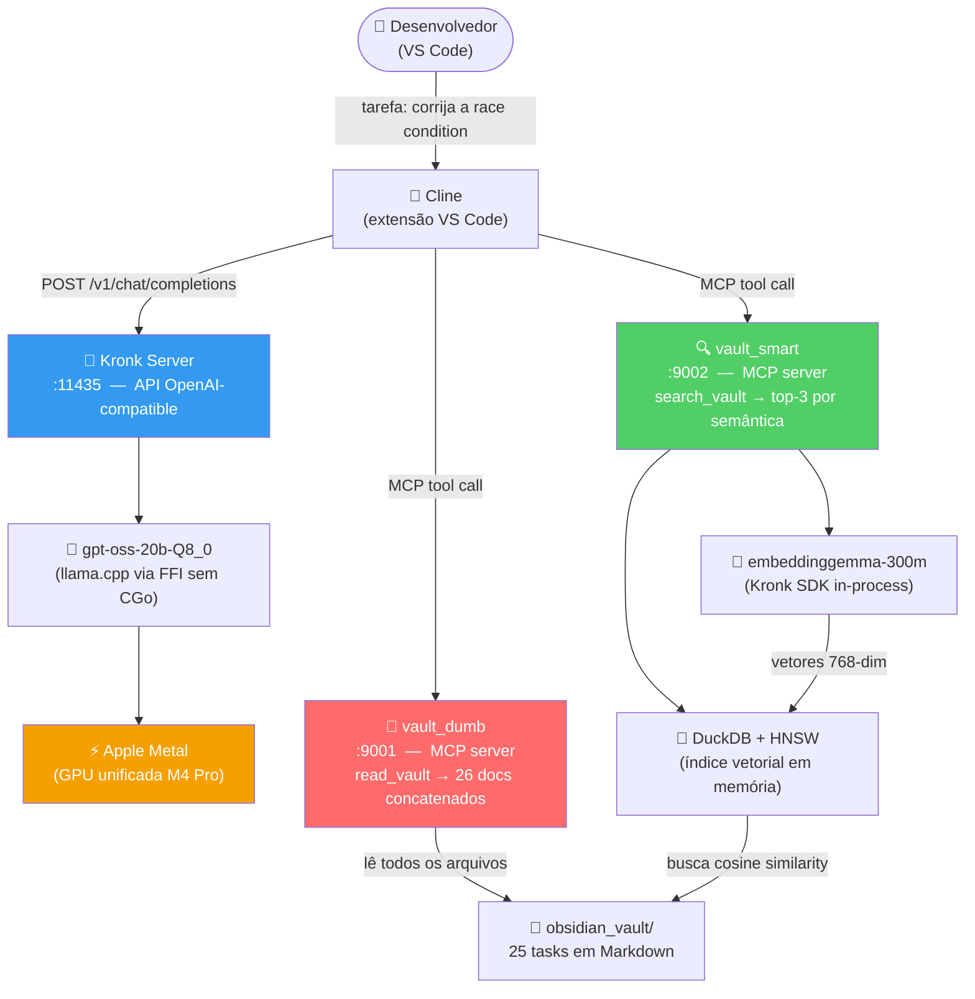
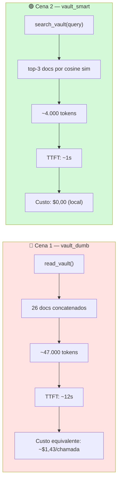

# IA sem Nuvem, em Golang

Repositório de demonstração da talk **"IA sem Nuvem, em Golang"** (Golang + AI + MCP, parte 2), apresentada na comunidade **GolangSP**. Mostra duas formas de construir um servidor MCP que busca contexto num backlog de notas (Obsidian) para um agente de IA — uma ingênua (carrega tudo) e uma com busca semântica de verdade (recupera só o relevante) — rodando localmente, sem nuvem, via [Kronk](https://github.com/ardanlabs/kronk).

📖 **[Guia de Estudo Completo →](GUIA-ESTUDO.md)** — 29 capítulos cobrindo LLM fundamentals, Kronk, MCP, Go FFI, modelos, arquiteturas e o código linha a linha.

---

## Estrutura do repositório

```
fake_project/      # serviço Go com bug de concorrência proposital (o alvo da demo)
mcp_vault/         # os dois servidores MCP (Cena 1 "dumb" vs Cena 2 "smart")
obsidian_vault/    # backlog de tasks em Markdown consumido pelos MCPs
slides/            # slides da talk
```

### `fake_project/`

Serviço de inventário (`internal/inventory/service.go`) com race condition real em `DeductStock` — checagem de estoque sem lock, causando estoque negativo sob concorrência. É o código que o agente corrige ao vivo.

```sh
cd fake_project && go test ./internal/inventory/... -race -v
```

### `mcp_vault/`

| Servidor | Porta | Ferramenta | Comportamento |
|----------|-------|------------|---------------|
| `cmd/dumb` | `:9001` | `read_vault` | Devolve os 26 docs concatenados (~47k tokens) |
| `cmd/smart` | `:9002` | `search_vault(query, top_k)` | Embeddings + DuckDB/HNSW, retorna top-3 (~4k tokens) |

```sh
cd mcp_vault && ./run.sh
```

### `obsidian_vault/`

25 tasks em Markdown (`TASK-001` a `TASK-025`). `TASK-001` descreve o bug de concorrência; as demais são ruído de backlog proposital para fazer o contraste de tokens ser real.

---

## Rodando localmente

**Pré-requisitos:** [`kronk`](https://github.com/ardanlabs/kronk) instalado, modelos baixados.

```sh
# 1. Baixar os modelos (primeira vez)
kronk model pull ggml-org/gpt-oss-20b-Q8_0-GGUF
kronk model pull ggml-org/embeddinggemma-300m-qat-q8_0-GGUF

# 2. Subir o servidor de inferência
kronk server start --processor metal   # ou cpu / cuda

# 3. Subir os dois servidores MCP
cd mcp_vault && ./run.sh

# 4. Configurar o Cline (VS Code) apontando para:
#    Provider: OpenAI-compatible  →  http://localhost:11435
#    Model:    gpt-oss-20b-Q8_0
#    MCP:      http://localhost:9001/mcp  e  http://localhost:9002/mcp
```

Configurações de GPU, contexto e cache ficam em `~/.kronk/models/model_config.yaml`.

---

## Arquitetura geral



---

## O contraste central da demo



---

## Stack

| Componente | Escolha |
|---|---|
| Editor | VS Code |
| Agente | [Cline](https://github.com/cline/cline) (extensão VS Code) |
| Inferência local | [Kronk](https://github.com/ardanlabs/kronk) (Ardan Labs) |
| Backend de compute | llama.cpp via FFI sem CGo (purego + libffi) |
| Aceleração | Apple Metal (M4 Pro) |
| Modelo principal | gpt-oss-20b-Q8_0 (MoE, 20B total, ~6B ativos) |
| Modelo de embedding | embeddinggemma-300m-qat-Q8_0 (768 dim) |
| Busca semântica | DuckDB + extensão VSS (HNSW, cosine similarity) |
| Backlog | Obsidian (Markdown) |

---

## Documentação

| Arquivo | Conteúdo |
|---|---|
| [`GUIA-ESTUDO.md`](GUIA-ESTUDO.md) | Guia técnico completo — 29 capítulos, ~5.300 linhas |
| [`benchmarks-apresentacao.md`](benchmarks-apresentacao.md) | Números reais de desempenho (CPU vs GPU vs híbrido) |
| [`slides-abertura.md`](slides-abertura.md) | Roteiro da talk — abertura |
| [`slides-kronk-deepdive.md`](slides-kronk-deepdive.md) | Roteiro da talk — deep dive técnico |
| [`slides-demos-finais.md`](slides-demos-finais.md) | Roteiro da talk — demos ao vivo |
| [`CLAUDE.md`](CLAUDE.md) | Contexto do projeto para assistentes de IA |
